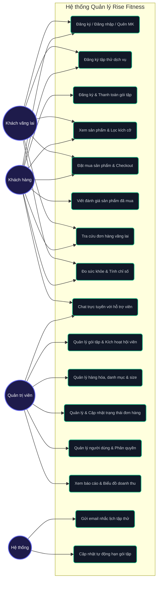
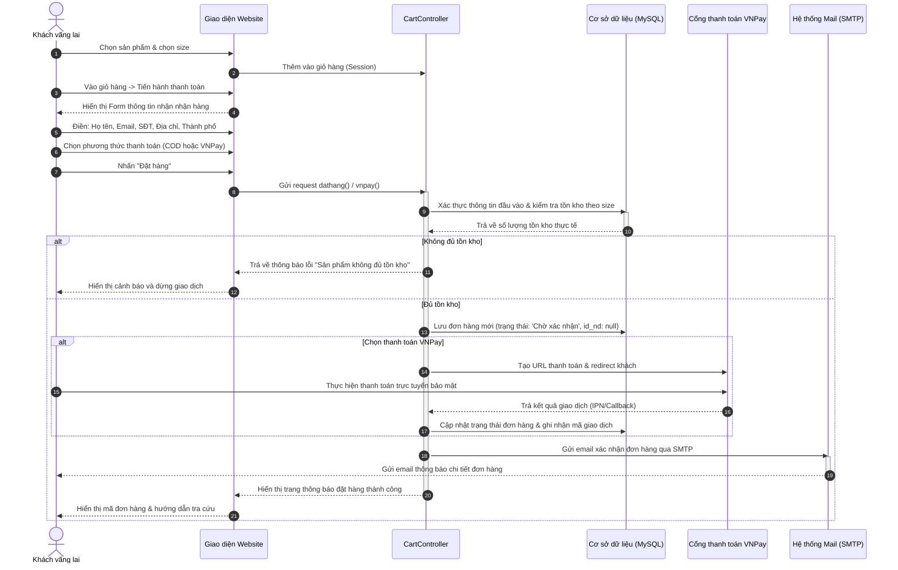
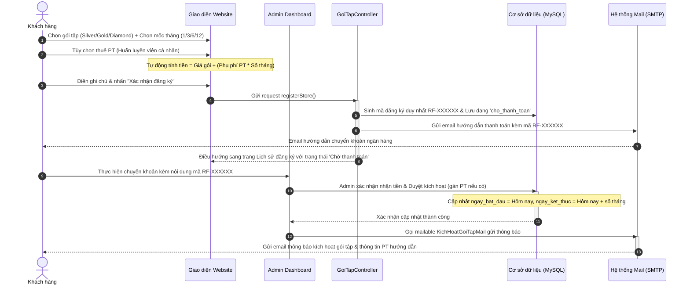
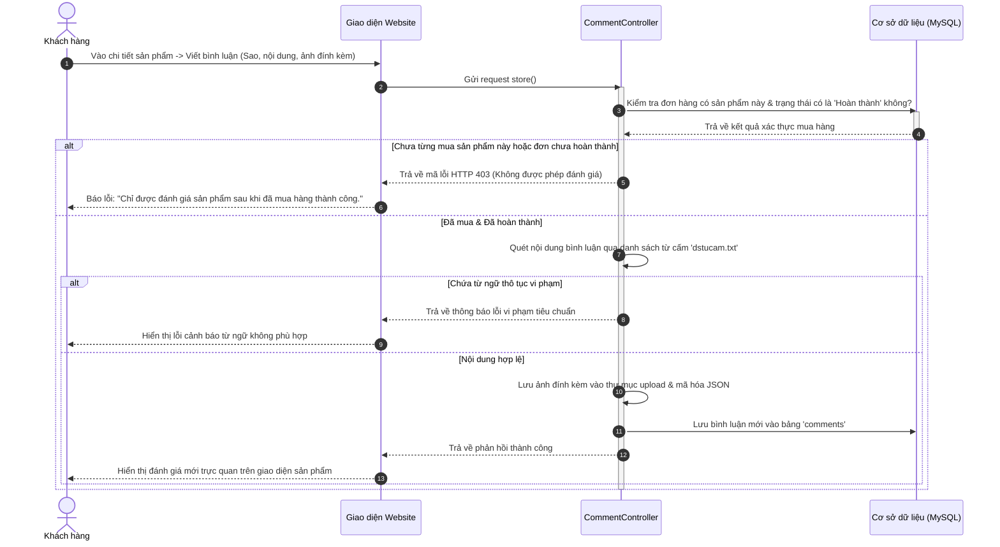

# YÊU CẦU NGƯỜI DÙNG & PHÂN TÍCH THIẾT KẾ HỆ THỐNG - RISE FITNESS

Tài liệu đặc tả các yêu cầu người dùng, sơ đồ phân rã chức năng (FDD), sơ đồ Use Case tổng quát và chi tiết các luồng nghiệp vụ hệ thống.

---

## A. Sơ đồ phân rã chức năng (Functional Decomposition Diagram - FDD)

Sơ đồ phân rã chức năng dưới đây thể hiện cấu trúc phân cấp các tính năng dành cho đối tượng **Khách hàng** và **Quản trị viên** trong hệ thống Rise Fitness:

```mermaid
graph TD
    %% Định nghĩa Style
    classDef default fill:#111827,stroke:#374151,stroke-width:1px,color:#d1d5db,font-family:Arial,font-size:12px;
    classDef root fill:#1e293b,stroke:#3b82f6,stroke-width:2px,color:#ffffff,font-size:14px,font-weight:bold;
    classDef actor fill:#1e1b4b,stroke:#6366f1,stroke-width:2px,color:#ffffff,font-size:13px,font-weight:bold;
    classDef module fill:#312e81,stroke:#818cf8,stroke-width:1.5px,color:#ffffff,font-size:12px,font-weight:bold;
    classDef leaf fill:#1f2937,stroke:#4b5563,stroke-width:1px,color:#e5e7eb,font-size:11px;

    ROOT[Website kinh doanh phòng GYM & Fitness<br/>Rise Fitness]:::root
    
    KH[Khách hàng / Khách vãng lai]:::actor
    AD[Quản trị viên]:::actor
    
    ROOT --> KH
    ROOT --> AD

    %% ================= KHÁCH HÀNG =================
    QLTK[Quản lý tài khoản]:::module
    DKTT[Đăng ký tập thử]:::module
    MGT[Mua gói tập]:::module
    MSP[Mua sản phẩm & Giỏ hàng]:::module
    DSK[Đo sức khỏe]:::module

    KH --> QLTK
    KH --> DKTT
    KH --> MGT
    KH --> MSP
    KH --> DSK

    %% Quản lý tài khoản
    QLTK_1[Đăng nhập]:::leaf
    QLTK_2[Đăng ký]:::leaf
    QLTK_3[Đặt lại mật khẩu]:::leaf
    QLTK_4[Chỉnh sửa thông tin cá nhân]:::leaf
    QLTK_5[Quên mật khẩu]:::leaf
    QLTK_6[Đăng xuất]:::leaf

    QLTK --> QLTK_1
    QLTK --> QLTK_2
    QLTK --> QLTK_3
    QLTK --> QLTK_4
    QLTK --> QLTK_5
    QLTK --> QLTK_6

    %% Đăng ký tập thử
    DKTT_1[Xem danh sách lớp học]:::leaf
    DKTT_2[Xem chi tiết thông tin lớp học]:::leaf
    DKTT_3[Đăng ký giữ chỗ lớp học]:::leaf
    DKTT_4[Đăng ký tập thử]:::leaf

    DKTT --> DKTT_1
    DKTT --> DKTT_2
    DKTT --> DKTT_3
    DKTT --> DKTT_4

    %% Mua gói tập
    MGT_1[Xem danh sách gói tập]:::leaf
    MGT_2[Xem chi tiết gói tập]:::leaf
    MGT_3[Thanh toán gói tập]:::leaf
    MGT_4[Nhận thông báo sắp hết hạn]:::leaf
    MGT_5[Gia hạn gói tập]:::leaf
    MGT_6[Xem lịch sử mua/gia hạn gói tập]:::leaf

    MGT --> MGT_1
    MGT --> MGT_2
    MGT --> MGT_3
    MGT --> MGT_4
    MGT --> MGT_5
    MGT --> MGT_6

    %% Mua sản phẩm
    MSP_1[Xem danh sách sản phẩm]:::leaf
    MSP_2[Lọc, tìm kiếm sản phẩm]:::leaf
    MSP_3[Thêm & Cập nhật giỏ hàng]:::leaf
    MSP_4[Đặt hàng nhanh Guest Checkout]:::leaf
    MSP_5[Tra cứu đơn hàng vãng lai]:::leaf

    MSP --> MSP_1
    MSP --> MSP_2
    MSP --> MSP_3
    MSP --> MSP_4
    MSP --> MSP_5

    %% Đo sức khỏe
    DSK_1[Nhập thông tin cơ thể]:::leaf
    DSK_2[Tính toán các chỉ số BMI, TDEE, BMR]:::leaf

    DSK --> DSK_1
    DSK --> DSK_2

    %% ================= QUẢN TRỊ VIÊN =================
    QLGT_AD[Quản lý gói tập]:::module
    QLDH_AD[Quản lý đơn hàng]:::module
    QLSP_AD[Quản lý sản phẩm]:::module
    QLND_AD[Quản lý người dùng]:::module
    BCTK_AD[Báo cáo thống kê]:::module

    AD --> QLGT_AD
    AD --> QLDH_AD
    AD --> QLSP_AD
    AD --> QLND_AD
    AD --> BCTK_AD

    %% Quản lý gói tập Admin
    QLGT_1[Cập nhật gói tập/Giá gói]:::leaf
    QLGT_2[Duyệt & kích hoạt hạn tập]:::leaf
    QLGT_3[Phân công Huấn luyện viên PT]:::leaf
    QLGT_AD --> QLGT_1
    QLGT_AD --> QLGT_2
    QLGT_AD --> QLGT_3

    %% Quản lý đơn hàng Admin
    QLDH_1[Xem danh sách & chi tiết đơn]:::leaf
    QLDH_2[Cập nhật trạng thái giao hàng]:::leaf
    QLDH_3[Duyệt lịch đăng ký tập thử]:::leaf
    QLDH_AD --> QLDH_1
    QLDH_AD --> QLDH_2
    QLDH_AD --> QLDH_3

    %% Quản lý sản phẩm Admin
    QLSP_1[Thêm/Sửa/Xóa sản phẩm]:::leaf
    QLSP_2[Quản lý danh mục & biến thể size]:::leaf
    QLSP_3[Cấu hình mã khuyến mãi & Freeship]:::leaf
    QLSP_AD --> QLSP_1
    QLSP_AD --> QLSP_2
    QLSP_AD --> QLSP_3

    %% Quản lý người dùng Admin
    QLND_1[Phân quyền tài khoản]:::leaf
    QLND_2[Khóa/Mở tài khoản khách]:::leaf
    QLND_3[Hệ thống Chat support tư vấn]:::leaf
    QLND_AD --> QLND_1
    QLND_AD --> QLND_2
    QLND_AD --> QLND_3

    %% Báo cáo thống kê Admin
    BCTK_1[Biểu đồ thống kê doanh thu]:::leaf
    BCTK_2[Biểu đồ thống kê đơn hàng]:::leaf
    BCTK_3[Biểu đồ thống kê lượt tập thử]:::leaf
    BCTK_AD --> BCTK_1
    BCTK_AD --> BCTK_2
    BCTK_AD --> BCTK_3
```

---

## B. Sơ đồ Use Case tổng quát (General Use Case Diagram)

Sơ đồ thể hiện mối quan hệ giữa các Actor và các chức năng chính trong hệ thống:

---

## C. Phân rã và vẽ sơ đồ các luồng nghiệp vụ chi tiết

### 1. Luồng Mua hàng Không Đăng nhập (Guest Checkout Flow)

Luồng này dành cho Khách vãng lai muốn mua sắm trực tuyến nhanh chóng mà không cần đăng ký tài khoản. Hệ thống sử dụng Session để quản lý giỏ hàng tạm thời và ghi nhận đơn hàng với mã khách hàng (`id_nd`) là `null`.

---

### 2. Luồng Đăng ký & Kích hoạt gói tập hội viên (Gym Package Registration & Activation)

Luồng nghiệp vụ xử lý khi khách hàng đăng ký dịch vụ tập luyện trực tuyến và hệ thống tự động hóa kích hoạt gói tập sau khi nhận thanh toán.

---

### 3. Luồng Đánh giá sản phẩm tin cậy (Verified Purchase Review)

Đảm bảo chỉ những khách hàng đã thực tế mua sản phẩm trong đơn hàng thành công (Hoàn thành) mới được viết đánh giá, tránh tình trạng spam ảo.

