# BÁO CÁO ĐỒ ÁN TỐT NGHIỆP TOÀN DIỆN (BẢN V3 - NÂNG CẤP HỆ THỐNG TOÀN DIỆN)
## ĐỀ TÀI: XÂY DỰNG HỆ THỐNG QUẢN LÝ ĐĂNG KÝ TẬP THỬ, GÓI TẬP VÀ BÁN LẺ SẢN PHẨM FITNESS - RISE FITNESS

---

# CHƯƠNG 1. TÌM HIỂU BÀI TOÁN VÀ ĐẶC TẢ YÊU CẦU NGƯỜI DÙNG

---

## 1.1. Giới thiệu bài toán

### 1.1.1. Lý do chọn bài toán
Trong những năm gần đây, cùng với sự gia tăng nhận thức của người dân về sức khỏe và chất lượng cuộc sống, nhu cầu tham gia các hoạt động thể dục thể thao, đặc biệt là Gym, Fitness và Yoga, ngày càng phát triển mạnh mẽ. Theo báo cáo của Ken Research, thị trường dịch vụ Fitness tại Việt Nam được đánh giá là một trong những thị trường có tiềm năng tăng trưởng cao trong khu vực Đông Nam Á nhờ sự gia tăng thu nhập bình quân đầu người, tốc độ đô thị hóa và xu hướng quan tâm đến sức khỏe của người dân. Sự phát triển này kéo theo nhu cầu mở rộng quy mô hoạt động của các trung tâm thể hình và yêu cầu nâng cao chất lượng quản lý, chăm sóc khách hàng. Bên cạnh đó, số lượng trung tâm thể hình và phòng tập gym tại các đô thị lớn như Hà Nội và Thành phố Hồ Chí Minh liên tục mở rộng nhằm đáp ứng nhu cầu ngày càng cao của thị trường.

Song song với sự phát triển của ngành Fitness, hoạt động thương mại điện tử tại Việt Nam cũng ghi nhận mức tăng trưởng mạnh mẽ. Theo Báo cáo Chỉ số Thương mại điện tử Việt Nam (EBI) của Hiệp hội Thương mại điện tử Việt Nam (VECOM), quy mô thị trường thương mại điện tử B2C Việt Nam liên tục tăng trưởng qua các năm, đồng thời hành vi mua sắm trực tuyến ngày càng trở nên phổ biến đối với người tiêu dùng. Người dùng có xu hướng tìm kiếm thông tin, đăng ký dịch vụ và mua sắm trực tuyến thay vì thực hiện các giao dịch theo phương thức truyền thống. Điều này đặt ra yêu cầu đối với các doanh nghiệp Fitness phải đẩy mạnh chuyển đổi số nhằm nâng cao chất lượng dịch vụ, tối ưu quy trình quản lý và mở rộng khả năng tiếp cận khách hàng.

Tuy nhiên, phần lớn các phòng tập gym quy mô vừa và nhỏ hiện nay vẫn đang áp dụng các phương thức quản lý truyền thống, dẫn đến nhiều hạn chế trong quá trình vận hành:
*   **Ghi chép thủ công bằng sổ sách hoặc Excel:** Thông tin khách hàng, lịch sử đăng ký tập thử và dữ liệu bán hàng thường được lưu trữ rời rạc, gây khó khăn trong việc tra cứu, cập nhật và dễ xảy ra thất lạc dữ liệu. Đây là một trong những hạn chế phổ biến của các doanh nghiệp nhỏ và vừa trong quá trình chuyển đổi số.
*   **Thiếu sự kết nối và tự động hóa:** Nhiều phòng tập chưa áp dụng hệ thống nhắc lịch tự động cho khách hàng trước buổi tập thử. Theo nghiên cứu về quản lý lịch hẹn dịch vụ, việc áp dụng hệ thống nhắc nhở tự động giúp giảm đáng kể tỷ lệ khách hàng bỏ hẹn (No-show) do quên lịch hoặc không nhận được thông báo kịp thời.
*   **Khó khăn trong quản lý bán lẻ sản phẩm Fitness:** Các sản phẩm bổ sung dinh dưỡng như Whey Protein, BCAA hoặc các phụ kiện tập luyện như găng tay, đai lưng thường được quản lý riêng lẻ, chưa đồng bộ với dữ liệu tồn kho. Đối với các sản phẩm có nhiều thuộc tính như kích thước (Size), hương vị hoặc màu sắc, việc kiểm kê thủ công dễ xảy ra sai sót và chênh lệch số liệu.
*   **Hạn chế trong thống kê và báo cáo:** Việc tổng hợp doanh thu, theo dõi hiệu quả kinh doanh, thống kê số lượng khách hàng đăng ký tập thử hoặc đánh giá hiệu quả bán hàng thường phải thực hiện thủ công, mất nhiều thời gian và tiềm ẩn nguy cơ sai sót.

Xuất phát từ thực tế đó, đề tài **“Xây dựng hệ thống quản lý đăng ký tập thử và bán lẻ sản phẩm Fitness – Rise Fitness”** được lựa chọn nhằm xây dựng một giải pháp quản lý tập trung, hỗ trợ số hóa quy trình đăng ký tập thử, quản lý khách hàng, quản lý bán lẻ sản phẩm Fitness và thống kê báo cáo. Hệ thống không chỉ góp phần nâng cao hiệu quả vận hành cho doanh nghiệp mà còn cải thiện trải nghiệm khách hàng thông qua việc đăng ký và mua sắm trực tuyến thuận tiện, nhanh chóng và chính xác hơn.

Website được thiết kế nhằm phục vụ hai chức năng trọng tâm:
1.  **Kênh bán hàng trực tuyến (E-commerce):** Cung cấp các sản phẩm chuyên biệt trong lĩnh vực thể thao như quần áo, dụng cụ tập luyện và thực phẩm bổ sung dinh dưỡng (Whey, Mass Gainer, phụ kiện có phân size và quản lý tồn kho thời gian thực).
2.  **Cầu nối thông tin chính thống (O2O - Online to Offline):** Giới thiệu chi tiết về doanh nghiệp Rise Fitness, bao gồm các bộ môn thể thao hiện có như gym, bơi lội, kick boxing, yoga và dance, đồng thời hỗ trợ đăng ký tập thử miễn phí và đăng ký gói hội viên trực tuyến.

---

### 1.1.2. Đề xuất các giải pháp thực hiện
Dựa trên việc phân tích yêu cầu nghiệp vụ của hệ thống quản lý đăng ký tập thử và bán lẻ sản phẩm Fitness cho doanh nghiệp Rise Fitness, nhóm nghiên cứu đề xuất hai phương án triển khai hệ thống như sau:

#### Phương án 1: Phát triển ứng dụng Desktop (Desktop Application)
Ứng dụng được xây dựng bằng ngôn ngữ C# trên nền tảng .NET (WinForms hoặc WPF), sử dụng hệ quản trị cơ sở dữ liệu SQL Server để lưu trữ và quản lý dữ liệu.
*   **Ưu điểm:**
    *   Hiệu năng xử lý cao do phần lớn tác vụ được thực hiện trực tiếp trên máy tính cài đặt ứng dụng.
    *   Dữ liệu được quản lý trong môi trường nội bộ, giúp tăng cường khả năng kiểm soát và bảo mật.
    *   Giao diện người dùng ổn định, phù hợp với các nghiệp vụ tại quầy lễ tân hoặc bộ phận quản lý.
*   **Nhược điểm:**
    *   Khả năng truy cập bị giới hạn trên các thiết bị đã cài đặt phần mềm.
    *   Khách hàng không thể chủ động đăng ký tập thử, tra cứu thông tin hoặc mua sản phẩm từ xa.
    *   Chi phí triển khai, bảo trì và nâng cấp hệ thống tương đối cao do phải cài đặt trên từng máy trạm.
    *   Khó mở rộng khi số lượng người dùng và chi nhánh tăng lên trong tương lai.

*Nhận xét:* Giải pháp Desktop phù hợp với các hệ thống quản lý nội bộ đơn lẻ nhưng chưa đáp ứng tốt nhu cầu tương tác trực tuyến và mở rộng tiếp cận khách hàng.

#### Phương án 2: Phát triển ứng dụng Web tích hợp (Web Application) - ĐỀ XUẤT CHỌN
Hệ thống được phát triển dưới dạng ứng dụng web responsive sử dụng framework **Laravel (PHP)**, cơ sở dữ liệu **MySQL** và kiến trúc **MVC kết hợp Repository Pattern**.
*   **Ưu điểm:**
    *   Cho phép người dùng truy cập mọi lúc, mọi nơi thông qua trình duyệt web trên máy tính, máy tính bảng hoặc điện thoại thông minh.
    *   Hỗ trợ khách hàng đăng ký tập thử trực tuyến, tra cứu thông tin dịch vụ và mua sắm sản phẩm mà không cần đến trực tiếp trung tâm.
    *   Dễ dàng tích hợp các dịch vụ bên thứ ba như thanh toán trực tuyến VNPay, gửi email thông báo và nhắc lịch tự động.
    *   Hỗ trợ quản lý tập trung dữ liệu khách hàng, sản phẩm, đơn hàng và lịch đăng ký tập thử trên cùng một hệ thống.
    *   Khả năng mở rộng cao, thuận lợi cho việc nâng cấp hoặc bổ sung chức năng trong tương lai nhờ Repository Pattern tách biệt nghiệp vụ.
    *   Chi phí triển khai và bảo trì thấp hơn so với việc cài đặt ứng dụng trên nhiều máy trạm.
*   **Nhược điểm:**
    *   Hệ thống phụ thuộc vào kết nối Internet trong quá trình sử dụng.
    *   Yêu cầu triển khai các cơ chế bảo mật ứng dụng web chặt chẽ để bảo vệ dữ liệu nhạy cảm (như mật khẩu, lịch sử thanh toán).

#### Đánh giá và lựa chọn giải pháp
Sau khi phân tích hai phương án, nhóm nhận thấy giải pháp phát triển ứng dụng Web (Phương án 2) phù hợp vượt trội với mục tiêu của đề tài. Hệ thống đáp ứng hoàn hảo yêu cầu tương tác hai chiều trực tuyến giữa doanh nghiệp và khách hàng, tối ưu hóa quy trình vận hành và tiết kiệm chi phí hạ tầng. Do đó, nhóm quyết định chọn phương án xây dựng ứng dụng Web sử dụng framework **Laravel 10**, hệ quản trị CSDL **MySQL 8.0** kết hợp **Repository Pattern** để triển khai dự án Rise Fitness.

---

### 1.1.3. Đánh giá tính khả thi của hệ thống

#### A. Tính khả thi về công nghệ
*   **Tính ổn định và tương thích:** Hệ thống website hoạt động ổn định trên nền tảng Laravel 10 (PHP 8.1+) và MySQL 8.0. Giao diện Bootstrap 5 tương thích hoàn toàn với các trình duyệt phổ biến hiện nay (Chrome, Safari, Edge) và tự động co giãn tối ưu trên thiết bị di động.
*   **Trải nghiệm người dùng:** Giao diện được thiết kế theo phong cách Athletic hiện đại, tối giản và dễ sử dụng cho cả quản trị viên, nhân viên, PT lẫn học viên phòng tập.
*   **Tối ưu hóa cơ sở dữ liệu:** CSDL gồm 22 bảng được thiết kế theo dạng chuẩn **3NF**, sử dụng ràng buộc khóa ngoại cứng và InnoDB Storage Engine. Áp dụng Database Indexing trên các trường khóa ngoại và các kỹ thuật Eager Loading trong Eloquent ORM giúp hệ thống chịu tải tốt, phản hồi nhanh chóng mà không chiếm dụng quá nhiều RAM máy chủ.
*   **Hỗ trợ ra quyết định:** Lưu trữ lịch sử giao dịch bán hàng, lịch đăng ký tập thử và lịch trình đo sức khỏe lâu dài, bảo mật, giúp hiển thị các biểu đồ doanh thu trực quan hỗ trợ ban quản lý phân tích tình hình kinh doanh.

#### B. Tính khả thi về kinh tế
*   **Tăng trưởng doanh thu:** Hệ thống tích hợp song song bán hàng thương mại điện tử và dịch vụ hội viên trực tuyến giúp doanh nghiệp khai thác tối đa nguồn doanh thu từ học viên và khách vãng lai thông qua thanh toán COD hoặc VNPay.
*   **Tối ưu hóa chi phí vận hành:** Sử dụng công nghệ mã nguồn mở (PHP, MySQL, Laravel) giúp doanh nghiệp không tốn chi phí mua bản quyền phần mềm. Chi phí duy trì hosting và tên miền định kỳ thấp, dễ dàng thu hồi vốn nhờ dòng tiền từ đơn hàng trực tuyến.

#### C. Tính khả thi về vận hành
*   **Số hóa quy trình:** Triệt tiêu hoàn toàn việc ghi chép sổ sách thủ công. Lễ tân tại quầy và thủ kho phối hợp đồng bộ thời gian thực khi bán hàng.
*   **Tăng hiệu suất làm việc:** Tự động hóa gửi email nhắc lịch tập thử thông qua Laravel Scheduler và gửi hóa đơn mua hàng qua mail. Tự động hóa tính toán BMI/BMR và bảo lưu ngày tập giúp giảm tải công việc cho huấn luyện viên PT và lễ tân.

---

### 1.1.4. Lập kế hoạch thực hiện
Dự án được lên kế hoạch thực hiện trong vòng 12 tuần dưới sự quản lý của mô hình Scrum, chia thành 4 Sprint cụ thể như sau:

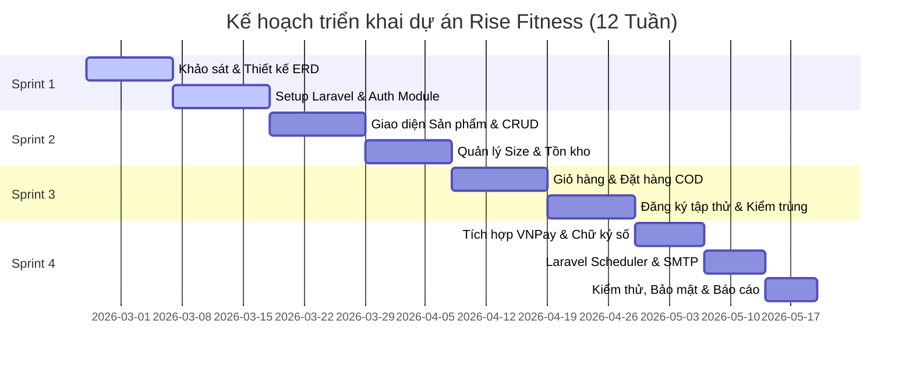
```mermaid
gantt
    title Kế hoạch triển khai dự án Rise Fitness (12 Tuần)
    dateFormat  YYYY-MM-DD
    section Sprint 1
    Khảo sát & Thiết kế ERD        :active, des1, 2026-02-25, 10d
    Setup Laravel & Auth Module   :active, des2, after des1, 11d
    section Sprint 2
    Giao diện Sản phẩm & CRUD     :des3, 2026-03-18, 11d
    Quản lý Size & Tồn kho        :des4, after des3, 10d
    section Sprint 3
    Giỏ hàng & Đặt hàng COD       :des5, 2026-04-08, 11d
    Đăng ký tập thử & Kiểm trùng  :des6, after des5, 10d
    section Sprint 4
    Tích hợp VNPay & Chữ ký số    :des7, 2026-04-29, 8d
    Laravel Scheduler & SMTP      :des8, after des7, 7d
    Kiểm thử, Bảo mật & Báo cáo   :des9, after des8, 6d
```

*   **Sprint 1 (Tuần 1 - 3):** Khảo sát hiện trạng, thu thập yêu cầu người dùng, thiết kế sơ đồ thực thể liên kết ERD. Cấu hình ban đầu framework Laravel 10 và CSDL MySQL. Phát triển Module đăng ký, đăng nhập và phân quyền 4 vai trò (Admin, Khách hàng, Nhân viên, PT).
*   **Sprint 2 (Tuần 4 - 6):** Xây dựng giao diện danh mục, chi tiết sản phẩm. Phát triển các chức năng CRUD sản phẩm phía Admin, thuộc tính quản lý biến thể kích cỡ (Size) và số lượng tồn kho/phụ phí tương ứng lưu tại bảng trung gian liên kết kích cỡ sản phẩm. Tích hợp xử lý nén và whiten ảnh qua GD Library.
*   **Sprint 3 (Tuần 7 - 9):** Phát triển mô-đun Giỏ hàng, Đặt hàng COD, quy trình Guest Checkout và tra cứu đơn hàng cho khách vãng lai. Xây dựng form Đăng ký tập thử trực tuyến phía khách hàng và duyệt đăng ký phía Admin, áp dụng logic chặn trùng lặp số điện thoại.
*   **Sprint 4 (Tuần 10 - 12):** Tích hợp cổng thanh toán trực tuyến VNPay và xác thực chữ ký số giao dịch HMAC-SHA512. Cấu hình gửi email nhắc lịch tập thử tự động bằng Laravel Task Scheduler gửi email nhắc lịch tự động hằng ngày. Triển khai các giải pháp bảo mật OWASP Top 10 (CSRF, XSS, SQL Injection, băm mật khẩu Bcrypt). Tiến hành kiểm thử hệ thống và deploy trang web lên môi trường Internet (Web Hosting).

---

## 1.2. Tìm hiểu yêu cầu người dùng

### 1.2.1. Lập kế hoạch xác định yêu cầu người dùng
Để đảm bảo hệ thống Rise Fitness đáp ứng sát sườn các nhu cầu thực tế của cả khách hàng và ban quản lý vận hành phòng tập, nhóm nghiên cứu đã triển khai kế hoạch khảo sát thu thập dữ liệu bằng cách phối hợp cả hai phương pháp định tính và định lượng.

### Phương pháp thu thập yêu cầu

| STT | Phương pháp | Đối tượng | Số lượng | Hình thức | Thời gian |

#### A. Kế hoạch phỏng vấn nhân sự trực tiếp (Định tính)
Nhóm tiến hành phỏng vấn đối thoại trực tiếp các nhân sự chủ chốt tham gia vận hành tại cơ sở Rise Fitness vào ngày **25/02/2026** (Từ 14:00 đến 15:20) tại văn phòng quản lý Rise Fitness (Ba Đình, Hà Nội).

*   **Nhân sự được phỏng vấn:**
    *   Nguyễn Huyền Trang (Quản lý phòng gym)
    *   Trần Diệu Thảo (Nhân viên lễ tân & bán hàng)
    *   Nguyễn Đức Anh (Thủ kho sản phẩm)
    *   Nguyễn Minh Hải (PT - Huấn luyện viên cá nhân)
*   **Phân tích viên (Nhóm nghiên cứu):** Nguyễn Như Quỳnh, Phạm Kim Ngân, Nguyễn Khánh Linh, Nguyễn Mạnh Dũng, Đỗ Minh Khoa.

Dưới đây là chi tiết câu hỏi, ghi nhận câu trả lời và các vấn đề tồn tại được tổng hợp:

| Chủ đề khảo sát | Câu hỏi phỏng vấn | Nội dung ghi nhận từ nhân sự | Vấn đề / Hạn chế xác định |
|---|---|---|---|
| **Chủ đề 1: Bối cảnh và cách vận hành thực tế** | **Câu 1:** Hằng ngày, việc tiếp nhận và xử lý thông tin đăng ký tập thử của khách hàng diễn ra như thế nào? | **Trần Diệu Thảo (Lễ tân):** Khách gọi hotline hoặc nhắn qua Fanpage, lễ tân sẽ ghi tay thông tin vào sổ. Cuối ngày mới nhập thủ công vào file Excel chung. Nhiều khi đông khách quá sẽ quên ghi vào sổ, hoặc cuối ngày nhập vào file Excel bị sai lệch chữ số điện thoại. | Đông khách dễ quên ghi sổ; nhập cuối ngày dễ sai lệch số điện thoại, mất mát thông tin. |
| | **Câu 2:** Khi khách hàng đến quầy mua sản phẩm bổ sung (Whey, phụ kiện) có nhiều size/kích thước khác nhau, quy trình kiểm tra tồn kho diễn ra ra sao? | **Nguyễn Đức Anh (Thủ kho):** Khách hỏi mua Whey Protein loại 2kg vị Socola chẳng hạn. Lễ tân tại quầy không biết rõ trong kho còn vị/size đó không. Lễ tân phải gọi bộ đàm cho tôi vào kho lục tìm trực tiếp. Nếu còn thì mang ra, nếu hết thì phải xin lỗi khách. Quá trình này mất từ 5-10 phút. Khách hàng phải đứng đợi rất sốt ruột. | Mỗi lần tra cứu mất 5–10 phút, khách phải đứng đợi, ảnh hưởng nghiêm trọng đến trải nghiệm mua hàng. |
| | **Câu 3:** Quy trình đăng ký gói tập hội viên và phân công huấn luyện viên PT cho học viên mới hiện nay đang được thực hiện như thế nào? | **Trần Diệu Thảo (Lễ tân):** Khách đóng tiền tại quầy, lễ tân xuất hóa đơn giấy rồi ghi vào sổ. Quản lý sẽ kiểm tra danh sách PT nào đang trống để phân công bằng miệng hoặc nhắn qua Zalo. Quy trình này rất dễ phân công không đều hoặc bỏ sót học viên chưa có PT phụ trách. | Ghi nhận gói tập và gán PT thủ công dễ gây sai sót, không tối ưu và dễ bỏ sót học viên. |
| **Chủ đề 2: Quản lý thông tin và hệ thống hiện tại** | **Câu 4:** Hiện tại phòng tập đang sử dụng công cụ gì để quản lý danh sách tập thử và doanh thu bán hàng lẻ? | **Nguyễn Huyền Trang (Quản lý):** Chúng tôi dùng Google Sheets để quản lý chung. Mỗi tuần lễ tân gửi file Excel bán hàng và danh sách tập thử, tôi sẽ tổng hợp lại. Công cụ này miễn phí nhưng không có phân quyền, ai cũng có thể sửa xóa dữ liệu của nhau, rất dễ bị mất công thức tính toán. | Google Sheets không có phân quyền bảo mật, dữ liệu dễ bị sửa xóa nhầm, mất công thức tính toán. |
| | **Câu 5:** Dữ liệu số lượng tồn kho trên file Excel có đảm bảo tính thời gian thực (Real-time) không? | **Nguyễn Đức Anh (Thủ kho):** Không thể real-time được. Thường thì cuối tuần tôi mới kiểm kho một lần rồi cập nhật số lượng lên Excel. Trong tuần nếu bán được hàng hoặc có hàng hỏng lỗi, số liệu trên file Excel sẽ bị lệch so với thực tế trong kho. | Trong tuần bán hàng hoặc có hàng hỏng, số liệu trên file bị lệch so với thực tế. |
| | **Câu 6:** Khi học viên có nhu cầu tạm dừng tập (bảo lưu gói tập) hoặc xin đổi huấn luyện viên PT khác, phòng tập xử lý như thế nào và có gặp khó khăn gì không? | **Nguyễn Huyền Trang (Quản lý):** Học viên phải viết đơn giấy hoặc nhắn tin cho tôi. Tôi tự tính toán số ngày còn lại bằng tay, cập nhật lên Excel và lưu ý vào sổ. Khi hết hạn bảo lưu, tôi phải tự nhớ để nhắc nhở họ đi tập lại. Nhiều khi đông việc quên kích hoạt lại gói tập của khách gây khiếu nại. Việc đổi PT cũ sang PT mới cũng nhắn tin thủ công nên PT cũ không nắm rõ, dễ gây hiểu lầm. | Tính toán bảo lưu thủ công dễ sai lệch; không tự động nhắc hạn bảo lưu; chuyển đổi PT thiếu chuẩn hóa gây hiểu lầm giữa các huấn luyện viên. |
| | **Câu 7:** Đã từng có sự cố nghiêm trọng nào xảy ra do sai lệch dữ liệu giữa các bộ phận chưa? | **Nguyễn Huyền Trang (Quản lý):** Có chứ. Có lần khách đến tập thử theo lịch hẹn trên Fanpage nhưng lễ tân quên không ghi sổ và không báo lịch cho huấn luyện viên (PT). Khách đến không có người hướng dẫn và phải ra về trong sự bực bội. Về bán hàng, đôi khi file Excel báo còn Whey vị dâu nhưng thực tế trong kho đã hết từ lâu do thủ kho chưa cập nhật kịp. | Sai sót ghi sổ làm mất lịch tập của khách, gây mất uy tín thương hiệu. |
| **Chủ đề 3: Tác động đến hoạt động kinh doanh** | **Câu 8:** Việc quản lý lịch hẹn tập thử thủ công ảnh hưởng như thế nào đến tỷ lệ chuyển đổi khách hàng đăng ký thẻ hội viên chính thức? | **Nguyễn Huyền Trang (Quản lý):** Tỷ lệ khách hàng đăng ký tập thử bị "bùng lịch" (không đến) lên tới 40-50%. Nguyên nhân lớn là chúng tôi không có nhân sự để nhắn tin hay gọi điện nhắc nhở trước buổi tập 1 ngày. Khách hàng dễ quên lịch và chúng tôi mất đi cơ hội tiếp cận họ. | Tỷ lệ "bùng lịch" tập thử cao (40-50%) do thiếu hệ thống nhắc lịch tự động. |
| | **Câu 9:** Khách hàng có phản hồi gì về các phương thức thanh toán hiện có, phương thức thanh toán hiện tại của phòng tập không? | **Trần Diệu Thảo (Lễ tân):** Khách mua hàng tại quầy chủ yếu thanh toán tiền mặt hoặc chuyển khoản ngân hàng rồi quét mã QR cá nhân. Nhiều khách hỏi có thanh toán trực tuyến qua thẻ hay ví điện tử để nhận khuyến mãi không nhưng chúng tôi chưa hỗ trợ. Khách cũng hay hỏi mã giảm giá khi mua số lượng nhiều nhưng lễ tân phải xin ý kiến quản lý mới dám giảm. | Chưa hỗ trợ thanh toán trực tuyến chính thống, chưa có hệ thống mã giảm giá tự động. |
| **Chủ đề 4: Quy trình nghiệp vụ kho và báo cáo** | **Câu 10:** Quy trình kiểm kê kho và xử lý hàng lỗi/hết hạn sử dụng được kiểm soát thế nào? | **Nguyễn Đức Anh (Thủ kho):** Hàng tháng tôi phải đối chiếu thủ công từng sản phẩm. Những sản phẩm cận date hoặc lỗi bao bì sẽ được ghi nhận vào biên bản giấy rồi trình quản lý duyệt thanh lý. Quy trình này rất mất thời gian vì có hàng trăm mặt hàng phụ kiện và thực phẩm bổ sung. | Kiểm kho bằng giấy tờ rườm rà, rất mất thời gian vì có hàng trăm mặt hàng phụ kiện và thực phẩm bổ sung. |
| | **Câu 11:** Công cụ Excel hiện tại có đáp ứng được nhu cầu báo cáo thống kê của quản lý không? | **Nguyễn Huyền Trang (Quản lý):** Chỉ đáp ứng được phần nào số liệu thô. Tôi muốn có biểu đồ trực quan thể hiện doanh thu từng trường theo từng ngày, danh sách sản phẩm bán chạy nhất, hay số lượng khách tập thử chuyển đổi thành hội viên theo tháng để đưa ra quyết định kinh doanh nhưng Excel làm rất phức tạp và mất thời gian. | Cần biểu đồ trực quan về doanh thu theo ngày, sản phẩm bán chạy nhất, tỷ lệ chuyển đổi khách tập thử -> hội viên theo tháng. Excel làm rất phức tạp và mất thời gian. |
| **Chủ đề 5: Nhu cầu cải thiện hệ thống** | **Câu 12:** Đối với hệ thống website mới, chức năng nào liên quan đến đăng ký tập thử cần được ưu tiên tự động hóa? | **Trần Diệu Thảo (Lễ tân):** Cần có form cho khách tự đăng ký trên web, hệ thống tự động kiểm tra xem SĐT đó đã đăng ký lần nào chưa để tránh spam tập thử miễn phí nhiều lần. Đồng thời, hệ thống cần tự gửi email xác nhận và email nhắc lịch hẹn tự động cho khách trước 1 ngày. | Xác lập chức năng chặn spam đăng ký tập thử và tự động gửi mail nhắc hẹn (Cron Job). |
| | **Câu 13:** Hệ thống bán hàng trực tuyến mới cần tích hợp những tính năng thanh toán và khuyến mại gì để thu hút khách hàng? | **Nguyễn Huyền Trang (Quản lý):** Cần tích hợp thanh toán trực tuyến qua cổng VNPay để khách thanh toán nhanh. Phải có hệ thống quản lý mã giảm giá tự động kiểm tra điều kiện áp dụng (hạn dùng, số lượng dùng) và trừ tiền trực tiếp trên đơn hàng để tránh lễ tân phải tính toán thủ công. | Tích hợp cổng VNPay, Module quản lý coupon tự động. |
| | **Câu 14:** Yêu cầu lớn nhất của thủ kho đối với module quản lý sản phẩm và size trên hệ thống mới là gì? | **Nguyễn Đức Anh (Thủ kho):** Hệ thống phải cho phép cập nhật số lượng tồn kho riêng biệt cho từng size sản phẩm (Ví dụ: Whey Protein 1kg còn 10 hũ, hũ 2kg còn 5 hũ). Khi khách đặt hàng size nào đó trên web thì hệ thống tự động trừ trực tiếp vào tồn kho của size đó thời gian thực. | Quản lý tồn kho chi tiết theo thuộc tính kích cỡ (size) thời gian thực. |
| | **Câu 15:** PT và ban quản lý kỳ vọng gì về các module quản lý gói tập, bảo lưu, đổi PT và theo dõi sức khỏe học viên trên hệ thống mới? | **Nguyễn Minh Hải (PT) & Nguyễn Huyền Trang (Quản lý):** Học viên có thể gửi yêu cầu đổi PT hoặc yêu cầu bảo lưu trực tiếp trên tài khoản cá nhân. Admin sẽ duyệt và chỉ định PT mới chỉ bằng vài click, hệ thống tự động tính ngày kết thúc mới khi bảo lưu và tự động gửi thông báo hệ thống đến các bên. Đồng thời, PT có thể cập nhật các chỉ số sức khỏe học viên ngay trên hệ thống để tự động tính BMI và vẽ biểu đồ tiến triển trực quan cho học viên theo dõi. | Thiết kế các module tự động hóa: đổi PT, bảo lưu gói tập, đo chỉ số cơ thể & vẽ biểu đồ BMI. |

---

#### B. Khảo sát diện rộng qua bảng hỏi (Định lượng)
Để khảo sát nhu cầu từ góc độ người tiêu dùng và học viên thực tế, nhóm nghiên cứu đã triển khai một bảng hỏi khảo sát trực tuyến và thu được **403 phản hồi hợp lệ**. Kết quả thu được phân bổ theo 4 nhóm hành vi cốt lõi:

##### Nhóm 1: Thống kê nhân khẩu học & Thói quen người dùng (Câu 1 - Câu 3)
*   **Câu 1. Bạn thuộc nhóm tuổi nào?**
    *   *Số liệu:* Độ tuổi từ 18–24 tuổi chiếm tỷ lệ áp đảo với **81.8%**. Tiếp theo là nhóm 25–34 tuổi chiếm **9.1%** và nhóm 35–44 tuổi chiếm **9.1%**.
    *   *Phân tích:* Khách hàng mục tiêu chính của Rise Fitness là giới trẻ (sinh viên và người đi làm trẻ). Họ là những người nhạy bén với công nghệ, thích tự trải nghiệm và có hành vi mua sắm trực tuyến rất cao.
*   **Câu 2. Bạn có thường xuyên tập thể dục/thể thao không?**
    *   *Số liệu:* Người tập luyện với tần suất 3–5 lần/tuần chiếm **45.5%**; tần suất 1–2 lần/tuần chiếm **27.3%**; nhóm người hiếm khi tập luyện chiếm **27.3%**.
    *   *Phân tích:* Tổng cộng có đến **72.8%** người dùng khảo sát có thói quen tập luyện thể thao thường xuyên. Tần suất tập luyện cao phản ánh nhu cầu lớn đối với việc sử dụng thực phẩm bổ sung dinh dưỡng (Whey, Mass) và phụ kiện thể thao.
*   **Câu 3. Bạn thường mua đồ thể thao ở đâu?**
    *   *Số liệu:* Sàn thương mại điện tử Shopee chiếm ưu thế tuyệt đối với **90.9%** lượt chọn; Cửa hàng trực tiếp chiếm **45.5%**; Lazada và Website thương hiệu cùng chiếm **27.3%**; mạng xã hội Facebook chiếm **9.1%**.
    *   *Phân tích:* Mua sắm qua sàn TMĐT nhờ tính tiện lợi và giá cả cạnh tranh vẫn là kênh chủ đạo. Tuy nhiên, tỷ lệ mua trực tiếp tại cửa hàng (**45.5%**) cho thấy nhu cầu được trực tiếp xem sản phẩm, thử size vẫn rất lớn. Website của Rise Fitness cần cung cấp thông tin sản phẩm và mô tả size cực kỳ chi tiết để bù đắp điểm yếu của kênh mua sắm online.

##### Nhóm 2: Hành vi mua sắm trực tuyến (Câu 4 - Câu 6)
*   **Câu 4. Khi mua đồ thể thao online, điều bạn quan tâm nhất là gì?**
    *   *Số liệu:* Giá cả và chất lượng sản phẩm nhận được sự quan tâm cao nhất (chiếm phần lớn lựa chọn "Rất quan tâm"). Tiêu chí về "Đánh giá của người mua trước" đạt mức đánh giá "Rất quan tâm" cao nhất trong các tiêu chí phụ.
    *   *Quyết định thiết kế:* Xây dựng module đánh giá (Comments) tại trang chi tiết sản phẩm. Nhằm đảm bảo tính tin cậy, hệ thống chỉ cho phép các tài khoản đã mua sản phẩm đó và đơn hàng đạt trạng thái "Hoàn thành" mới được để lại bình luận và thang điểm rate sao (Verified Purchase).
*   **Câu 5. Bạn thường bỏ dở việc mua hàng online vì lý do nào?**
    *   *Số liệu:* Lý do lớn nhất là "Thiếu thông tin chi tiết của sản phẩm" (**45.5%**). Các lý do tiếp theo bao gồm: Quy trình thanh toán quá phức tạp (**27.3%**), Lo ngại về an toàn thông tin và bảo mật (**27.3%**), và Không có phương thức thanh toán phù hợp (**27.3%**).
    *   *Quyết định thiết kế:* Cung cấp mô tả sản phẩm chi tiết cùng thông số kích cỡ rõ ràng. Đồng thời tối giản hóa quy trình thanh toán bằng cách hỗ trợ Đặt hàng nhanh không cần tài khoản (Guest Checkout) bên cạnh luồng đặt hàng đăng nhập.
*   **Câu 6. Bạn thường thanh toán online bằng cách nào?**
    *   *Số liệu:* Phương thức Chuyển khoản ngân hàng phổ biến nhất với **72.7%**; theo sau là COD (trả tiền mặt khi nhận hàng) với **63.6%**; Ví MoMo chiếm **45.5%**; Thẻ ngân hàng chiếm **36.4%** và Ví VNPay chiếm **9.1%**.
    *   *Quyết định thiết kế:* Hỗ trợ thanh toán COD trực tiếp và tích hợp cổng thanh toán trực tuyến quốc gia **VNPay** để hỗ trợ quét mã QR-Pay từ mọi ứng dụng Mobile Banking ngân hàng và thẻ nội địa/quốc tế.

##### Nhóm 3: Nhu cầu và Kỳ vọng đối với Rise Fitness (Câu 7 - Câu 10)
*   **Câu 7. Bạn có quan tâm đến việc mua sắm đồ tập gym/thể thao trực tuyến không?**
    *   *Số liệu:* **36.4%** chọn "Quan tâm"; **36.4%** chọn "Bình thường" và **27.3%** chọn "Rất quan tâm".
    *   *Phân tích:* Có tới **63.7%** khách hàng bày tỏ sự hứng thú rõ rệt đối với việc mua đồ trực tuyến, chứng minh tiềm năng phát triển lớn của website.
*   **Câu 8. Nếu Rise Fitness có website bán hàng, bạn muốn tìm thấy những gì trên đó?**
    *   *Số liệu:* Khách hàng kỳ vọng nhiều nhất ở Quần áo tập luyện (**72.7%**), Dụng cụ thể thao (**72.7%**) và chức năng Đăng ký tập thử (**72.7%**). Tiếp theo là Thông tin các lớp học (**45.5%**), Lịch tập (**45.5%**).
    *   *Quyết định thiết kế:* Xây dựng trang web tích hợp song song cả hai mảng: TMĐT (Bán quần áo, dụng cụ thể thao, thực phẩm bổ sung Whey/Mass) và Dịch vụ (Đăng ký tập thử, xem gói tập hội viên, đặt lịch PT).
*   **Câu 9. Bạn có muốn đăng ký tập thử một buổi online trước khi quyết định không?**
    *   *Số liệu:* Có đến **81.8%** người dùng trả lời "Có, rất tiện" và **18.2%** chọn "Có thể".
    *   *Phân tích:* Nhu cầu trải nghiệm thực tế thông qua đăng ký trực tuyến là cực kỳ lớn. Tính năng đăng ký tập thử là cầu nối O2O (Online-to-Offline) đắc lực giúp chuyển đổi người xem web thành hội viên phòng tập.
*   **Câu 10. Mức giá bạn sẵn sàng chi cho một bộ đồ tập gym chất lượng?**
    *   *Số liệu:* Phân khúc giá từ 200.000đ - 400.000đ được lựa chọn nhiều nhất với **54.5%**. Phân khúc Dưới 200.000đ chiếm **27.3%** và phân khúc cao cấp hơn 400.000đ - 700.000đ chiếm **18.2%**.
    *   *Phân tích:* Phân khúc trung cấp bình dân (200k - 400k) chiếm thị phần lớn nhất. Hệ thống cần tập trung đăng tải các sản phẩm trong tầm giá này để tối ưu hóa doanh số bán hàng.

##### Nhóm 4: Tính năng hữu ích & Kỳ vọng trải nghiệm (Câu 11 - Câu 12)
*   **Câu 11. Tính năng nào sau đây bạn thấy hữu ích nhất trên website thể thao?**
    *   *Số liệu:* Hệ thống ghi nhận mức độ đánh giá "Hữu ích" và "Rất hữu ích" cao nhất ở các tính năng: Đánh giá & Bình luận sản phẩm, Bộ lọc sản phẩm theo size/kích cỡ và tính năng Chat hỗ trợ trực tuyến.
    *   *Quyết định thiết kế:* Xây dựng bộ lọc thuộc tính AJAX nhanh chóng và tích hợp module chat trực tuyến hỗ trợ khách hàng kết hợp thông báo Telegram Bot để nhân viên trả lời tức thời.
*   **Câu 12. Điều bạn thấy khó chịu nhất khi dùng website bán hàng là gì?**
    *   *Số liệu:* Yếu tố gây khó chịu nhất là "Quá nhiều quảng cáo pop-up đè màn hình" với **54.5%**; tiếp theo là "Tải trang chậm" với **36.4%** và "Giao diện lộn xộn" với **9.1%**.
    *   *Quyết định thiết kế:* Cam kết không chèn quảng cáo pop-up. Thiết kế giao diện phẳng tối giản, hiện đại và tối ưu hóa truy vấn CSDL để đảm bảo thời gian tải trang nhanh nhất dưới 2.5 giây.

---

### 1.2.2. Phân tích hệ thống tương tự (Benchmarking)
Nhằm định vị chính xác hướng đi cho dự án, nhóm nghiên cứu đã tiến hành khảo sát và phân tích ba hệ thống website của các thương hiệu Fitness lớn nhất tại Việt Nam hiện nay:

1.  **California Fitness & Yoga:** Chuỗi phòng tập lớn nhất với hơn 30 câu lạc bộ. Website hỗ trợ đăng ký tập thử trực tuyến bằng form và gửi mã xác nhận qua email, tập trung chính vào giới thiệu các gói hội viên và lấy thông tin để tư vấn. Tuy nhiên, website không tích hợp cửa hàng thương mại điện tử để bán phụ kiện hay Whey Protein, cũng không có hệ thống nhắc lịch hẹn tự động được công bố rộng rãi.
2.  **CITIGYM:** Hệ thống phòng tập cao cấp có chính sách giá công khai. Website có form đăng ký tập thử riêng và hiển thị đầy đủ bảng giá các loại thẻ hội viên. Tuy nhiên, CITIGYM không có tính năng bán lẻ sản phẩm Fitness trực tuyến và không hỗ trợ nhắc lịch tự động.
3.  **Elite Fitness:** Thương hiệu phòng tập cao cấp 5 sao. Cho phép khách hàng điền form đăng ký tập thử từ 3-7 ngày trực tuyến. Website tập trung vào giới thiệu cơ sở vật chất và lịch học các lớp Yoga/Group X, chưa tích hợp chức năng mua sắm sản phẩm.

##### Bảng đối sánh chi tiết các hệ thống tương tự trên thị trường:

| Tiêu chí đối sánh | California Fitness & Yoga | CITIGYM | Elite Fitness | Rise Fitness (Đề xuất) |
|---|---|---|---|---|
| **Giao diện (UI/UX)** | Năng động, nhiều hình ảnh lớn, tải trang tương đối chậm do dung lượng nặng. | Trẻ trung, trực quan, nhiều banner ưu đãi. | Sang trọng, tối giản, bố cục truyền thống. | **Hiện đại, phong cách thể thao phẳng, tốc độ tải trang nhanh (dưới 2.5s).** |
| **Đăng ký tập thử trực tuyến** | Có (Form liên hệ + nhân viên gọi lại). | Có (Form đăng ký riêng). | Có (Form đăng ký nhận voucher tập thử). | **Có (Form tự động, kiểm tra trùng lặp SĐT để tránh spam).** |
| **Chọn cơ sở / Bộ môn** | Có | Có | Có | **Có** |
| **Thanh toán trực tuyến** | Không hỗ trợ mua trực tiếp (phải thông qua tư vấn viên). | Hỗ trợ thanh toán gói hội viên qua thẻ tín dụng. | Không hỗ trợ (phải thanh toán tại quầy). | **Hỗ trợ thanh toán đơn hàng sản phẩm & gói tập qua VNPay và COD.** |
| **Tự động nhắc lịch tập thử** | Không có (chỉ liên hệ thủ công qua telesale). | Không có. | Không có. | **Có (Laravel Task Scheduler tự gửi email nhắc lịch trước 24h qua SMTP).** |
| **Bán lẻ sản phẩm Fitness** | Không tích hợp. | Không tích hợp. | Không tích hợp. | **Có (Tích hợp cửa hàng TMĐT Whey, Mass, phụ kiện tập luyện).** |
| **Quản lý tồn kho theo size** | Không hỗ trợ. | Không hỗ trợ. | Không hỗ trợ. | **Có (Cập nhật và trừ kho tự động theo thời gian thực trên bảng trung gian liên kết kích cỡ sản phẩm).** |

*Nhận xét:* Các hệ thống lớn hiện nay chỉ tập trung vào việc giới thiệu dịch vụ và thu thập thông tin khách hàng tiềm năng. Việc chưa tích hợp gian hàng TMĐT bán lẻ sản phẩm fitness (Whey, phụ kiện) và thiếu hệ thống nhắc lịch tập thử tự động là những khoảng trống thị trường lớn mà Rise Fitness khai thác để làm điểm nhấn khác biệt.

---

### 1.2.3. Đánh giá nhận xét quy trình hiện tại và đề xuất cải tiến cho quy trình mới
Qua quá trình khảo sát thực tế tại Rise Fitness, nhóm nghiên cứu đã lập bản đối sánh quy trình vận hành thủ công cũ (Before) và quy trình số hóa cải tiến (After) trên website mới để minh chứng hiệu quả thiết thực của đề tài:

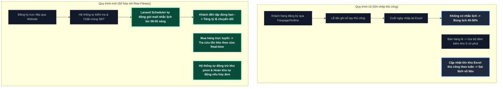
```mermaid
flowchart TD
    %% Define Styles
    classDef process fill:#111827,stroke:#374151,stroke-width:1px,color:#d1d5db;
    classDef highlight fill:#1e293b,stroke:#3b82f6,stroke-width:2px,color:#ffffff,font-weight:bold;
    classDef success fill:#064e3b,stroke:#10b981,stroke-width:2px,color:#ffffff,font-weight:bold;

    subgraph OLD_PROCESS["Quy trình cũ (Ghi chép thủ công)"]
        A1[Khách hàng đăng ký qua Fanpage/Hotline]:::process --> A2[Lễ tân ghi sổ tay thủ công]:::process
        A2 --> A3[Cuối ngày nhập lại Excel]:::process
        A3 --> A4[Không có nhắc lịch -> Bùng lịch 40-50%]:::highlight
        A5[Bán hàng lẻ -> Gọi bộ đàm kiểm kho 5-10 phút]:::process
        A6[Cập nhật tồn kho Excel thủ công theo tuần -> Sai lệch số liệu]:::highlight
    end

    subgraph NEW_PROCESS["Quy trình mới (Số hóa với Rise Fitness)"]
        B1[Đăng ký trực tiếp qua Website]:::process --> B2[Hệ thống tự kiểm tra & Chặn trùng SĐT]:::process
        B2 --> B3[Laravel Scheduler tự động gửi mail nhắc lịch lúc 08:00 sáng]:::success
        B3 --> B4[Khách đến tập đúng hẹn -> Tăng tỷ lệ chuyển đổi]:::success
        B5[Mua hàng trực tuyến -> Tra cứu tồn kho theo size Real-time]:::success
        B6[Hệ thống tự động trừ kho pivot & Hoàn kho tự động nếu hủy đơn]:::success
    end
```


##### Bảng đối sánh hiện trạng và cải tiến quy trình nghiệp vụ:

| Quy trình nghiệp vụ | Hiện trạng (Trước cải tiến) | Đề xuất cải tiến (Sau số hóa) |
| :--- | :--- | :--- |
| **1. Đăng ký & nhắc lịch tập thử** | Lễ tân ghi sổ tay và nhập Excel thủ công dễ sai lệch; tỷ lệ bùng lịch 40-50% do thiếu nhắc hẹn. | Đăng ký trực tiếp qua form web, kiểm trùng SĐT; hệ thống tự động gửi email nhắc lịch tập trước 24h. |
| **2. Bán sản phẩm & quản lý tồn kho** | Kiểm kho thủ công mất 5-10 phút; cập nhật Excel theo tuần gây lệch tồn kho biến thể size thực tế. | Tra cứu tồn kho theo size thời gian thực trên web; hệ thống tự động trừ kho/hoàn kho khi thanh toán/hủy đơn. |
| **3. Đăng ký gói tập & phân công PT** | Ghi nhận gói tập và phân PT thủ công (miệng/Zalo) dễ không đều hoặc bỏ sót học viên; khó theo dõi chỉ số sức khỏe. | Admin duyệt gói tập online, phân PT dựa trên thống kê tải công việc; học viên tự theo dõi biểu đồ BMI trực quan. |
| **4. Bảo lưu & đổi huấn luyện viên** | Học viên viết đơn giấy; Admin tính toán ngày bảo lưu thủ công dễ sai sót; chuyển đổi PT thiếu chuẩn hóa. | Gửi yêu cầu online; hệ thống tự động đóng băng và cộng dồn ngày tập; chuyển đổi PT tự động thông báo qua hệ thống. |
| **5. Hỗ trợ khách & báo cáo thống kê** | Khách liên hệ Fanpage rời rạc; báo cáo doanh thu Excel thủ công cuối tháng tốn thời gian, số liệu chậm trễ. | Tích hợp khung chatbox liên kết Telegram Webhook phản hồi nhanh; Dashboard tự động vẽ biểu đồ doanh thu real-time. |

---

### 1.2.4. Tổng hợp yêu cầu chức năng

### Bảng yêu cầu chức năng

| Mã | Tên chức năng | Mô tả | Đối tượng sử dụng | Mức ưu tiên |
|----|---------------|-------|-------------------|-------------|
| **Nhóm: Quản lý tài khoản** | | | | |
| F01 | Đăng ký tài khoản | Khách hàng đăng ký tài khoản mới với họ tên, email, mật khẩu, SĐT | Khách hàng | Cao |
| F02 | Đăng nhập / Đăng xuất | Xác thực người dùng bằng email và mật khẩu | Khách hàng, Admin | Cao |
| F03 | Quên mật khẩu | Gửi email chứa link đặt lại mật khẩu | Khách hàng | Trung bình |
| F04 | Quản lý thông tin cá nhân | Cập nhật họ tên, SĐT, địa chỉ, ảnh đại diện | Khách hàng | Trung bình |
| F05 | Quản lý tài khoản người dùng | Xem, khóa/mở khóa tài khoản khách hàng | Admin | Cao |
| **Nhóm: Quản lý sản phẩm** | | | | |
| F06 | Quản lý danh mục | Thêm, sửa, xóa danh mục sản phẩm | Admin | Cao |
| F07 | Quản lý sản phẩm | CRUD sản phẩm (tên, giá, mô tả, hình ảnh, giảm giá, số lượng tồn) | Admin | Cao |
| F08 | Quản lý kích thước (Size) | Tạo size cho sản phẩm, gán phụ phí và số lượng tồn kho riêng theo size | Admin | Cao |
| F09 | Quản lý hình ảnh sản phẩm | Upload nhiều hình ảnh cho mỗi sản phẩm | Admin | Trung bình |
| F10 | Xem danh sách sản phẩm | Hiển thị sản phẩm theo danh mục, tìm kiếm, lọc, sắp xếp | Khách hàng | Cao |
| F11 | Xem chi tiết sản phẩm | Hiển thị thông tin chi tiết, hình ảnh, giá theo size, đánh giá | Khách hàng | Cao |
| **Nhóm: Giỏ hàng & Thanh toán** | | | | |
| F12 | Giỏ hàng | Thêm, sửa số lượng, xóa sản phẩm, chọn size, tính tổng tiền | Khách hàng | Cao |
| F13 | Áp dụng mã khuyến mãi | Nhập mã khuyến mãi, kiểm tra hợp lệ, tính tiền giảm | Khách hàng | Cao |
| F14 | Thanh toán COD | Đặt hàng với hình thức thanh toán khi nhận hàng | Khách hàng | Cao |
| F15 | Thanh toán VNPay | Tích hợp cổng thanh toán VNPay, xác nhận giao dịch | Khách hàng | Cao |
| F16 | Kiểm tra tồn kho | Tự động kiểm tra số lượng tồn (theo size nếu có) trước khi tạo đơn | Hệ thống | Cao |
| **Nhóm: Quản lý đơn hàng** | | | | |
| F17 | Tạo đơn hàng | Tạo đơn hàng mới kèm chi tiết, trừ tồn kho tự động | Hệ thống | Cao |
| F18 | Xem lịch sử đơn hàng | Hiển thị danh sách đơn hàng của khách, lọc theo trạng thái | Khách hàng | Cao |
| F19 | Xem chi tiết đơn hàng | Xem thông tin chi tiết đơn hàng, sản phẩm, trạng thái | Khách hàng, Admin | Cao |
| F20 | Hủy đơn hàng | Khách hàng hủy đơn khi đang ở trạng thái "Chờ xác nhận" | Khách hàng | Trung bình |
| F21 | Cập nhật trạng thái đơn hàng | Admin thay đổi trạng thái: Chờ xác nhận → Chờ giao → Đang giao → Hoàn thành/Thất bại/Bị hủy | Admin | Cao |
| F22 | Cập nhật thông tin giao hàng | Khách sửa địa chỉ, SĐT, tên người nhận khi đơn chưa giao | Khách hàng | Trung bình |
| F23 | Mua lại đơn hàng | Tạo lại giỏ hàng từ đơn hàng cũ (đã hoàn thành/hủy/thất bại) | Khách hàng | Trung bình |
| **Nhóm: Khuyến mãi** | | | | |
| F24 | Quản lý khuyến mãi | CRUD mã khuyến mãi (loại giảm giá, giá trị, thời hạn, giới hạn lượt) | Admin | Cao |
| F25 | Kiểm tra & áp dụng mã | Kiểm tra mã hợp lệ, trong hạn, còn lượt; tính tiền giảm | Hệ thống | Cao |
| **Nhóm: Đăng ký tập thử** | | | | |
| F26 | Đăng ký tập thử | Khách điền form: họ tên, SĐT, email, cơ sở, môn, giờ, ngày mong muốn | Khách hàng | Cao |
| F27 | Kiểm tra trùng SĐT | Ngăn khách đăng ký tập thử trùng SĐT đã tồn tại | Hệ thống | Cao |
| F28 | Quản lý danh sách tập thử | Xem, lọc, thống kê danh sách đăng ký tập thử | Admin/Nhân viên | Cao |
| F29 | Xác nhận lịch tập thử | Nhân viên xác nhận đơn đăng ký, hệ thống gửi email xác nhận | Admin/Nhân viên | Cao |
| F30 | Gửi email nhắc nhở tự động | Tự động gửi email nhắc nhở trước ngày tập 1 ngày vào 8h sáng | Hệ thống | Trung bình |
| F31 | Tự động hủy đăng ký quá hạn | Hệ thống tự hủy đơn đăng ký chưa xác nhận khi ngày tập đã qua | Hệ thống | Trung bình |
| **Nhóm: Đánh giá & Bình luận** | | | | |
| F32 | Đánh giá sản phẩm | Khách hàng đã mua sản phẩm được viết đánh giá và cho điểm | Khách hàng | Trung bình |
| F33 | Xem đánh giá | Hiển thị đánh giá của các khách hàng khác trên trang chi tiết sản phẩm | Khách hàng | Trung bình |
| **Nhóm: Thống kê & Dashboard** | | | | |
| F34 | Dashboard quản trị | Hiển thị tổng quan: doanh thu, số đơn, số khách, sản phẩm bán chạy | Admin | Cao |
| F35 | Thống kê doanh thu | Biểu đồ doanh thu theo thời gian (ngày, tháng) | Admin | Trung bình |
| **Nhóm: Huấn luyện viên (PT)** | | | | |
| F36 | Dashboard PT | Xem thống kê số lượng học viên đang quản lý và thông báo mới | PT | Cao |
| F37 | Xem danh sách học viên | Xem thông tin chi tiết học viên đang được phân công phụ trách | PT | Cao |
| F38 | Cập nhật chỉ số sức khỏe | Nhập chiều cao, cân nặng, lượng mỡ, lượng nước, thói quen sống và lời khuyên; tự động tính chỉ số BMI | PT | Cao |
| F39 | Xem lịch sử chỉ số sức khỏe | Xem biểu đồ hoặc danh sách lịch sử các lần đo chỉ số sức khỏe của học viên | PT, Khách hàng | Trung bình |
| F40 | Quản lý thông báo PT | Nhận thông báo khi được phân công học viên mới hoặc thay đổi học viên; đánh dấu đã đọc | PT / Hệ thống | Trung bình |
| **Nhóm: Quản lý đổi PT & Bảo lưu** | | | | |
| F41 | Gửi yêu cầu đổi PT | Học viên gửi yêu cầu đổi PT kèm lý do (chỉ trong 7 ngày đầu kích hoạt) | Khách hàng | Trung bình |
| F42 | Phê duyệt yêu cầu đổi PT | Admin duyệt yêu cầu đổi PT và chỉ định PT mới; hệ thống gửi thông báo cho các bên | Admin | Cao |
| F43 | Gửi yêu cầu bảo lưu | Học viên gửi yêu cầu bảo lưu gói tập với số ngày và ngày bắt đầu mong muốn | Khách hàng | Trung bình |
| F44 | Phê duyệt yêu cầu bảo lưu | Admin duyệt/từ chối bảo lưu; tự động cập nhật trạng thái gói tập và tính ngày kết thúc mới | Admin | Cao |

---

### 1.2.5. Tổng hợp yêu cầu phi chức năng

| Mã | Yêu cầu | Mô tả chi tiết |
|----|----------|-----------------|
| NF01 | **Bảo mật** | Mật khẩu được mã hóa bằng bcrypt. Sử dụng CSRF token chống tấn công Cross-Site Request Forgery. Xác thực phiên đăng nhập bằng Laravel Auth |
| NF02 | **Hiệu năng** | Trang web tải trong vòng 3 giây. Truy vấn cơ sở dữ liệu được tối ưu với Eloquent ORM và index |
| NF03 | **Giao diện responsive** | Giao diện tương thích trên các thiết bị: desktop, tablet, điện thoại. Sử dụng Bootstrap/CSS responsive |
| NF04 | **Dễ sử dụng** | Giao diện trực quan, thân thiện. Thông báo lỗi rõ ràng bằng tiếng Việt. Điều hướng đơn giản |
| NF05 | **Tính sẵn sàng** | Hệ thống hoạt động 24/7, hỗ trợ nhiều người dùng truy cập đồng thời |
| NF06 | **Khả năng mở rộng** | Kiến trúc MVC cho phép thêm module mới dễ dàng. Sử dụng Repository Pattern tách biệt logic nghiệp vụ |
| NF07 | **Tính toàn vẹn dữ liệu** | Sử dụng foreign key, ràng buộc kiểu ENUM cho trạng thái. Kiểm tra dữ liệu đầu vào (validation) |
| NF08 | **Email tự động** | Hệ thống gửi email xác nhận và nhắc nhở tự động thông qua SMTP (Gmail). Lên lịch gửi bằng Laravel Scheduler |
| NF09 | **Thanh toán an toàn** | Tích hợp cổng thanh toán VNPay với xác thực chữ ký số (secure hash) |
| NF10 | **Sao lưu dữ liệu** | Cơ sở dữ liệu MySQL hỗ trợ backup định kỳ |

---

### 1.2.6. Xác định nhóm người dùng (Actor) và phân rã các luồng nghiệp vụ cốt lõi

### A. Bảng phân tích nhóm người dùng (Actor Matrix)

Hệ thống Rise Fitness được thiết kế để phân quyền và phục vụ 5 nhóm tác nhân chính, đảm bảo đáp ứng đầy đủ các luồng nghiệp vụ (mua hàng trực tuyến, đăng ký tập thử, quản lý gói tập, đổi PT và theo dõi chỉ số sức khỏe):

| STT | Nhóm người dùng | Mô tả vai trò | Quyền hạn và Chức năng chính trong hệ thống |
|:---:|---|---|---|
| 1 | **Khách vãng lai** | Người dùng chưa đăng nhập hoặc chưa có tài khoản trên hệ thống. | - Xem danh mục, tìm kiếm, lọc và xem chi tiết sản phẩm.<br>- Xem đánh giá, bình luận của các khách hàng khác.<br>- Thêm sản phẩm vào giỏ hàng, tùy chỉnh số lượng, thay đổi size sản phẩm.<br>- **Đặt hàng & Thanh toán không đăng nhập (Guest Checkout)**: Nhập thông tin trực tiếp (Họ tên, SĐT, Email, Địa chỉ, Thành phố), chọn thanh toán COD hoặc VNPay trực tuyến.<br>- **Tra cứu đơn hàng**: Xem chi tiết trạng thái đơn hàng thông qua Mã đơn hàng + SĐT tại trang trang tra cứu đơn hàng vãng lai.<br>- Đăng ký tập thử miễn phí (ngăn trùng SĐT).<br>- Đăng ký tài khoản mới. |
| 2 | **Khách hàng** | Người dùng đã đăng ký tài khoản và đăng nhập thành công. | - Kế thừa toàn bộ quyền xem và chọn sản phẩm của Khách vãng lai.<br>- **Đặt hàng & Thanh toán đã đăng nhập**: Hệ thống tự động lấy thông tin từ Profile cá nhân (có thể thay đổi địa chỉ nhận hàng).<br>- Áp dụng mã khuyến mãi (Coupon/Promo Code) vào đơn hàng.<br>- **Quản lý đơn hàng**: Xem lịch sử mua hàng, theo dõi chi tiết trạng thái đơn hàng (6 bước).<br>- **Cập nhật thông tin giao hàng** (Họ tên, SĐT, Địa chỉ) hoặc **Hủy đơn hàng** trực tiếp trên website (nếu đơn ở trạng thái "Chờ xác nhận").<br>- **Mua lại đơn cũ (Repurchase)**: Nhân bản nhanh giỏ hàng từ đơn hàng cũ chỉ bằng 1 click.<br>- **Đánh giá & Bình luận**: Cho điểm (1-5 sao) và viết đánh giá đối với các sản phẩm đã mua thành công.<br>- Đăng ký mua các gói tập dài hạn, gói tập có PT huấn luyện viên.<br>- **Yêu cầu đổi PT**: Gửi yêu cầu thay đổi PT trong vòng 7 ngày đầu kể từ lúc gói tập được kích hoạt.<br>- **Yêu cầu bảo lưu**: Gửi yêu cầu bảo lưu gói tập tạm thời.<br>- **Theo dõi sức khỏe**: Xem lịch sử các chỉ số đo đạc chiều cao, cân nặng, BMI, lượng mỡ, lượng nước và lời khuyên do PT cập nhật.<br>- Cập nhật thông tin cá nhân và thay đổi mật khẩu. |
| 3 | **Huấn luyện viên cá nhân (PT)** | Huấn luyện viên thể hình hỗ trợ và theo dõi quá trình tập luyện của học viên. | - Xem Dashboard thống kê số lượng học viên đang phụ trách và thông báo mới.<br>- Xem danh sách học viên đang được gán phụ trách tập luyện (`dang_tap`).<br>- **Cập nhật chỉ số sức khỏe**: Đo đạc và ghi nhận các thông số cơ thể (Chiều cao, Cân nặng, Lượng mỡ, Lượng nước, Thói quen sống, Nhắc nhở) cho học viên; hệ thống tự động tính toán chỉ số BMI.<br>- Xem lịch sử biến thiên chỉ số sức khỏe của học viên.<br>- Nhận thông báo hệ thống khi được phân công học viên mới hoặc khi học viên chuyển đổi sang PT khác phụ trách. |
| 4 | **Admin & Nhân viên** | Quản trị viên hệ thống và nhân viên vận hành (lễ tân, thủ kho). | - **Quản lý sản phẩm**: CRUD sản phẩm, danh mục, upload nhiều hình ảnh phụ.<br>- **Quản lý Size & Tồn kho**: Thiết lập size cho sản phẩm, gán giá cộng thêm (surcharge) và số lượng tồn kho riêng biệt theo từng size. Tự động đồng bộ số lượng tổng.<br>- **Quản lý đơn hàng**: Duyệt đơn hàng, thay đổi trạng thái đơn hàng (Chờ xác nhận → Chờ giao hàng → Đang giao hàng → Hoàn thành / Thất bại / Hủy).<br>- **Quản lý khuyến mãi**: Thiết lập mã giảm giá (giảm theo % hoặc số tiền, giới hạn lượt dùng, thời hạn sử dụng).<br>- **Quản lý tập thử**: Duyệt danh sách đăng ký tập thử, cập nhật trạng thái lịch hẹn.<br>- **Quản lý tài khoản**: Xem danh sách khách hàng, khóa/mở khóa tài khoản.<br>- **Duyệt yêu cầu đổi PT**: Xem xét lý do đổi PT của học viên và gán PT mới.<br>- **Duyệt yêu cầu bảo lưu**: Phê duyệt hoặc từ chối yêu cầu bảo lưu gói tập của học viên.<br>- **Thống kê doanh thu**: Dashboard trực quan theo dõi doanh thu theo ngày/tháng, số đơn hàng, số lượt tập thử, danh sách sản phẩm bán chạy. |
| 5 | **Hệ thống (System)** | Quy trình xử lý tự động hóa phía máy chủ (Laravel Backend & Cron Job). | - **Kiểm tra & Trừ tồn kho**: Tự động xác thực số lượng tồn thực tế của size sản phẩm khi tạo đơn, trừ kho ngay khi đặt hàng thành công.<br>- **Hoàn kho tự động**: Cộng lại tồn kho khi đơn hàng bị hủy hoặc giao thất bại.<br>- **Gửi email tự động**: Gửi hóa đơn điện tử PDF ngay sau khi đặt hàng thành công; gửi mail xác nhận lịch tập thử khi nhân viên duyệt.<br>- **Lên lịch gửi nhắc nhở (Laravel Scheduler / SMTP)**: Tự động gửi email nhắc nhở lịch tập thử trước ngày hẹn 1 ngày vào đúng **8h00 sáng** hàng ngày.<br>- **Tự động hủy lịch tập thử quá hạn**: Chuyển trạng thái các lịch tập thử quá ngày hẹn mà chưa được duyệt sang "Đã hủy".<br>- **Tự động bảo lưu & kích hoạt lại**: Chuyển đổi trạng thái gói tập sang bảo lưu hoặc tự động kích hoạt lại khi đến ngày tương ứng. |

---

##### B. Sơ đồ phân rã chức năng (Functional Decomposition Diagram - FDD)

Sơ đồ phân rã chức năng dưới đây thể hiện cấu trúc phân cấp các tính năng dành cho đối tượng **Khách hàng** và **Quản trị viên** trong hệ thống Rise Fitness:


```mermaid
graph TD
    %% Định nghĩa Style
    classDef default fill:#111827,stroke:#374151,stroke-width:1px,color:#d1d5db,font-family:Arial,font-size:12px;
    classDef root fill:#1e293b,stroke:#3b82f6,stroke-width:2px,color:#ffffff,font-size:14px,font-weight:bold;
    classDef actor fill:#1e1b4b,stroke:#6366f1,stroke-width:2px,color:#ffffff,font-size:13px,font-weight:bold;
    classDef module fill:#312e81,stroke:#818cf8,stroke-width:1.5px,color:#ffffff,font-size:12px,font-weight:bold;
    classDef leaf fill:#1f2937,stroke:#4b5563,stroke-width:1px,color:#e5e7eb,font-size:11px;

    ROOT[Website kinh doanh phòng GYM & Fitness<br/>Rise Fitness]:::root
    
    KH[Khách hàng / Khách vãng lai]:::actor
    AD[Quản trị viên]:::actor
    
    ROOT --> KH
    ROOT --> AD

    %% ================= KHÁCH HÀNG =================
    QLTK[Quản lý tài khoản]:::module
    DKTT[Đăng ký tập thử]:::module
    MGT[Mua gói tập]:::module
    MSP[Mua sản phẩm & Giỏ hàng]:::module
    DSK[Đo sức khỏe]:::module

    KH --> QLTK
    KH --> DKTT
    KH --> MGT
    KH --> MSP
    KH --> DSK

    %% Quản lý tài khoản
    QLTK_1[Đăng nhập]:::leaf
    QLTK_2[Đăng ký]:::leaf
    QLTK_3[Đặt lại mật khẩu]:::leaf
    QLTK_4[Chỉnh sửa thông tin cá nhân]:::leaf
    QLTK_5[Quên mật khẩu]:::leaf
    QLTK_6[Đăng xuất]:::leaf

    QLTK --> QLTK_1
    QLTK --> QLTK_2
    QLTK --> QLTK_3
    QLTK --> QLTK_4
    QLTK --> QLTK_5
    QLTK --> QLTK_6

    %% Đăng ký tập thử
    DKTT_1[Xem danh sách lớp học]:::leaf
    DKTT_2[Xem chi tiết thông tin lớp học]:::leaf
    DKTT_3[Đăng ký giữ chỗ lớp học]:::leaf
    DKTT_4[Đăng ký tập thử]:::leaf

    DKTT --> DKTT_1
    DKTT --> DKTT_2
    DKTT --> DKTT_3
    DKTT --> DKTT_4

    %% Mua gói tập
    MGT_1[Xem danh sách gói tập]:::leaf
    MGT_2[Xem chi tiết gói tập]:::leaf
    MGT_3[Thanh toán gói tập]:::leaf
    MGT_4[Nhận thông báo sắp hết hạn]:::leaf
    MGT_5[Gia hạn gói tập]:::leaf
    MGT_6[Xem lịch sử mua/gia hạn gói tập]:::leaf

    MGT --> MGT_1
    MGT --> MGT_2
    MGT --> MGT_3
    MGT --> MGT_4
    MGT --> MGT_5
    MGT --> MGT_6

    %% Mua sản phẩm
    MSP_1[Xem danh sách sản phẩm]:::leaf
    MSP_2[Lọc, tìm kiếm sản phẩm]:::leaf
    MSP_3[Thêm & Cập nhật giỏ hàng]:::leaf
    MSP_4[Đặt hàng nhanh Guest Checkout]:::leaf
    MSP_5[Tra cứu đơn hàng vãng lai]:::leaf

    MSP --> MSP_1
    MSP --> MSP_2
    MSP --> MSP_3
    MSP --> MSP_4
    MSP --> MSP_5

    %% Đo sức khỏe
    DSK_1[Nhập thông tin cơ thể]:::leaf
    DSK_2[Tính toán các chỉ số BMI, TDEE, BMR]:::leaf

    DSK --> DSK_1
    DSK --> DSK_2

    %% ================= QUẢN TRỊ VIÊN =================
    QLGT_AD[Quản lý gói tập]:::module
    QLDH_AD[Quản lý đơn hàng]:::module
    QLSP_AD[Quản lý sản phẩm]:::module
    QLND_AD[Quản lý người dùng]:::module
    BCTK_AD[Báo cáo thống kê]:::module

    AD --> QLGT_AD
    AD --> QLDH_AD
    AD --> QLSP_AD
    AD --> QLND_AD
    AD --> BCTK_AD

    %% Quản lý gói tập Admin
    QLGT_1[Cập nhật gói tập/Giá gói]:::leaf
    QLGT_2[Duyệt & kích hoạt hạn tập]:::leaf
    QLGT_3[Phân công Huấn luyện viên PT]:::leaf
    QLGT_AD --> QLGT_1
    QLGT_AD --> QLGT_2
    QLGT_AD --> QLGT_3

    %% Quản lý đơn hàng Admin
    QLDH_1[Xem danh sách & chi tiết đơn]:::leaf
    QLDH_2[Cập nhật trạng thái giao hàng]:::leaf
    QLDH_3[Duyệt lịch đăng ký tập thử]:::leaf
    QLDH_AD --> QLDH_1
    QLDH_AD --> QLDH_2
    QLDH_AD --> QLDH_3

    %% Quản lý sản phẩm Admin
    QLSP_1[Thêm/Sửa/Xóa sản phẩm]:::leaf
    QLSP_2[Quản lý danh mục & biến thể size]:::leaf
    QLSP_3[Cấu hình mã khuyến mãi & Freeship]:::leaf
    QLSP_AD --> QLSP_1
    QLSP_AD --> QLSP_2
    QLSP_AD --> QLSP_3

    %% Quản lý người dùng Admin
    QLND_1[Phân quyền tài khoản]:::leaf
    QLND_2[Khóa/Mở tài khoản khách]:::leaf
    QLND_3[Hệ thống Chat support tư vấn]:::leaf
    QLND_AD --> QLND_1
    QLND_AD --> QLND_2
    QLND_AD --> QLND_3

    %% Báo cáo thống kê Admin
    BCTK_1[Biểu đồ thống kê doanh thu]:::leaf
    BCTK_2[Biểu đồ thống kê đơn hàng]:::leaf
    BCTK_3[Biểu đồ thống kê lượt tập thử]:::leaf
    BCTK_AD --> BCTK_1
    BCTK_AD --> BCTK_2
    BCTK_AD --> BCTK_3
```

---

# CHƯƠNG 2. THIẾT KẾ HỆ THỐNG VÀ CƠ SỞ DỮ LIỆU

---

## 2.1. Phân tích hướng đối tượng (OOAD) & Kiến trúc hệ thống

### 2.1.1. Kiến trúc hệ thống MVC và Repository Pattern
Hệ thống áp dụng mô hình kiến trúc MVC (Model-View-Controller) cải tiến kết hợp **Repository Pattern** để phân tách rõ ràng giữa giao diện người dùng, logic nghiệp vụ và các truy vấn cơ sở dữ liệu. Điều này giúp mã nguồn của hệ thống trở nên modular, dễ bảo trì, mở rộng và kiểm thử độc lập.

### 2.1.2. Biểu đồ lớp chuẩn hóa (Class Diagram)
Hệ thống sử dụng kiến trúc MVC kết hợp với **Repository Pattern** để phân tách rõ ràng tầng xử lý logic nghiệp vụ và tầng giao diện:

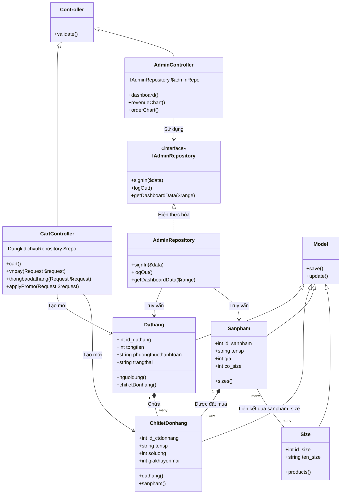
```mermaid
classDiagram
    class Controller {
        +validate()
    }
    
    class CartController {
        -DangkidichvuRepository $repo
        +cart()
        +vnpay(Request $request)
        +thongbaodathang(Request $request)
        +applyPromo(Request $request)
    }
    
    class AdminController {
        -IAdminRepository $adminRepo
        +dashboard()
        +revenueChart()
        +orderChart()
    }
    
    class IAdminRepository {
        <<interface>>
        +signIn($data)
        +logOut()
        +getDashboardData($range)
    }
    
    class AdminRepository {
        +signIn($data)
        +logOut()
        +getDashboardData($range)
    }
    
    class Model {
        +save()
        +update()
    }
    
    class Dathang {
        +int id_dathang
        +int tongtien
        +string phuongthucthanhtoan
        +string trangthai
        +nguoidung()
        +chitietDonhang()
    }
    
    class ChitietDonhang {
        +int id_ctdonhang
        +string tensp
        +int soluong
        +int giakhuyenmai
        +dathang()
        +sanpham()
    }
    
    class Sanpham {
        +int id_sanpham
        +string tensp
        +int gia
        +int co_size
        +sizes()
    }
    
    class Size {
        +int id_size
        +string ten_size
        +products()
    }

    Controller <|-- CartController
    Controller <|-- AdminController
    AdminController --> IAdminRepository : Sử dụng
    IAdminRepository <|.. AdminRepository : Hiện thực hóa
    AdminRepository --> Dathang : Truy vấn
    AdminRepository --> Sanpham : Truy vấn
    CartController --> Dathang : Tạo mới
    CartController --> ChitietDonhang : Tạo mới
    Model <|-- Dathang
    Model <|-- ChitietDonhang
    Model <|-- Sanpham
    Model <|-- Size
    Dathang "1" *-- "many" ChitietDonhang : Chứa
    Sanpham "1" *-- "many" ChitietDonhang : Được đặt mua
    Sanpham "many" -- "many" Size : Liên kết qua sanpham_size
```

---

---

## 2.2. Phân tích thiết kế ca sử dụng (UML Use Case)

### 2.2.1. Sơ đồ ca sử dụng tổng quát (General Use Case Diagram)

Sơ đồ thể hiện mối quan hệ giữa các Actor và các chức năng chính trong hệ thống:


```mermaid
graph LR
    %% Định nghĩa Actors (Tác nhân)
    Guest["Khách vãng lai"]
    Member["Khách hàng (Đã đăng nhập)"]
    PT["Huấn luyện viên (PT)"]
    Admin["Quản trị viên / Nhân viên"]
    System["Hệ thống (Laravel Backend)"]

    %% Kế thừa (Khách hàng kế thừa tất cả chức năng của Khách vãng lai)
    Member --> Guest

    subgraph "HỆ THỐNG RISE FITNESS"
        %% Nhóm Sản phẩm & Đăng ký tập thử
        subgraph "Phân hệ Tra cứu & Dịch vụ"
            UC_XemSP(("Xem & Tìm kiếm sản phẩm"))
            UC_XemDetail(("Xem chi tiết sản phẩm & Size"))
            UC_DangKyTapThu(("Đăng ký tập thử"))
            UC_TraCuuDon(("Tra cứu đơn hàng vãng lai"))
        end

        %% Nhóm Đơn hàng & Thanh toán
        subgraph "Phân hệ Đặt hàng & Hội viên"
            UC_GuestCheckout(("Đặt hàng không tài khoản"))
            UC_MemberCheckout(("Đặt hàng qua tài khoản"))
            UC_ApplyPromo(("Áp dụng mã khuyến mãi"))
            UC_ManageOrder(("Quản lý & Hủy đơn hàng"))
            UC_Repurchase(("Mua lại đơn hàng cũ"))
            UC_ReviewProduct(("Đánh giá & Bình luận sản phẩm"))
            UC_RegisterPackage(("Đăng ký gói tập"))
            UC_RequestPTChange(("Yêu cầu đổi PT"))
            UC_RequestBaoLuu(("Yêu cầu bảo lưu gói tập"))
            UC_ViewHealth(("Xem chỉ số sức khỏe (BMI)"))
        end

        %% Nhóm Huấn luyện viên (PT)
        subgraph "Phân hệ Huấn luyện viên (PT)"
            UC_PtDashboard(("Xem dashboard PT"))
            UC_PtClients(("Xem danh sách học viên"))
            UC_PtHealth(("Cập nhật chỉ số sức khỏe"))
            UC_PtNotify(("Xem & đọc thông báo"))
        end

        %% Nhóm Quản trị hệ thống
        subgraph "Phân hệ Quản trị (Admin)"
            UC_ManageProducts(("Quản lý sản phẩm & Size"))
            UC_ManageOrders(("Quản lý & Duyệt đơn hàng"))
            UC_ManagePromos(("Quản lý mã khuyến mãi"))
            UC_ApproveTrial(("Duyệt đăng ký tập thử"))
            UC_ApprovePTChange(("Duyệt yêu cầu đổi PT"))
            UC_ApproveBaoLuu(("Duyệt yêu cầu bảo lưu"))
            UC_RevenueStats(("Xem thống kê doanh thu"))
        end

        %% Nhóm Hệ thống tự động
        subgraph "Phân hệ Tự động hóa"
            UC_AutoCheckStock(("Kiểm tra & Trừ tồn kho"))
            UC_AutoReplenish(("Hoàn kho khi hủy/thất bại"))
            UC_AutoSendEmail(("Gửi email nhắc lịch & Hóa đơn"))
            UC_AutoReactivate(("Kích hoạt gói bảo lưu"))
        end
    end

    %% Liên kết Khách vãng lai với các Use Case
    Guest --- UC_XemSP
    Guest --- UC_XemDetail
    Guest --- UC_DangKyTapThu
    Guest --- UC_TraCuuDon
    Guest --- UC_GuestCheckout

    %% Liên kết Khách hàng với các Use Case chuyên biệt
    Member --- UC_MemberCheckout
    Member --- UC_ApplyPromo
    Member --- UC_ManageOrder
    Member --- UC_Repurchase
    Member --- UC_ReviewProduct
    Member --- UC_RegisterPackage
    Member --- UC_RequestPTChange
    Member --- UC_RequestBaoLuu
    Member --- UC_ViewHealth

    %% Liên kết PT với các Use Case chuyên biệt
    PT --- UC_PtDashboard
    PT --- UC_PtClients
    PT --- UC_PtHealth
    PT --- UC_PtNotify

    %% Liên kết Admin với các Use Case
    UC_ManageProducts --- Admin
    UC_ManageOrders --- Admin
    UC_ManagePromos --- Admin
    UC_ApproveTrial --- Admin
    UC_ApprovePTChange --- Admin
    UC_ApproveBaoLuu --- Admin
    UC_RevenueStats --- Admin

    %% Liên kết Hệ thống với các Use Case tự động
    UC_AutoCheckStock --- System
    UC_AutoReplenish --- System
    UC_AutoSendEmail --- System
    UC_AutoReactivate --- System

    %% Style cho các Actor
    style Guest fill:#ffebee,stroke:#c62828,stroke-width:2px;
    style Member fill:#ffebee,stroke:#c62828,stroke-width:2px;
    style PT fill:#f3e5f5,stroke:#4a148c,stroke-width:2px;
    style Admin fill:#e8eaf6,stroke:#1a237e,stroke-width:2px;
    style System fill:#e8f5e9,stroke:#1b5e20,stroke-width:2px;
```


---

### C. Phân rã và vẽ sơ đồ các luồng nghiệp vụ chi tiết

### 2.2.2. Phân rã sơ đồ ca sử dụng chi tiết và kịch bản ca sử dụng

#### 1. Luồng Mua hàng Không Đăng nhập (Guest Checkout Flow)
Luồng này dành cho Khách vãng lai muốn mua sắm trực tuyến nhanh chóng mà không cần đăng ký tài khoản. Hệ thống sử dụng Session để quản lý giỏ hàng tạm thời và ghi nhận đơn hàng với mã khách hàng (`mã khách hàng`) là `null`.

##### Sơ đồ Use Case chi tiết cho Luồng Mua hàng Không Đăng nhập:

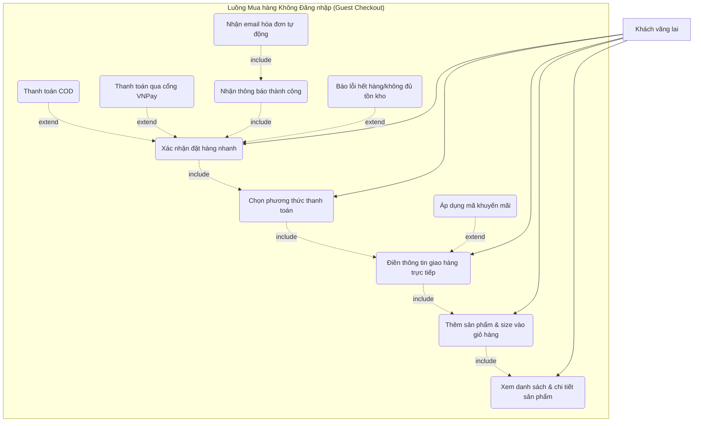
```mermaid
graph TB
    subgraph "Luồng Mua hàng Không Đăng nhập (Guest Checkout)"
        UC_Xemsp("Xem danh sách & chi tiết sản phẩm")
        UC_AddCart("Thêm sản phẩm & size vào giỏ hàng")
        UC_FillInfo("Điền thông tin giao hàng trực tiếp")
        UC_SelectPay("Chọn phương thức thanh toán")
        UC_Confirm("Xác nhận đặt hàng nhanh")
        
        UC_AddCart -.->|include| UC_Xemsp
        UC_FillInfo -.->|include| UC_AddCart
        UC_SelectPay -.->|include| UC_FillInfo
        UC_Confirm -.->|include| UC_SelectPay

        UC_Promo("Áp dụng mã khuyến mãi")
        UC_Promo -.->|extend| UC_FillInfo

        UC_COD("Thanh toán COD")
        UC_VNPay("Thanh toán qua cổng VNPay")
        UC_COD -.->|extend| UC_Confirm
        UC_VNPay -.->|extend| UC_Confirm

        UC_Notify("Nhận thông báo thành công")
        UC_Email("Nhận email hóa đơn tự động")
        UC_Notify -.->|include| UC_Confirm
        UC_Email -.->|include| UC_Notify

        UC_Error("Báo lỗi hết hàng/không đủ tồn kho")
        UC_Error -.->|extend| UC_Confirm
    end

    Guest[Khách vãng lai]
    Guest ---> UC_Xemsp
    Guest ---> UC_AddCart
    Guest ---> UC_FillInfo
    Guest ---> UC_SelectPay
    Guest ---> UC_Confirm
```


#### 2. Luồng Mua hàng Đã Đăng nhập (Member Checkout Flow)
Luồng này dành cho Khách hàng đã đăng nhập tài khoản. Hệ thống tự động liên kết đơn hàng với ID tài khoản (`mã khách hàng`), cho phép áp dụng mã khuyến mãi, tự động điền thông tin, quản lý lịch sử đơn hàng, hủy/cập nhật đơn hàng và đánh giá sản phẩm.

##### Sơ đồ Use Case chi tiết cho Luồng Mua hàng Có Đăng nhập:

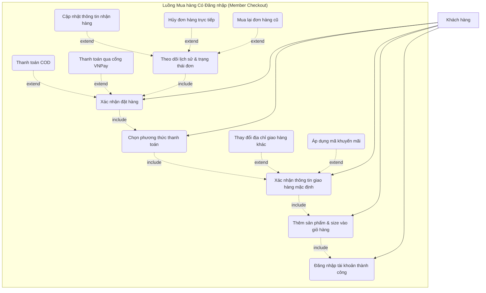
```mermaid
graph TB
    subgraph "Luồng Mua hàng Có Đăng nhập (Member Checkout)"
        UC_Login("Đăng nhập tài khoản thành công")
        UC_AddCart("Thêm sản phẩm & size vào giỏ hàng")
        UC_FillInfo("Xác nhận thông tin giao hàng mặc định")
        UC_SelectPay("Chọn phương thức thanh toán")
        UC_Confirm("Xác nhận đặt hàng")
        
        UC_AddCart -.->|include| UC_Login
        UC_FillInfo -.->|include| UC_AddCart
        UC_SelectPay -.->|include| UC_FillInfo
        UC_Confirm -.->|include| UC_SelectPay

        UC_ChangeAddr("Thay đổi địa chỉ giao hàng khác")
        UC_Promo("Áp dụng mã khuyến mãi")
        UC_ChangeAddr -.->|extend| UC_FillInfo
        UC_Promo -.->|extend| UC_FillInfo

        UC_COD("Thanh toán COD")
        UC_VNPay("Thanh toán qua cổng VNPay")
        UC_COD -.->|extend| UC_Confirm
        UC_VNPay -.->|extend| UC_Confirm

        UC_History("Theo dõi lịch sử & trạng thái đơn")
        UC_UpdateInfo("Cập nhật thông tin nhận hàng")
        UC_Cancel("Hủy đơn hàng trực tiếp")
        UC_Repurchase("Mua lại đơn hàng cũ")

        UC_History -.->|include| UC_Confirm
        UC_UpdateInfo -.->|extend| UC_History
        UC_Cancel -.->|extend| UC_History
        UC_Repurchase -.->|extend| UC_History
    end

    Member[Khách hàng]
    Member ---> UC_Login
    Member ---> UC_AddCart
    Member ---> UC_FillInfo
    Member ---> UC_SelectPay
    Member ---> UC_Confirm
```


#### 3. Luồng Đăng ký tập thử & Gửi mail nhắc lịch tự động (Trial Registration Flow)
Luồng này mô tả quá trình khách hàng đăng ký trải nghiệm phòng tập thử miễn phí, nhân viên duyệt lịch, hệ thống tự động hóa việc gửi email nhắc nhở trước ngày tập 1 ngày vào lúc 8h sáng thông qua tiến trình lập lịch Laravel Scheduler (Cron Job), và tự động hủy các đăng ký tập thử quá hạn khi truy cập danh sách.

##### Sơ đồ Use Case chi tiết cho Luồng Đăng ký tập thử & Nhắc lịch:

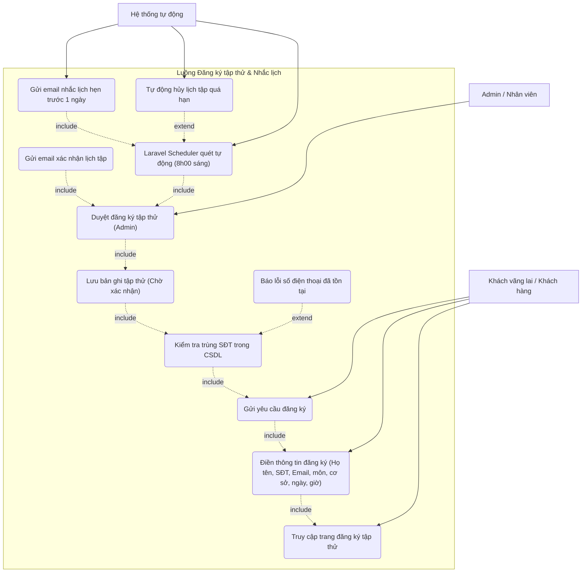
```mermaid
graph TB
    subgraph "Luồng Đăng ký tập thử & Nhắc lịch"
        UC_Access("Truy cập trang đăng ký tập thử")
        UC_FillForm("Điền thông tin đăng ký (Họ tên, SĐT, Email, môn, cơ sở, ngày, giờ)")
        UC_Submit("Gửi yêu cầu đăng ký")
        UC_CheckDup("Kiểm tra trùng SĐT trong CSDL")
        UC_SavePending("Lưu bản ghi tập thử (Chờ xác nhận)")
        
        UC_FillForm -.->|include| UC_Access
        UC_Submit -.->|include| UC_FillForm
        UC_CheckDup -.->|include| UC_Submit
        UC_SavePending -.->|include| UC_CheckDup

        UC_DupError("Báo lỗi số điện thoại đã tồn tại")
        UC_DupError -.->|extend| UC_CheckDup

        UC_Approve("Duyệt đăng ký tập thử (Admin)")
        UC_SendConfirm("Gửi email xác nhận lịch tập")
        
        UC_Approve -.->|include| UC_SavePending
        UC_SendConfirm -.->|include| UC_Approve

        UC_Scheduler("Laravel Scheduler quét tự động (8h00 sáng)")
        UC_SendReminder("Gửi email nhắc lịch hẹn trước 1 ngày")
        
        UC_Scheduler -.->|include| UC_Approve
        UC_SendReminder -.->|include| UC_Scheduler

        UC_AutoCancel("Tự động hủy lịch tập quá hạn")
        UC_AutoCancel -.->|extend| UC_Scheduler
    end

    User[Khách vãng lai / Khách hàng]
    Admin[Admin / Nhân viên]
    System[Hệ thống tự động]

    User ---> UC_Access
    User ---> UC_FillForm
    User ---> UC_Submit

    Admin ---> UC_Approve

    System ---> UC_Scheduler
    System ---> UC_SendReminder
    System ---> UC_AutoCancel
```


#### 4. Luồng Đăng ký & Kích hoạt gói tập hội viên trực tuyến (Gym Class Registration Flow)
Học viên lựa chọn gói tập, thời hạn (1, 3, 6, 12 tháng) và tùy chọn có thuê huấn luyện viên (PT) trên website. Hệ thống tự động tính toán số tiền và Admin thực hiện kích hoạt trên Dashboard sau khi xác nhận thanh toán.

##### Sơ đồ Use Case chi tiết cho Luồng Đăng ký gói tập & PT:

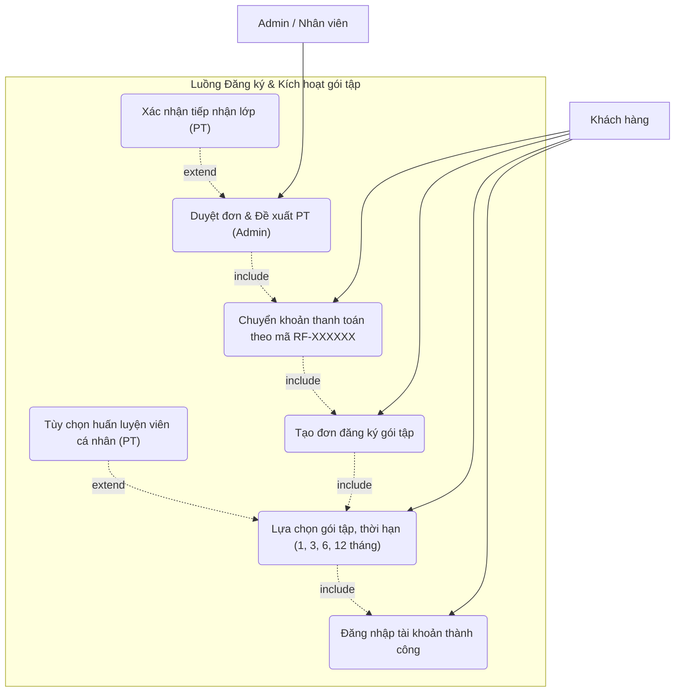
```mermaid
graph TB
    subgraph "Luồng Đăng ký & Kích hoạt gói tập"
        UC_Login("Đăng nhập tài khoản thành công")
        UC_Select("Lựa chọn gói tập, thời hạn (1, 3, 6, 12 tháng)")
        UC_HirePT("Tùy chọn huấn luyện viên cá nhân (PT)")
        UC_CreateOrder("Tạo đơn đăng ký gói tập")
        UC_Pay("Chuyển khoản thanh toán theo mã RF-XXXXXX")
        
        UC_Select -.->|include| UC_Login
        UC_HirePT -.->|extend| UC_Select
        UC_CreateOrder -.->|include| UC_Select
        UC_Pay -.->|include| UC_CreateOrder

        UC_Approve("Duyệt đơn & Đề xuất PT (Admin)")
        UC_PtConfirm("Xác nhận tiếp nhận lớp (PT)")
        
        UC_Approve -.->|include| UC_Pay
        UC_PtConfirm -.->|extend| UC_Approve
    end

    Member[Khách hàng]
    Admin[Admin / Nhân viên]

    Member ---> UC_Login
    Member ---> UC_Select
    Member ---> UC_CreateOrder
    Member ---> UC_Pay

    Admin ---> UC_Approve
```


#### 5. Luồng Yêu cầu đổi Huấn luyện viên (PT) (PT Reassignment Request Flow)
Hội viên gửi yêu cầu xin thay đổi huấn luyện viên cá nhân (PT) kèm lý do cụ thể. Admin phòng tập xem xét phê duyệt hoặc từ chối. Nếu từ chối, yêu cầu kết thúc. Nếu duyệt, Admin chọn PT mới thay thế và gửi lời mời đến PT này (trạng thái yêu cầu chuyển sang Chờ xác nhận). PT mới có quyền đồng ý nhận lớp (hoàn tất đổi PT) hoặc từ chối nhận lớp (yêu cầu chuyển về Chờ xử lý để Admin chọn PT khác).

##### Sơ đồ Use Case chi tiết cho Luồng Yêu cầu đổi PT:

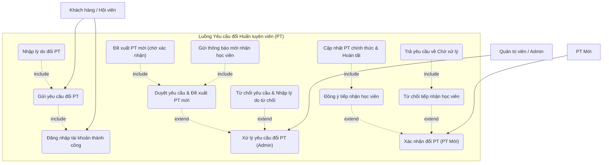
```mermaid
graph TB
    subgraph "Luồng Yêu cầu đổi Huấn luyện viên (PT)"
        UC_Login("Đăng nhập tài khoản thành công")
        UC_RequestPTChange("Gửi yêu cầu đổi PT")
        UC_InputReason("Nhập lý do đổi PT")
        
        UC_RequestPTChange -.->|include| UC_Login
        UC_InputReason -.->|include| UC_RequestPTChange

        UC_ProcessPTChange("Xử lý yêu cầu đổi PT (Admin)")
        UC_ApprovePTChange("Duyệt yêu cầu & Đề xuất PT mới")
        UC_RejectPTChange("Từ chối yêu cầu & Nhập lý do từ chối")
        
        UC_ApprovePTChange -.->|extend| UC_ProcessPTChange
        UC_RejectPTChange -.->|extend| UC_ProcessPTChange
        
        UC_ProposePT("Đề xuất PT mới (chờ xác nhận)")
        UC_NotifyProposal("Gửi thông báo mời nhận học viên")
        
        UC_ProposePT -.->|include| UC_ApprovePTChange
        UC_NotifyProposal -.->|include| UC_ApprovePTChange
        
        UC_PtAction("Xác nhận đổi PT (PT Mới)")
        UC_AcceptAssignment("Đồng ý tiếp nhận học viên")
        UC_RejectAssignment("Từ chối tiếp nhận học viên")
        
        UC_AcceptAssignment -.->|extend| UC_PtAction
        UC_RejectAssignment -.->|extend| UC_PtAction
        
        UC_FinalizeChange("Cập nhật PT chính thức & Hoàn tất")
        UC_ResetRequest("Trả yêu cầu về Chờ xử lý")
        
        UC_FinalizeChange -.->|include| UC_AcceptAssignment
        UC_ResetRequest -.->|include| UC_RejectAssignment
    end

    Member[Khách hàng / Hội viên]
    Admin[Quản trị viên / Admin]
    PT_Moi[PT Mới]

    Member ---> UC_Login
    Member ---> UC_RequestPTChange
    Admin ---> UC_ProcessPTChange
    PT_Moi ---> UC_PtAction
```


#### 6. Luồng Yêu cầu bảo lưu gói tập (Membership Suspension/Preservation Flow)
Học viên gửi đơn bảo lưu gói tập online với số ngày và ngày bắt đầu mong muốn. Admin duyệt yêu cầu sẽ tạm dừng hạn gói tập hiện tại và lưu số ngày còn lại. Hệ thống tự động kích hoạt bảo lưu và khôi phục trạng thái hoạt động ("Đang tập") của gói tập khi hết thời hạn bảo lưu mỗi khi Admin tải danh sách yêu cầu.

##### Sơ đồ Use Case chi tiết cho Luồng Yêu cầu bảo lưu gói tập:

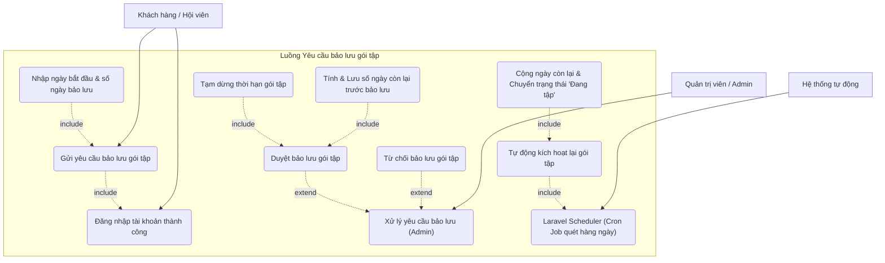
```mermaid
graph TB
    subgraph "Luồng Yêu cầu bảo lưu gói tập"
        UC_Login("Đăng nhập tài khoản thành công")
        UC_RequestPreserve("Gửi yêu cầu bảo lưu gói tập")
        UC_InputPreserveDetails("Nhập ngày bắt đầu & số ngày bảo lưu")
        
        UC_RequestPreserve -.->|include| UC_Login
        UC_InputPreserveDetails -.->|include| UC_RequestPreserve

        UC_ProcessPreserve("Xử lý yêu cầu bảo lưu (Admin)")
        UC_ApprovePreserve("Duyệt bảo lưu gói tập")
        UC_RejectPreserve("Từ chối bảo lưu gói tập")
        
        UC_ApprovePreserve -.->|extend| UC_ProcessPreserve
        UC_RejectPreserve -.->|extend| UC_ProcessPreserve
        
        UC_PausePackage("Tạm dừng thời hạn gói tập")
        UC_CalculateDays("Tính & Lưu số ngày còn lại trước bảo lưu")
        
        UC_PausePackage -.->|include| UC_ApprovePreserve
        UC_CalculateDays -.->|include| UC_ApprovePreserve
        
        UC_Scheduler("Laravel Scheduler (Cron Job quét hàng ngày)")
        UC_AutoReactivate("Tự động kích hoạt lại gói tập")
        UC_ResumePackage("Cộng ngày còn lại & Chuyển trạng thái 'Đang tập'")
        
        UC_AutoReactivate -.->|include| UC_Scheduler
        UC_ResumePackage -.->|include| UC_AutoReactivate
    end

    Member[Khách hàng / Hội viên]
    Admin[Quản trị viên / Admin]
    System[Hệ thống tự động]

    Member ---> UC_Login
    Member ---> UC_RequestPreserve
    
    Admin ---> UC_ProcessPreserve
    System ---> UC_Scheduler
```


#### 7. Luồng Đánh giá sản phẩm đã qua mua hàng (Verified Review Flow)
Hệ thống xác thực quyền đánh giá của khách hàng, đảm bảo chỉ những tài khoản đã mua sản phẩm đó và đơn hàng đã ở trạng thái "Hoàn thành" mới có quyền bình luận và cho điểm đánh giá sản phẩm. Nội dung đánh giá được kiểm duyệt qua bộ lọc từ cấm.

##### Sơ đồ Use Case chi tiết cho Luồng Đánh giá sản phẩm:

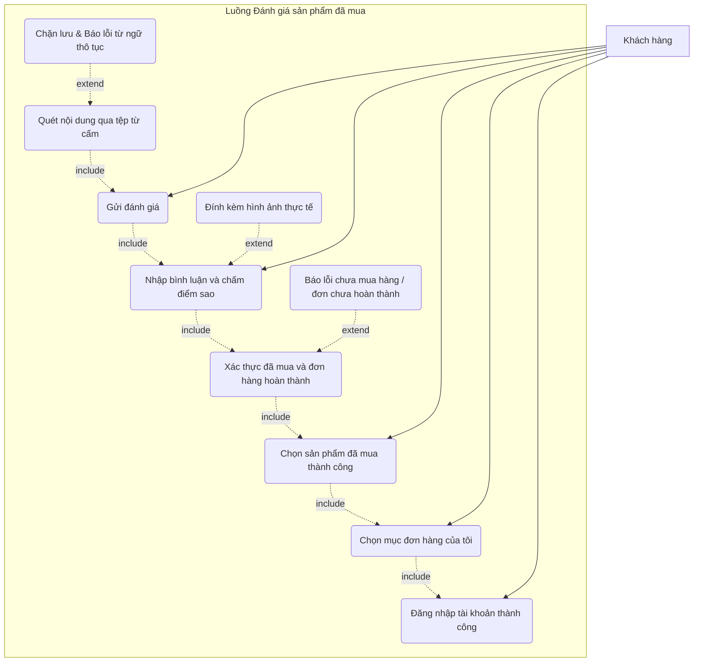
```mermaid
graph TB
    subgraph "Luồng Đánh giá sản phẩm đã mua"
        UC_Login("Đăng nhập tài khoản thành công")
        UC_Orders("Chọn mục đơn hàng của tôi")
        UC_SelectProd("Chọn sản phẩm đã mua thành công")
        UC_CheckBought("Xác thực đã mua và đơn hàng hoàn thành")
        UC_Write("Nhập bình luận và chấm điểm sao")
        UC_Submit("Gửi đánh giá")
        
        UC_Orders -.->|include| UC_Login
        UC_SelectProd -.->|include| UC_Orders
        UC_CheckBought -.->|include| UC_SelectProd
        UC_Write -.->|include| UC_CheckBought
        UC_Submit -.->|include| UC_Write
 
        UC_Attach("Đính kèm hình ảnh thực tế")
        UC_Attach -.->|extend| UC_Write
 
        UC_NotBought("Báo lỗi chưa mua hàng / đơn chưa hoàn thành")
        UC_NotBought -.->|extend| UC_CheckBought
 
        UC_Filter("Quét nội dung qua tệp từ cấm")
        UC_CensorError("Chặn lưu & Báo lỗi từ ngữ thô tục")
        
        UC_Filter -.->|include| UC_Submit
        UC_CensorError -.->|extend| UC_Filter
    end

    Member[Khách hàng]
    Member ---> UC_Login
    Member ---> UC_Orders
    Member ---> UC_SelectProd
    Member ---> UC_Write
    Member ---> UC_Submit
```


#### 8. Luồng Chat support trực tuyến thời gian thực (Real-time Live Chat Flow)
Người dùng gửi tin nhắn để nhận hỗ trợ trực tiếp từ ban quản lý phòng tập. Các tin nhắn được đồng bộ thời gian thực để nâng cao trải nghiệm chăm sóc khách hàng.

##### Sơ đồ Use Case chi tiết cho Luồng Chat Support trực tuyến:

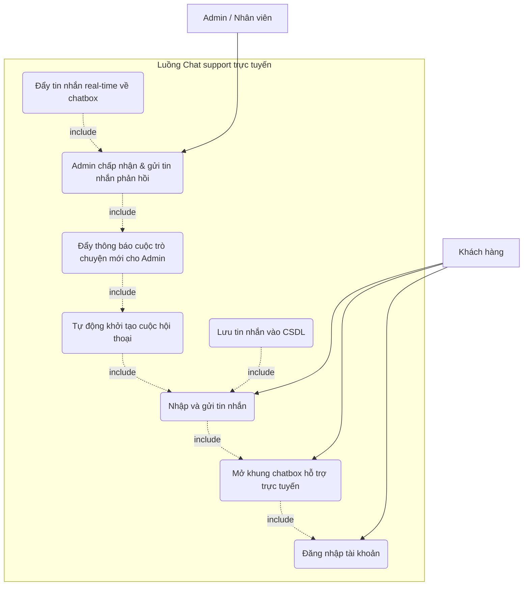
```mermaid
graph TB
    subgraph "Luồng Chat support trực tuyến"
        UC_Login("Đăng nhập tài khoản")
        UC_OpenChat("Mở khung chatbox hỗ trợ trực tuyến")
        UC_Send("Nhập và gửi tin nhắn")
        UC_Init("Tự động khởi tạo cuộc hội thoại")
        UC_SaveMsg("Lưu tin nhắn vào CSDL")
        
        UC_OpenChat -.->|include| UC_Login
        UC_Send -.->|include| UC_OpenChat
        UC_Init -.->|include| UC_Send
        UC_SaveMsg -.->|include| UC_Send
 
        UC_Notify("Đẩy thông báo cuộc trò chuyện mới cho Admin")
        UC_Reply("Admin chấp nhận & gửi tin nhắn phản hồi")
        UC_PushRealtime("Đẩy tin nhắn real-time về chatbox")
        
        UC_Notify -.->|include| UC_Init
        UC_Reply -.->|include| UC_Notify
        UC_PushRealtime -.->|include| UC_Reply
    end

    Member[Khách hàng]
    Admin[Admin / Nhân viên]

    Member ---> UC_Login
    Member ---> UC_OpenChat
    Member ---> UC_Send
 
    Admin ---> UC_Reply
```


---


#### 9. Luồng Huấn luyện viên PT cập nhật chỉ số sức khỏe học viên (Personal Trainer Health Metrics Update Flow)

##### Sơ đồ Use Case chi tiết cho Luồng PT cập nhật chỉ số sức khỏe:
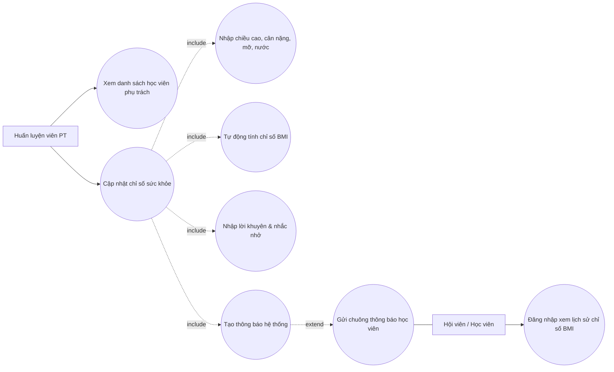
```mermaid
graph LR
    Actor_PT[Huấn luyện viên PT]
    Actor_Member[Hội viên / Học viên]

    Actor_PT --> UC_ViewClients((Xem danh sách học viên phụ trách))
    Actor_PT --> UC_UpdateHealth((Cập nhật chỉ số sức khỏe))
    
    UC_UpdateHealth -.->|include| UC_InputMetrics((Nhập chiều cao, cân nặng, mỡ, nước))
    UC_UpdateHealth -.->|include| UC_CalculateBMI((Tự động tính chỉ số BMI))
    UC_UpdateHealth -.->|include| UC_GiveAdvice((Nhập lời khuyên & nhắc nhở))
    
    UC_UpdateHealth -.->|include| UC_CreateSystemNotif((Tạo thông báo hệ thống))
    
    UC_CreateSystemNotif -.->|extend| UC_MemberNotify((Gửi chuông thông báo học viên))
    UC_MemberNotify --- Actor_Member
    
    Actor_Member --> UC_ViewHealthHistory((Đăng nhập xem lịch sử chỉ số BMI))
```

##### Kịch bản ca sử dụng (Use Case Scenario) cho Luồng PT cập nhật chỉ số sức khỏe:
* **Tác nhân chính**: Huấn luyện viên PT, Hội viên/Học viên.
* **Mục tiêu**: Huấn luyện viên PT đo đạc và ghi nhận các thông số thể trạng cơ thể học viên vào hệ thống, tự động tính toán BMI và gửi thông báo cập nhật cho học viên.
* **Tiền điều kiện**: Huấn luyện viên PT đã đăng nhập vào tài khoản cá nhân và đang phụ trách học viên tương ứng trong trạng thái "Đang tập".
* **Kịch bản chính (Luồng sự kiện chính)**:
  1. Huấn luyện viên PT truy cập vào trang "Danh sách học viên" để xem danh sách học viên đang quản lý.
  2. Huấn luyện viên chọn học viên cần cập nhật và nhấn nút "Cập nhật chỉ số".
  3. Hệ thống hiển thị biểu mẫu cập nhật bao gồm: Ngày ghi nhận, Chiều cao (cm), Cân nặng (kg), Lượng mỡ (%), Lượng nước (%), Nhận xét thói quen sống, và Nhắc nhở/Lời khuyên luyện tập.
  4. Huấn luyện viên điền thông tin và nhấn nút "Lưu chỉ số".
  5. Hệ thống xác thực dữ liệu đầu vào, tự động tính toán chỉ số khối cơ thể (BMI) theo công thức: Cân nặng / (Chiều cao/100)^2.
  6. Hệ thống lưu bản ghi mới vào cơ sở dữ liệu và tự động khởi tạo thông báo hệ thống gửi tới tài khoản học viên.
  7. Học viên đăng nhập vào hệ thống, nhận thông báo tại biểu tượng chuông và xem lịch sử biểu đồ chỉ số sức khỏe của mình.
* **Các luồng ngoại lệ**:
  * *Ngoại lệ 5a*: Ngày ghi nhận được chọn là ngày trong tương lai -> Hệ thống hiển thị thông báo lỗi: "Ngày ghi nhận không được vượt quá ngày hiện tại." và giữ nguyên dữ liệu trong biểu mẫu.
  * *Ngoại lệ 5b*: Dữ liệu chiều cao hoặc cân nặng nhập sai định dạng hoặc nằm ngoài khoảng thực tế (ví dụ: Chiều cao < 50cm hoặc > 300cm) -> Hệ thống báo lỗi và yêu cầu nhập lại thông tin hợp lệ.


---

## 2.3. Thiết kế quy trình nghiệp vụ (BPMN) và biểu đồ tuần tự (Sequence Diagram)

### 2.3.1. Sơ đồ hoạt động chuẩn BPMN (Activity Diagram - BPMN Swimlane Model)
Các biểu đồ hoạt động theo chuẩn BPMN 2.0 phân làn nghiệp vụ (Swimlanes) thể hiện quy trình phối hợp hoạt động giữa Khách hàng, Hệ thống Rise Fitness, các tác nhân liên quan (Cổng thanh toán, PT, Thủ kho) cho tất cả các luồng nghiệp vụ chính của hệ thống:

#### 1. Quy trình Đặt hàng và Thanh toán trực tuyến (COD & VNPay)
Thể hiện sự phối hợp đặt mua sản phẩm giữa Khách hàng, Hệ thống, Cổng VNPay và Bộ phận Kho:

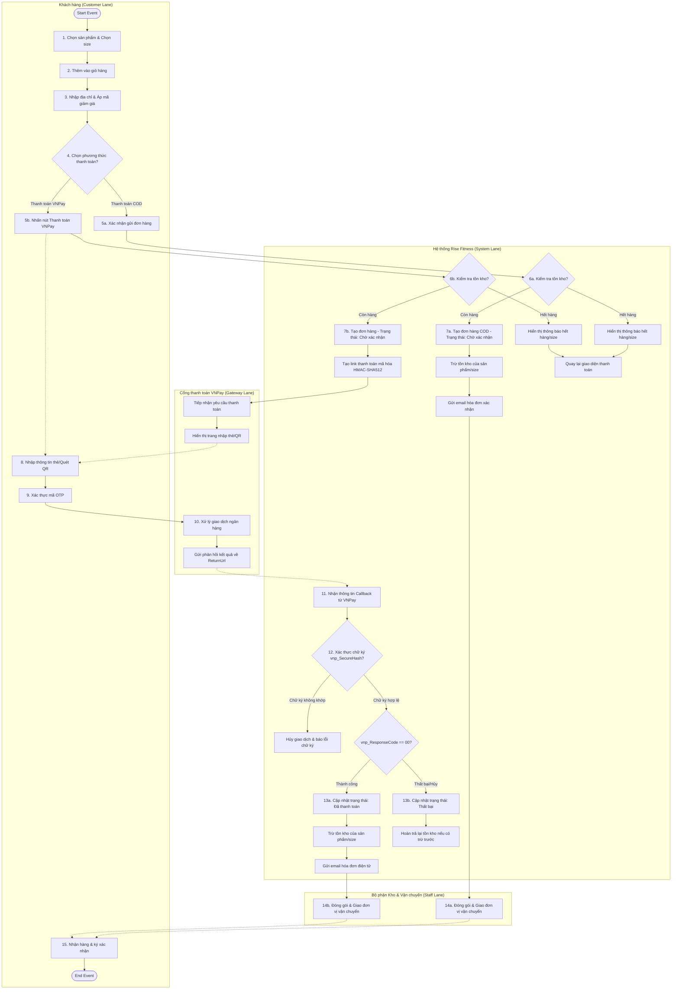
```mermaid
graph TB
    subgraph KhachHang ["Khách hàng (Customer Lane)"]
        Start([Start Event]) --> ChonSp[1. Chọn sản phẩm & Chọn size]
        ChonSp --> ThemGio[2. Thêm vào giỏ hàng]
        ThemGio --> NhapInfo[3. Nhập địa chỉ & Áp mã giảm giá]
        NhapInfo --> ChonPT{4. Chọn phương thức thanh toán?}
        
        ChonPT -->|Thanh toán COD| GuiDon[5a. Xác nhận gửi đơn hàng]
        ChonPT -->|Thanh toán VNPay| ClickVNPay[5b. Nhấn nút Thanh toán VNPay]
        
        ClickVNPay -.-> NhapThongTinThe[8. Nhập thông tin thẻ/Quét QR]
        NhapThongTinThe --> XacNhanOTP[9. Xác thực mã OTP]
        
        NhanHang[15. Nhận hàng & ký xác nhận] --> EndEvent([End Event])
    end

    subgraph HeThong ["Hệ thống Rise Fitness (System Lane)"]
        GuiDon --> KiemTraKhoCOD{6a. Kiểm tra tồn kho?}
        KiemTraKhoCOD -->|Hết hàng| BaoLoiCOD[Hiển thị thông báo hết hàng/size]
        KiemTraKhoCOD -->|Còn hàng| TaoDonCOD[7a. Tạo đơn hàng COD - Trạng thái: Chờ xác nhận]
        TaoDonCOD --> TruKhoCOD[Trừ tồn kho của sản phẩm/size]
        TruKhoCOD --> GuiMailCOD[Gửi email hóa đơn xác nhận]
        
        ClickVNPay --> KiemTraKhoVN{6b. Kiểm tra tồn kho?}
        KiemTraKhoVN -->|Hết hàng| BaoLoiVN[Hiển thị thông báo hết hàng/size]
        KiemTraKhoVN -->|Còn hàng| TaoDonVN[7b. Tạo đơn hàng - Trạng thái: Chờ xác nhận]
        TaoDonVN --> TaoLink[Tạo link thanh toán mã hóa HMAC-SHA512]
        
        UrlCallback[11. Nhận thông tin Callback từ VNPay] --> VerifyHash{12. Xác thực chữ ký vnp_SecureHash?}
        VerifyHash -->|Chữ ký không khớp| CancelDon[Hủy giao dịch & báo lỗi chữ ký]
        VerifyHash -->|Chữ ký hợp lệ| CheckStatus{vnp_ResponseCode == 00?}
        
        CheckStatus -->|Thành công| CapNhatPaid[13a. Cập nhật trạng thái: Đã thanh toán]
        CheckStatus -->|Thất bại/Hủy| CapNhatFail[13b. Cập nhật trạng thái: Thất bại]
        
        CapNhatPaid --> TruKhoVN[Trừ tồn kho của sản phẩm/size]
        TruKhoVN --> GuiMailVN[Gửi email hóa đơn điện tử]
        
        CapNhatFail --> HoanKho[Hoàn trả lại tồn kho nếu có trừ trước]
        
        BaoLoiCOD --> HienThiLaiCheckout[Quay lại giao diện thanh toán]
        BaoLoiVN --> HienThiLaiCheckout
    end

    subgraph CongVNPay ["Cổng thanh toán VNPay (Gateway Lane)"]
        TaoLink --> NhanYeuCau[Tiếp nhận yêu cầu thanh toán]
        NhanYeuCau --> HienThiThanhToan[Hiển thị trang nhập thẻ/QR]
        HienThiThanhToan -.-> NhapThongTinThe
        XacNhanOTP --> XuLyGiaoDich[10. Xử lý giao dịch ngân hàng]
        XuLyGiaoDich --> RedirectBack[Gửi phản hồi kết quả về ReturnUrl]
        RedirectBack -.-> UrlCallback
    end

    subgraph BoPhanKho ["Bộ phận Kho & Vận chuyển (Staff Lane)"]
        GuiMailCOD --> ChuyenGiaoHangCOD[14a. Đóng gói & Giao đơn vị vận chuyển]
        ChuyenGiaoHangCOD -.-> NhanHang
        GuiMailVN --> ChuyenGiaoHangVN[14b. Đóng gói & Giao đơn vị vận chuyển]
        ChuyenGiaoHangVN -.-> NhanHang
    end
```

#### 2. Quy trình Đăng ký tập thử & Gửi mail nhắc lịch tự động
Thể hiện sự phối hợp đăng ký tập thử giữa Khách hàng, Nhân viên lễ tân và Tiến trình tự động của hệ thống:

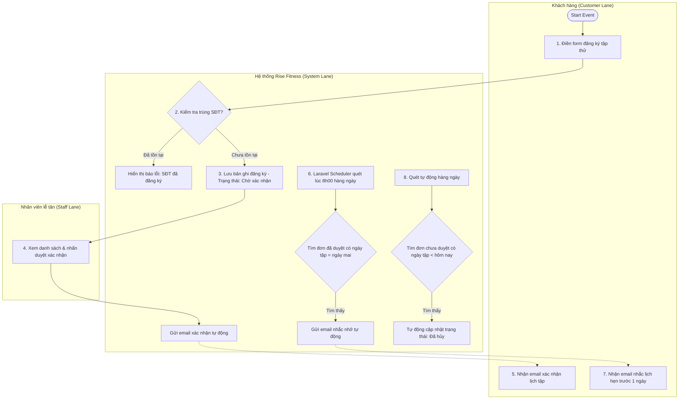
```mermaid
graph TB
    subgraph KhachHang2 ["Khách hàng (Customer Lane)"]
        Start2([Start Event]) --> DienForm[1. Điền form đăng ký tập thử]
        NhanMailXacNhan[5. Nhận email xác nhận lịch tập]
        NhanMailNhacNhan[7. Nhận email nhắc lịch hẹn trước 1 ngày]
    end

    subgraph HeThong2 ["Hệ thống Rise Fitness (System Lane)"]
        DienForm --> KiemTraTrung{2. Kiểm tra trùng SĐT?}
        KiemTraTrung -->|Đã tồn tại| BaoLoiTrung[Hiển thị báo lỗi: SĐT đã đăng ký]
        KiemTraTrung -->|Chưa tồn tại| LuuPending[3. Lưu bản ghi đăng ký - Trạng thái: Chờ xác nhận]
        
        SendMailAction[Gửi email xác nhận tự động] -.-> NhanMailXacNhan
        
        CronJob[6. Laravel Scheduler quét lúc 8h00 hàng ngày] --> CheckNgayTap{Tìm đơn đã duyệt có ngày tập = ngày mai}
        CheckNgayTap -->|Tìm thấy| SendMailReminder[Gửi email nhắc nhở tự động]
        SendMailReminder -.-> NhanMailNhacNhan
        
        CronJob2[8. Quét tự động hàng ngày] --> CheckQuaHan{Tìm đơn chưa duyệt có ngày tập < hôm nay}
        CheckQuaHan -->|Tìm thấy| AutoCancelJob[Tự động cập nhật trạng thái: Đã hủy]
    end

    subgraph NhanVien2 ["Nhân viên lễ tân (Staff Lane)"]
        LuuPending --> DuyetTrial[4. Xem danh sách & nhấn duyệt xác nhận]
        DuyetTrial --> SendMailAction
    end
```

#### 3. Quy trình Đăng ký gói tập, đổi PT và bảo lưu gói tập
Thể hiện quy trình đăng ký gói hội viên, yêu cầu đổi PT huấn luyện và bảo lưu gói tập giữa Khách hàng, Admin, PT và Hệ thống tự động:

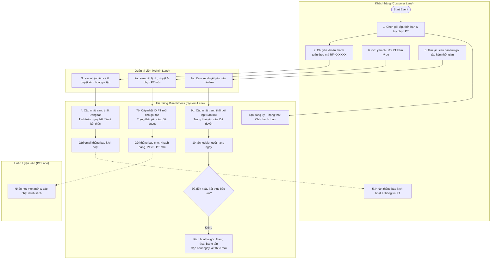
```mermaid
graph TB
    subgraph KhachHang3 ["Khách hàng (Customer Lane)"]
        Start3([Start Event]) --> DangKyGoi[1. Chọn gói tập, thời hạn & tùy chọn PT]
        DangKyGoi --> CKThanhToan[2. Chuyển khoản thanh toán theo mã RF-XXXXXX]
        NhanKichHoat[5. Nhận thông báo kích hoạt & thông tin PT]
        
        YeuCauDoiPT[6. Gửi yêu cầu đổi PT kèm lý do]
        YeuCauBaoLuu[8. Gửi yêu cầu bảo lưu gói tập kèm thời gian]
    end

    subgraph HeThong3 ["Hệ thống Rise Fitness (System Lane)"]
        DangKyGoi --> TinhTien[Tạo đăng ký - Trạng thái: Chờ thanh toán]
        
        KichHoatSuccess[4. Cập nhật trạng thái: Đang tập<br>Tính toán ngày bắt đầu & kết thúc]
        KichHoatSuccess --> SendMailActive[Gửi email thông báo kích hoạt]
        SendMailActive -.-> NhanKichHoat
        
        UpdatePT[7b. Cập nhật ID PT mới cho gói tập<br>Trạng thái yêu cầu: Đã duyệt]
        UpdatePT --> NotifyParties[Gửi thông báo cho: Khách hàng, PT cũ, PT mới]
        
        UpdateBaoLuu[9b. Cập nhật trạng thái gói tập: Bảo lưu<br>Trạng thái yêu cầu: Đã duyệt]
        UpdateBaoLuu --> AutoCronBaoLuu[10. Scheduler quét hàng ngày]
        AutoCronBaoLuu --> CheckEndBaoLuu{Đã đến ngày kết thúc bảo lưu?}
        CheckEndBaoLuu -->|Đúng| ReactivateGoi[Kích hoạt lại gói: Trạng thái: Đang tập<br>Cập nhật ngày kết thúc mới]
    end

    subgraph Admin3 ["Quản trị viên (Admin Lane)"]
        CKThanhToan --> DuyetThanhToan[3. Xác nhận tiền về & duyệt kích hoạt gói tập]
        DuyetThanhToan --> KichHoatSuccess
        
        YeuCauDoiPT --> DuyetDoiPT[7a. Xem xét lý do, duyệt & chọn PT mới]
        DuyetDoiPT --> UpdatePT
        
        YeuCauBaoLuu --> DuyetBaoLuu[9a. Xem xét duyệt yêu cầu bảo lưu]
        DuyetBaoLuu --> UpdateBaoLuu
    end

    subgraph PtLane3 ["Huấn luyện viên (PT Lane)"]
        NotifyParties -.-> PtReceive[Nhận học viên mới & cập nhật danh sách]
    end
```

#### 4. Quy trình PT cập nhật chỉ số sức khỏe học viên
Thể hiện sự tương tác nghiệp vụ đo đạc chỉ số cơ thể giữa PT, Hệ thống và Khách hàng:

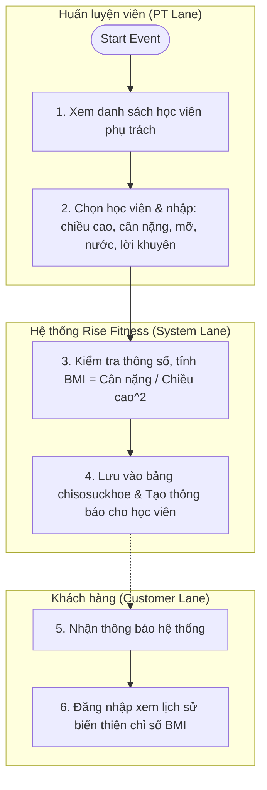
```mermaid
graph TB
    subgraph KhachHang4 ["Khách hàng (Customer Lane)"]
        NhanNotifHealth[5. Nhận thông báo hệ thống]
        NhanNotifHealth --> XemChiSoHistory[6. Đăng nhập xem lịch sử biến thiên chỉ số BMI]
    end

    subgraph HeThong4 ["Hệ thống Rise Fitness (System Lane)"]
        LuuChiSo[3. Kiểm tra thông số, tính BMI = Cân nặng / Chiều cao^2]
        LuuChiSo --> SaveToDB[4. Lưu vào bảng chisosuckhoe & Tạo thông báo cho học viên]
        SaveToDB -.-> NhanNotifHealth
    end

    subgraph PtLane4 ["Huấn luyện viên (PT Lane)"]
        Start4([Start Event]) --> ViewClients[1. Xem danh sách học viên phụ trách]
        ViewClients --> InputHealth[2. Chọn học viên & nhập: chiều cao, cân nặng, mỡ, nước, lời khuyên]
        InputHealth --> LuuChiSo
    end
```

#### 5. Quy trình Đánh giá sản phẩm và Quét từ cấm
Thể hiện quy trình phản hồi, gửi bình luận và kiểm duyệt từ cấm tự động trong hệ thống:

```mermaid
graph TB
    subgraph KhachHang5 ["Khách hàng (Customer Lane)"]
        Start5([Start Event]) --> VietComment[1. Nhập bình luận, rating & tải ảnh]
        VietComment --> NhanKetQua{Nhận phản hồi?}
        NhanKetQua -->|Thành công| End5([Xem đánh giá hiển thị])
        NhanKetQua -->|Thất bại| End5_Fail([Xem thông báo lỗi])
    end

    subgraph HeThong5 ["Hệ thống Rise Fitness (System Lane)"]
        VietComment --> CheckPurchase{2. Đã mua sản phẩm này?}
        CheckPurchase -->|Chưa/Chưa hoàn thành| RejectNoPurchase[Báo lỗi: Chỉ được đánh giá sau khi mua hàng]
        RejectNoPurchase -.-> NhanKetQua
        
        CheckPurchase -->|Đã mua thành công| FilterProfanity{3. Quét từ cấm qua dstucam.txt?}
        FilterProfanity -->|Chứa từ cấm| RejectProfanity[Báo lỗi: Vi phạm tiêu chuẩn từ ngữ]
        RejectProfanity -.-> NhanKetQua
        
        FilterProfanity -->|Hợp lệ| SaveComment[4. Tạo bản ghi bình luận mới]
        SaveComment --> UpdateRating[5. Tính lại điểm trung bình sản phẩm]
    end

    subgraph Database5 ["Cơ sở dữ liệu (Database Lane)"]
        CheckPurchase <=>|Truy vấn đơn hàng thành công| DB_Orders[(Bảng dathang & chitiet_donhang)]
        SaveComment --> DB_Comments[(Bảng comments)]
        UpdateRating --> DB_Products[(Bảng sanpham)]
        DB_Comments -.-> NhanKetQua
    end
```

#### 6. Quy trình Chatbox hỗ trợ trực tuyến
Thể hiện quy trình giao tiếp thời gian thực kết nối khách hàng với nhân viên hỗ trợ trực tiếp:

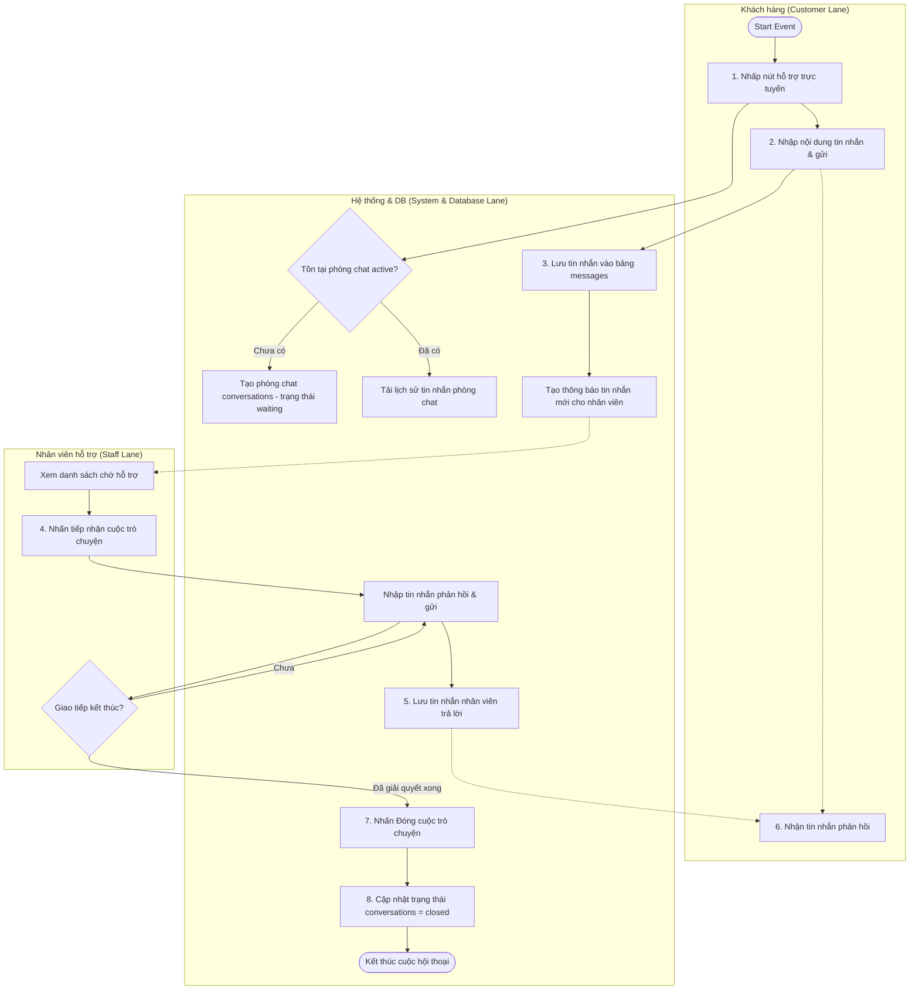
```mermaid
graph TB
    subgraph KhachHang6 ["Khách hàng (Customer Lane)"]
        Start6([Start Event]) --> MoChat[1. Nhấp nút hỗ trợ trực tuyến]
        MoChat --> GuiTinKhach[2. Nhập nội dung tin nhắn & gửi]
        GuiTinKhach -.-> NhanTinTraLoi[6. Nhận tin nhắn phản hồi]
    end

    subgraph HeThong6 ["Hệ thống & DB (System & Database Lane)"]
        MoChat --> CheckActiveRoom{Tồn tại phòng chat active?}
        CheckActiveRoom -->|Chưa có| TaoPhong[Tạo phòng chat conversations - trạng thái waiting]
        CheckActiveRoom -->|Đã có| LayPhong[Tải lịch sử tin nhắn phòng chat]
        
        GuiTinKhach --> LuuTinKhach[3. Lưu tin nhắn vào bảng messages]
        LuuTinKhach --> NotifyStaff[Tạo thông báo tin nhắn mới cho nhân viên]
        
        GuiTinStaff --> LuuTinStaff[5. Lưu tin nhắn nhân viên trả lời]
        LuuTinStaff -.-> NhanTinTraLoi
        
        DongPhong --> UpdateChatStatus[8. Cập nhật trạng thái conversations = closed]
        UpdateChatStatus --> End6([Kết thúc cuộc hội thoại])
    end

    subgraph NhanVien6 ["Nhân viên hỗ trợ (Staff Lane)"]
        NotifyStaff -.-> ViewChatQueue[Xem danh sách chờ hỗ trợ]
        ViewChatQueue --> TiepNhan[4. Nhấn tiếp nhận cuộc trò chuyện]
        TiepNhan --> GuiTinStaff[Nhập tin nhắn phản hồi & gửi]
        GuiTinStaff --> XemGiaoTiep{Giao tiếp kết thúc?}
        XemGiaoTiep -->|Chưa| GuiTinStaff
        XemGiaoTiep -->|Đã giải quyết xong| DongPhong[7. Nhấn Đóng cuộc trò chuyện]
    end
```

---

### 2.3.2. Thiết kế biểu đồ tuần tự (Sequence Diagram)

##### 1. Luồng Mua hàng Không Đăng nhập (Guest Checkout Flow)
```mermaid
sequenceDiagram
    autonumber
    actor Guest as Khách vãng lai
    participant Web as Giao diện Website
    participant Controller as Bộ điều khiển giỏ hàng
    participant DB as Cơ sở dữ liệu (MySQL)
    participant VNPay as Cổng VNPay
    participant Email as Hệ thống Mail (SMTP)

    Guest->>Web: Chọn sản phẩm & chọn size
    Web->>Controller: Thêm vào giỏ hàng (Session)
    Guest->>Web: Vào Giỏ hàng -> Tiến hành thanh toán
    Web-->>Guest: Hiển thị Form thông tin nhận hàng
    Note over Guest, Web: Điền: Họ tên, Email, SĐT, Địa chỉ, Thành phố
    Guest->>Web: Nhập thông tin & chọn PTTT (COD hoặc VNPay)
    Guest->>Web: Nhấn "Đặt hàng"
    Web->>Controller: Gửi request xử lý đơn hàng / phương thức thanh toán VNPay
    
    rect rgb(240, 240, 240)
        Note over Controller: Xác thực thông tin đầu vào & kiểm tra tồn kho theo size
        Controller->>DB: Truy vấn số lượng tồn kho thực tế
        alt Không đủ tồn kho
            DB-->>Controller: Trả về số lượng tồn kho hiện tại
            Controller-->>Web: Trả về thông báo lỗi "Sản phẩm không đủ tồn kho"
            Web-->>Guest: Hiển thị cảnh báo và dừng giao dịch
        else Đủ tồn kho
            Controller->>DB: Trừ số lượng tồn kho (sản phẩm/size)
        end
    end

    alt Chọn thanh toán COD
        Controller->>DB: Tạo đơn hàng mới (không cần đăng nhập tài khoản, trạng thái: Chờ xác nhận)
        Controller->>Email: Kích hoạt gửi email hóa đơn
        Email-->>Guest: Gửi email hóa đơn điện tử tự động
        Controller-->>Web: Redirect về trang Thông báo đặt hàng thành công
        Web-->>Guest: Hiển thị mã đơn hàng (Ví dụ: RF-123456) & lời cảm ơn
    else Chọn thanh toán VNPay
        Controller->>VNPay: Gửi request tạo URL thanh toán (kèm checksum bảo mật)
        VNPay-->>Web: Redirect sang trang thanh toán VNPay
        Web-->>Guest: Hiển thị giao diện quét mã QR/Thẻ ngân hàng
        Guest->>VNPay: Thực hiện chuyển khoản/thanh toán thành công
        VNPay->>Controller: Trả về kết quả giao dịch (IPN / Return URL kèm Secure Hash)
        Note over Controller: Kiểm tra tính toàn vẹn chữ ký số chữ ký bảo mật thanh toán
        alt Giao dịch hợp lệ & thành công
            Controller->>DB: Tạo đơn hàng (không cần đăng nhập tài khoản, trạng thái: Chờ giao hàng, đã thanh toán)
            Controller->>Email: Kích hoạt gửi email hóa đơn
            Email-->>Guest: Gửi email hóa đơn điện tử tự động
            Controller-->>Web: Redirect về trang Thông báo đặt hàng thành công
            Web-->>Guest: Hiển thị thông tin thanh toán thành công
        else Giao dịch thất bại / hủy
            Controller->>DB: Hoàn lại tồn kho
            Controller-->>Web: Redirect về trang thanh toán kèm thông báo lỗi
            Web-->>Guest: Báo lỗi thanh toán thất bại
        end
    end

    Note over Guest, Web: Tra cứu đơn hàng sau khi mua
    Guest->>Web: Vào mục "Tra cứu đơn hàng"
    Guest->>Web: Nhập Mã đơn hàng + Số điện thoại nhận hàng
    Web->>DB: Truy vấn thông tin đơn hàng tương ứng (id_dathang & sdt)
    DB-->>Web: Trả về dữ liệu đơn hàng & trạng thái hiện tại
    Web-->>Guest: Hiển thị chi tiết đơn hàng (Chờ xác nhận / Đang giao / Đã hoàn thành...)
```

---


##### 2. Luồng Mua hàng Đã Đăng nhập (Member Checkout Flow)
```mermaid
sequenceDiagram
    autonumber
    actor Member as Khách hàng (Đã đăng nhập)
    participant Web as Giao diện Website
    participant Controller as Bộ điều khiển giỏ hàng
    participant DB as Cơ sở dữ liệu (MySQL)
    participant VNPay as Cổng VNPay
    participant Email as Hệ thống Mail (SMTP)

    Member->>Web: Vào trang sản phẩm, chọn size & thêm vào giỏ hàng
    Member->>Web: Tiến hành thanh toán
    Web->>DB: Lấy thông tin cá nhân mặc định (Họ tên, SĐT, Email, Địa chỉ)
    DB-->>Web: Trả về thông tin của tài khoản
    Web-->>Member: Tự động điền (autofill) thông tin giao hàng (có thể chỉnh sửa)
    
    rect rgb(240, 240, 240)
        Note over Member, Web: Áp dụng mã khuyến mãi (Coupon/Promo Code)
        Member->>Web: Nhập mã khuyến mãi
        Web->>Controller: Gửi yêu cầu áp dụng mã (áp dụng khuyến mãi)
        Controller->>DB: Kiểm tra tính hợp lệ (Thời hạn, số lượt còn lại, đơn tối thiểu)
        alt Mã hợp lệ
            DB-->>Controller: Trả về thông tin mã giảm giá
            Controller->>Controller: Tính lại tổng tiền cần thanh toán sau giảm giá
            Controller-->>Web: Trả về số tiền giảm & tổng tiền mới
            Web-->>Member: Hiển thị giảm giá thành công
        else Mã không hợp lệ
            Controller-->>Web: Trả về thông báo lỗi
            Web-->>Member: Báo lỗi "Mã không hợp lệ hoặc hết hạn"
        end
    end

    Member->>Web: Chọn phương thức thanh toán & xác nhận đặt hàng
    Web->>Controller: Gửi request xử lý đơn hàng / phương thức thanh toán VNPay
    Note over Controller: Xác thực thông tin, kiểm tra tồn kho & tăng số lượt đã dùng của mã KM
    
    alt Đủ tồn kho
        Controller->>DB: Tạo đơn hàng mới (mã khách hàng = ID người dùng, trạng thái: Chờ xác nhận)
        Controller->>DB: Trừ tồn kho thực tế của size/sản phẩm đặt mua
        alt Phương thức thanh toán COD
            Controller->>Email: Gửi email hóa đơn tự động
            Email-->>Member: Nhận hóa đơn điện tử qua email
            Controller-->>Web: Báo đặt hàng thành công
        else Phương thức thanh toán VNPay
            Controller->>VNPay: Chuyển hướng thanh toán qua cổng VNPay
            VNPay-->>Member: Hiển thị cổng thanh toán
            Member->>VNPay: Thanh toán thành công
            VNPay->>Controller: Trả về kết quả giao dịch
            Controller->>DB: Cập nhật đơn hàng (trạng thái: Chờ giao hàng, đã thanh toán)
            Controller->>Email: Gửi email hóa đơn tự động
            Controller-->>Web: Báo đặt hàng và thanh toán thành công
        end
    end

    Note over Member, Web: Quản lý & thao tác sau đặt hàng
    Member->>Web: Vào mục "Lịch sử đơn hàng" (Đã đăng nhập)
    Web->>DB: Lấy danh sách đơn hàng có mã khách hàng = ID của Member
    DB-->>Web: Trả về danh sách đơn hàng
    Web-->>Member: Hiển thị danh sách các đơn hàng
    
    alt Đơn hàng ở trạng thái 'Chờ xác nhận'
        Member->>Web: Click "Cập nhật thông tin giao hàng" hoặc "Hủy đơn"
        Web->>Controller: Gửi request cập nhật / hủy
        Controller->>DB: Thực hiện update thông tin nhận hàng / cập nhật trạng thái = 'Đã hủy' & cộng lại tồn kho
        DB-->>Web: Xác nhận thành công
        Web-->>Member: Thông báo cập nhật/hủy đơn thành công
    end

    alt Đơn hàng ở trạng thái 'Đã hoàn thành'
        Member->>Web: Click "Mua lại đơn hàng" (Repurchase)
        Web->>Controller: Lấy toàn bộ sản phẩm cũ trong đơn hàng thêm lại vào giỏ hàng
        Controller-->>Web: Redirect về trang giỏ hàng mới
        Web-->>Member: Hiển thị giỏ hàng đã có sẵn các sản phẩm cũ
        
        Member->>Web: Viết bình luận & Đánh giá (Rating 1-5 sao)
        Web->>Controller: Gửi comment & rating
        Controller->>DB: Lưu vào bảng đánh giá (bảng bình luận và đánh giá)
        Controller-->>Web: Hiển thị đánh giá mới trên trang chi tiết sản phẩm
    end
```

---


##### 3. Luồng Đăng ký tập thử & Gửi mail nhắc lịch tự động (Trial Registration Flow)
```mermaid
sequenceDiagram
    autonumber
    actor Guest as Khách vãng lai / Khách hàng
    participant Web as Giao diện Website
    participant Controller as Bộ điều khiển đăng ký dịch vụ
    participant DB as Cơ sở dữ liệu (MySQL)
    participant Admin as Admin / Nhân viên phòng gym
    participant System as Laravel Scheduler (Hệ thống chạy tự động)
    participant Email as Hệ thống Mail (SMTP)

    Guest->>Web: Vào trang "Đăng ký tập thử"
    Guest->>Web: Điền Họ tên, SĐT, Email, Bộ môn, Cơ sở tập, Ngày tập, Giờ tập
    Guest->>Web: Nhấn "Đăng ký tập thử"
    Web->>Controller: Gửi request store()
    Note over Controller: Kiểm tra trùng SĐT trong danh sách đăng ký tập thử
    Controller->>DB: Kiểm tra SĐT đã tồn tại chưa
    alt SĐT đã đăng ký tập thử trước đó
        DB-->>Controller: Trả về thông tin đăng ký cũ
        Controller-->>Web: Báo lỗi "Số điện thoại này đã đăng ký tập thử rồi!"
        Web-->>Guest: Hiển thị thông báo lỗi
    else SĐT chưa tồn tại
        Controller->>DB: Tạo bản ghi đăng ký tập thử (trạng thái: Chờ xác nhận)
        Controller-->>Web: Thông báo đăng ký thành công
        Web-->>Guest: Hiển thị thông báo "Đăng ký thành công, vui lòng chờ nhân viên liên hệ xác nhận"
    end

    Note over Admin, DB: Quy trình duyệt của nhân viên phòng gym
    Admin->>Web: Xem danh sách đăng ký tập thử trong trang Admin
    Admin->>Web: Nhấn "Xác nhận" lịch tập của khách
    Web->>Controller: Cập nhật trạng thái: Đã xác nhận
    Controller->>DB: Lưu trạng thái mới vào CSDL
    Controller->>Email: Kích hoạt gửi email xác nhận lịch tập
    Email-->>Guest: Gửi email xác nhận lịch tập thành công kèm thời gian, địa điểm cơ sở

    Note over System, DB: Quy trình gửi mail nhắc nhở tự động hằng ngày (lúc 8:00 sáng)
    loop Quét tự động mỗi ngày vào 8h00 sáng (Laravel Scheduler)
        System->>DB: Tìm các bản ghi tập thử có ngày_tap = ngày_mai và trạng thái: Đã xác nhận
        DB-->>System: Trả về danh sách đăng ký tập thử phù hợp
        loop Đối với mỗi bản ghi tìm thấy
            System->>Email: Kích hoạt gửi mail nhắc lịch (thư điện tử nhắc lịch)
            Email-->>Guest: Gửi email nhắc nhở lịch tập: "Bạn có lịch tập thử vào ngày mai..."
        end
    end

    Note over System, DB: Quy trình tự động hủy đăng ký tập thử quá hạn
    loop Quét tự động khi Admin/Nhân viên tải trang danh sách
        System->>DB: Tìm các bản ghi có ngày_tap < hôm_nay và đơn chờ xác nhận hoặc đã xác nhận nhưng quá hạn
        DB-->>System: Trả về danh sách quá hạn chưa hoàn thành
        System->>DB: Cập nhật trạng thái = 3 (Đã hủy)
    end
```

---


##### 4. Luồng Đăng ký & Kích hoạt gói tập hội viên trực tuyến (Gym Class Registration Flow)
```mermaid
sequenceDiagram
    autonumber
    actor Khách hàng
    actor Admin
    actor PT as Huấn luyện viên (PT)
    participant Website
    participant Hệ thống Email
    
    Khách hàng->>Website: Chọn gói tập + Chọn thời hạn + Tùy chọn PT
    Note over Website: Tổng tiền = Giá gói + (Phụ thu PT * Số tháng)
    Website-->>Khách hàng: Hiển thị hóa đơn tạm tính & Mã đăng ký RF-XXXXXX
    Khách hàng->>Admin: Thực hiện thanh toán chuyển khoản kèm nội dung mã RF-XXXXXX
    Admin->>Website: Duyệt thanh toán & Gán PT phụ trách
    Website->>Website: Cập nhật trạng thái thành 'cho_pt_xac_nhan'
    Website->>PT: Gửi thông báo có học viên mới cần xác nhận
    
    Note over PT: PT kiểm tra danh sách lớp mới
    alt PT đồng ý nhận lớp
        PT->>Website: Đồng ý tiếp nhận học viên
        Website->>Website: Cập nhật trạng thái thành 'dang_tap'
        Note over Website: Tự động set ngày bắt đầu = Hiện tại, ngày kết thúc = Hiện tại + Số tháng
        Website->>Hệ thống Email: Kích hoạt tiến trình gửi mail thông báo
        Hệ thống Email-->>Khách hàng: Gửi email thông báo kích hoạt gói tập kèm lịch trình & PT
    else PT từ chối nhận lớp
        PT->>Website: Từ chối nhận lớp (nhập lý do)
        Website->>Website: Thêm PT vào danh sách từ chối, reset huấn luyện viên cá nhân
        Website->>Website: Trả trạng thái về 'da_thanh_toan'
        Website->>Admin: Gửi thông báo PT từ chối nhận lớp để gán lại PT khác
    end
```

---


##### 5. Luồng Yêu cầu đổi Huấn luyện viên (PT) (PT Reassignment Request Flow)
```mermaid
sequenceDiagram
    autonumber
    actor KH as Khách hàng
    actor Admin as Quản trị viên (Admin)
    actor PT_Moi as PT Mới
    actor PT_Cu as PT Cũ
    participant Ctrl as Bộ điều khiển yêu cầu
    participant PtCtrl as Bộ điều khiển huấn luyện viên
    participant DB as Cơ sở dữ liệu (MySQL)

    KH->>DB: Gửi yêu cầu đổi PT (gửi yêu cầu đổi huấn luyện viên)
    Note over KH, DB: Lưu yêu cầu vào bảng yêu cầu đổi huấn luyện viên (trạng thái: Chờ xử lý)
    
    Admin->>Ctrl: Xem danh sách yêu cầu đổi PT
    Admin->>Ctrl: Nhấn duyệt & đề xuất PT mới (mã huấn luyện viên mới)
    Ctrl->>DB: Lưu mã huấn luyện viên mới (chờ xác nhận)
    Ctrl->>DB: Cập nhật trạng thái yêu cầu = 'cho_pt_moi_xac_nhan'
    Ctrl->>DB: Tạo thông báo cho Khách hàng & PT Mới
    
    Note over PT_Moi: PT Mới xem danh sách lời mời
    alt PT mới đồng ý tiếp nhận học viên
        PT_Moi->>PtCtrl: Đồng ý tiếp nhận học viên
        PtCtrl->>DB: Cập nhật huấn luyện viên mới, reset mã huấn luyện viên mới
        PtCtrl->>DB: Cập nhật trạng thái yêu cầu = 'da_duyet'
        PtCtrl->>DB: Tạo thông báo cho Khách hàng (Thành công), PT Cũ (Đã chuyển lớp), và Admin
    else PT mới từ chối tiếp nhận học viên
        PT_Moi->>PtCtrl: Từ chối nhận học viên (nhập lý do)
        PtCtrl->>DB: Thêm PT mới vào danh sách huấn luyện viên từ chối, reset mã huấn luyện viên mới
        PtCtrl->>DB: Trả trạng thái yêu cầu về 'cho_xu_ly'
        PtCtrl->>DB: Tạo thông báo cho Admin để chọn PT khác
    end
```

---


##### 6. Luồng Yêu cầu bảo lưu gói tập (Membership Suspension/Preservation Flow)
```mermaid
sequenceDiagram
    autonumber
    actor KH as Khách hàng
    actor Admin as Quản trị viên (Admin)
    participant Ctrl as Bộ điều khiển yêu cầu
    participant DB as Cơ sở dữ liệu (MySQL)

    KH->>DB: Gửi yêu cầu bảo lưu gói tập (ngày bắt đầu, số ngày bảo lưu)
    Note over KH, DB: Lưu yêu cầu vào bảng yêu cầu bảo lưu (trạng thái: Chờ duyệt)
    
    Admin->>Ctrl: Xem danh sách yêu cầu bảo lưu
    Note over Ctrl, DB: Kiểm tra & tự động cập nhật trạng thái bảo lưu / tự động kích hoạt lại các gói bảo lưu hết hạn
    
    Admin->>Ctrl: Nhấn "Duyệt yêu cầu bảo lưu"
    
    alt Ngày bắt đầu bảo lưu <= ngày hôm nay
        Ctrl->>DB: Cập nhật trạng thái gói tập = 'bao_luu'
        Ctrl->>DB: Lưu số ngày còn lại trước khi bảo lưu của gói tập
    end
    Ctrl->>DB: Cập nhật trạng thái yêu cầu = 'da_duyet'
    Ctrl->>DB: Tạo thông báo duyệt bảo lưu thành công gửi khách hàng
    DB-->>KH: Nhận thông báo bảo lưu thành công
```

---


##### 7. Luồng Đánh giá sản phẩm đã qua mua hàng (Verified Review Flow)
```mermaid
sequenceDiagram
    autonumber
    actor Khách hàng
    participant Website
    participant CSDL
    
    Khách hàng->>Website: Gửi đánh giá sản phẩm (Rating, Content, Ảnh đính kèm)
    Note over Website: Kiểm tra: Đơn hàng chứa sản phẩm này có tồn tại & trạng thái 'Hoàn thành' không?
    alt Chưa mua hoặc Đơn hàng chưa hoàn thành
        Website-->>Khách hàng: Trả về lỗi: "Chỉ được đánh giá sản phẩm sau khi mua hàng thành công."
    else Đã mua & Đã hoàn thành
        Note over Website: Quét nội dung bình luận qua tệp từ cấm
        alt Vi phạm từ ngữ thô tục
            Website-->>Khách hàng: Báo lỗi vi phạm tiêu chuẩn cộng đồng
        else Nội dung hợp lệ
            Website->>CSDL: Lưu bình luận vào bảng bình luận (lưu rating & đường dẫn ảnh JSON)
            Website-->>Khách hàng: Hiển thị đánh giá thành công trên trang chi tiết sản phẩm
        end
    end
```

---


##### 8. Luồng Chat support trực tuyến thời gian thực (Real-time Live Chat Flow)
```mermaid
sequenceDiagram
    autonumber
    actor KH as Khách hàng
    participant WS as Giao diện Web (Chatbox)
    participant DB as Cơ sở dữ liệu (MySQL)
    participant AD as Admin / Nhân viên Support
    
    KH->>WS: Nhập lời nhắn đầu tiên ("Tư vấn gói tập...")
    WS->>DB: Kiểm tra cuộc hội thoại cũ có active không?
    alt Chưa có hội thoại active
        WS->>DB: Tạo cuộc hội thoại mới trong bảng hội thoại (trạng thái hoạt động, chưa phân công nhân viên)
    end
    WS->>DB: Lưu tin nhắn đầu tiên vào bảng tin nhắn (người gửi: Khách hàng)
    DB-->>AD: Hiển thị thông báo có cuộc trò chuyện mới trên Dashboard Admin
    AD->>WS: Chấp nhận hỗ trợ & gửi tin nhắn phản hồi
    WS->>DB: Cập nhật gán nhân viên hỗ trợ trong bảng hội thoại & Lưu tin nhắn phản hồi
    DB-->>WS: Đẩy tin nhắn về giao diện chatbox của khách hàng (Real-time / Polling)
    WS-->>KH: Hiển thị nội dung tư vấn của Admin trên khung chat
```


---


##### 9. Luồng Huấn luyện viên PT cập nhật chỉ số sức khỏe học viên (Personal Trainer Health Metrics Update Flow)

##### Sơ đồ tuần tự (Sequence Diagram):
```mermaid
sequenceDiagram
    autonumber
    actor PT as Huấn luyện viên (PT)
    actor KH as Khách hàng
    participant View as Giao diện PT (chiso_create)
    participant Ctrl as PtController
    participant DB as Database (MySQL)

    PT->>View: Nhập: chiều cao, cân nặng, lượng mỡ, lượng nước, lời khuyên
    PT->>View: Nhấn nút "Lưu chỉ số"
    View->>Ctrl: POST /pt/chi-so/{dangky_id} (chieu_cao, can_nang, ...)
    Note over Ctrl: Validate dữ liệu đầu vào<br>Tính BMI = can_nang / (chieu_cao/100)^2
    Ctrl->>DB: Tạo bản ghi chiso_suc_khoe
    Ctrl->>DB: Tạo thông báo mới (loai = 'chi_so', link = '/chi-so-suc-khoe')
    DB-->>KH: Nhận thông báo "PT vừa cập nhật chỉ số sức khỏe của bạn"
    Ctrl-->>View: Redirect về pt.chiso.index kèm thông báo thành công
```


---

## 2.4. Thiết kế giao diện (UI Design)

### 2.4.1. Mô tả giao diện cần xây dựng
Hệ thống giao diện được phân tách thành các phân vùng độc lập dựa trên vai trò của các nhóm người dùng trong hệ thống:

1. **Nhóm giao diện phía khách hàng (Front-end dành cho Khách hàng & Khách vãng lai):**
   * *Trang chủ:* Hiển thị banner quảng cáo động giới thiệu các dịch vụ phòng tập, danh mục sản phẩm bổ sung dinh dưỡng và phụ kiện, danh sách sản phẩm nổi bật, và nút đăng ký nhanh lịch tập thử miễn phí.
   * *Trang danh sách sản phẩm:* Tích hợp bộ lọc tìm kiếm nhanh trực tuyến theo danh mục sản phẩm và kích cỡ, cho phép cập nhật danh sách hiển thị tức thời không cần tải lại toàn bộ trang.
   * *Trang chi tiết sản phẩm:* Hiển thị slide hình ảnh sản phẩm thực tế, bảng chọn kích cỡ sản phẩm, thông tin mô tả chi tiết và khu vực hiển thị bình luận kèm điểm đánh giá của những khách hàng đã mua sản phẩm thành công.
   * *Trang giỏ hàng và đặt hàng:* Hiển thị danh sách các sản phẩm đã chọn mua, áp dụng mã giảm giá tự động, biểu mẫu điền thông tin người nhận hàng và lựa chọn phương thức thanh toán trực tiếp khi nhận hàng hoặc thanh toán trực tuyến qua cổng thanh toán điện tử.
   * *Trang hồ sơ cá nhân và quản lý dịch vụ:* Cho phép khách hàng theo dõi thông tin cá nhân, thay đổi mật khẩu, quản lý lịch sử đơn hàng mua sắm, gửi yêu cầu bảo lưu gói tập, gửi yêu cầu xin thay đổi huấn luyện viên cá nhân và xem biểu đồ tiến trình biến thiên chỉ số sức khỏe của bản thân theo thời gian.

2. **Nhóm giao diện dành cho Huấn luyện viên cá nhân (PT - Personal Trainer):**
   * *Trang tổng quan huấn luyện viên:* Hiển thị các số liệu thống kê nhanh về tổng số lượng học viên đang phụ trách tập luyện và danh sách các thông báo công việc mới nhất chưa đọc.
   * *Trang quản lý danh sách học viên:* Liệt kê danh sách các học viên đang được phân công phụ trách. Tích hợp tính năng tiếp nhận hoặc từ chối nhận lớp đối với học viên mới đăng ký gói tập, và tiếp nhận hoặc từ chối yêu cầu đổi huấn luyện viên từ học viên của huấn luyện viên khác.
   * *Trang theo dõi chỉ số sức khỏe:* Hiển thị biểu đồ lịch sử các lần đo đạc thể trạng của học viên, giúp huấn luyện viên dễ dàng theo dõi sự thay đổi về mặt thể chất.
   * *Trang cập nhật chỉ số cơ thể:* Cung cấp biểu mẫu ghi nhận các chỉ số đo đạc thực tế của học viên bao gồm chiều cao, cân nặng, tỷ lệ mỡ, tỷ lệ nước, thói quen sinh hoạt hằng ngày. Hệ thống tự động tính toán chỉ số khối cơ thể và gửi thông tin tư vấn cùng lời khuyên dinh dưỡng trực tiếp tới giao diện của học viên.
   * *Trang danh sách thông báo:* Hiển thị toàn bộ lịch sử các thông báo hệ thống gửi riêng cho huấn luyện viên (thông báo có lớp mới, thông báo học viên đổi người phụ trách, v.v.).

3. **Nhóm giao diện quản trị hệ thống (Back-end dành cho Admin):**
   * *Trang đăng nhập quản trị:* Giao diện đăng nhập bảo mật có tích hợp mã xác thực chống robot dành riêng cho người quản lý.
   * *Trang Dashboard quản trị:* Hiển thị biểu đồ trực quan động về doanh số bán hàng, biểu đồ đơn hàng theo mốc thời gian và các thẻ tóm tắt doanh thu, số lượng đơn hàng, số đăng ký tập thử.
   * *Các trang quản lý danh mục nghiệp vụ:* Cung cấp các chức năng thêm, đọc, sửa, xóa thông tin danh mục, sản phẩm, quản lý số lượng tồn kho và phụ phí theo từng kích cỡ sản phẩm, quản lý mã khuyến mãi, tài khoản người dùng, và danh sách đăng ký lịch hẹn tập thử.
   * *Trang duyệt và xử lý yêu cầu hội viên:* Giao diện tiếp nhận, phê duyệt hoặc từ chối các yêu cầu bảo lưu thời hạn gói tập và yêu cầu xin thay đổi huấn luyện viên cá nhân của học viên phòng tập.

### 2.4.2. Bản đồ giao diện (Sitemap / UI Map)
Sơ đồ điều hướng kết nối giữa các trang chính trong hệ thống Rise Fitness:

```mermaid
graph TD
    %% Nhóm Khách hàng & Khách vãng lai
    Home["Trang chủ"] --> ProductList["Danh sách Sản phẩm"]
    Home --> RegisterTrial["Đăng ký tập thử"]
    Home --> UserLogin["Đăng nhập / Đăng ký"]
    ProductList --> ProductDetail["Chi tiết Sản phẩm"]
    ProductDetail --> Cart["Giỏ hàng"]
    Cart --> Checkout["Thanh toán & Xác nhận"]
    Checkout --> OrderSuccess["Thông báo đặt hàng thành công"]
    
    UserLogin --> UserProfile["Hồ sơ cá nhân"]
    UserProfile --> OrderHistory["Lịch sử Đơn hàng"]
    OrderHistory --> OrderDetail["Chi tiết Đơn hàng"]
    UserProfile --> HealthHistoryView["Lịch sử chỉ số sức khỏe"]
    UserProfile --> RequestPreserve["Yêu cầu bảo lưu gói tập"]
    UserProfile --> RequestPTChange["Yêu cầu đổi PT"]
    
    %% Nhóm Quản trị viên (Admin)
    AdminLogin["Đăng nhập Admin"] --> AdminDashboard["Dashboard Quản trị"]
    AdminDashboard --> ManageProducts["Quản lý Sản phẩm & Size"]
    AdminDashboard --> ManageOrders["Quản lý Đơn hàng"]
    AdminDashboard --> ManageTrials["Quản lý Đăng ký tập thử"]
    AdminDashboard --> ManagePromos["Quản lý Khuyến mãi"]
    AdminDashboard --> ManageRequests["Duyệt Yêu cầu (Bảo lưu, Đổi PT)"]
    
    %% Nhóm Huấn luyện viên (PT)
    PTLogin["Đăng nhập PT"] --> PTDashboard["Dashboard Huấn luyện viên"]
    PTDashboard --> PTClientList["Danh sách Học viên"]
    PTClientList --> PTHealthHistory["Lịch sử chỉ số sức khỏe học viên"]
    PTHealthHistory --> PTCreateMetrics["Cập nhật chỉ số cơ thể"]
    PTDashboard --> PTNotifications["Danh sách thông báo PT"]
```

---

## 2.5. Thiết kế cơ sở dữ liệu

### 2.5.1. Thiết kế mức khái niệm (Conceptual Design - ERD)

Sơ đồ thực thể liên kết (ERD) dưới đây biểu diễn cấu trúc dữ liệu khái niệm của hệ thống Rise Fitness, thể hiện đầy đủ các thực thể và mối quan hệ ràng buộc giữa chúng trong toàn bộ hệ thống (bao gồm bán hàng sản phẩm, dịch vụ gói tập hội viên, huấn luyện viên cá nhân, bảo lưu gói tập, đổi PT, thông báo và chat trực tuyến):

```mermaid
erDiagram
    phanquyen ||--o{ nguoidung : "phân vai trò"
    nguoidung ||--o{ dathang : "đặt hàng"
    nguoidung ||--o{ comments : "bình luận"
    khuyenmai ||--o{ dathang : "áp dụng cho"
    dathang ||--|{ chitiet_donhang : "chứa"
    sanpham ||--|{ chitiet_donhang : "được đặt"
    danhmuc ||--o{ sanpham : "phân loại"
    sanpham ||--o{ images : "có nhiều ảnh"
    sanpham ||--|{ sanpham_size : "chứa các size"
    size ||--|{ sanpham_size : "được định nghĩa"
    
    goitap ||--|{ goitap_gia : "định nghĩa giá"
    goitap_gia ||--o{ dangky_goitap : "đăng ký"
    nguoidung ||--o{ dangky_goitap : "đăng ký gói"
    nguoidung ||--o{ dangky_goitap : "phụ trách (PT)"
    dangky_goitap ||--o{ chi_so_suc_khoe : "ghi nhận"
    nguoidung ||--o{ chi_so_suc_khoe : "được ghi nhận"
    nguoidung ||--o{ chi_so_suc_khoe : "đo đạc (PT)"
    
    dangky_goitap ||--o{ yeucau_doipt : "yêu cầu"
    nguoidung ||--o{ yeucau_doipt : "gửi yêu cầu"
    nguoidung ||--o{ yeucau_doipt : "pt cũ"
    nguoidung ||--o{ yeucau_doipt : "pt mới"
    
    dangky_goitap ||--o{ yeucau_baoluu : "yêu cầu"
    nguoidung ||--o{ yeucau_baoluu : "gửi yêu cầu"
    
    nguoidung ||--o{ conversations : "khách hàng"
    nguoidung ||--o{ conversations : "nhân viên"
    conversations ||--|{ messages : "chứa"
    nguoidung ||--o{ messages : "gửi"
    nguoidung ||--o{ thongbao : "nhận thông báo"
```


---

### 2.5.2. Thiết kế mức logic (Logical Design - Relational Schema)

Ánh xạ các thực thể trong sơ đồ ERD khái niệm sang lược đồ quan hệ logic chuẩn hóa (các thuộc tính gạch chân là khóa chính [PK], thuộc tính in nghiêng hoặc kèm chú thích là khóa ngoại [FK] tham chiếu):

1. **`phanquyen`** (<u>`id_phanquyen`</u>, `tenquyen`)
2. **`nguoidung`** (<u>`id_nd`</u>, `hoten`, `email`, `password`, `sdt`, `diachi`, `id_phanquyen` (FK tham chiếu `phanquyen`), `trang_thai`, `cart_data`)
3. **`danhmuc`** (<u>`id_danhmuc`</u>, `tendanhmuc`, `trangthai`)
4. **`sanpham`** (<u>`id_sanpham`</u>, `tensp`, `giasp`, `giakhuyenmai`, `gia_duoc_giam`, `giamgia`, `soluong`, `co_size`, `id_danhmuc` (FK tham chiếu `danhmuc`), `sku`, `trang_thai`)
5. **`size`** (<u>`id_size`</u>, `ten_size`, `trang_thai`)
6. **`sanpham_size`** (<u>`id_sanpham`</u> (FK tham chiếu `sanpham`), <u>`id_size`</u> (FK tham chiếu `size`), `soluong`, `gia_cong_them`)
7. **`khuyenmai`** (<u>`id_khuyenmai`</u>, `tenkm`, `makm`, `giamgia`, `loaikm`, `trangthai`, `ngayapdung`, `ngayhethan`)
8. **`dathang`** (<u>`id_dathang`</u>, `tongtien`, `tiengiam`, `tienphaitra`, `id_khuyenmai` (FK tham chiếu `khuyenmai`), `phuongthucthanhtoan`, `diachigiaohang`, `hoten`, `email`, `sdt`, `ngaydathang`, `trangthai`, `id_nd` (FK tham chiếu `nguoidung`), `ngaygiaohang`, `ngay_hoan_thanh`)
9. **`chitiet_donhang`** (<u>`id_ctdonhang`</u>, `tensp`, `soluong`, `giatien`, `giakhuyenmai`, `id_sanpham` (FK tham chiếu `sanpham`), `id_dathang` (FK tham chiếu `dathang`), `id_nd` (FK tham chiếu `nguoidung`))
10. **`comments`** (<u>`id`</u>, `content`, `rating`, `images`, `user_id` (FK tham chiếu `nguoidung`), `sanpham_id` (FK tham chiếu `sanpham`), `id_dathang` (FK tham chiếu `dathang`))
11. **`dangkidichvu`** (<u>`id`</u>, `hoten`, `email`, `sdt`, `id_co_so`, `id_dich_vu`, `ngay_tap`, `gio_tap`, `trang_thai`)
12. **`goitap`** (<u>`id_goitap`</u>, `ten_goi`, `slug`, `mo_ta_ngan`, `mo_ta_chi_tiet`, `hinh_anh`, `loai_goi`, `gia_pt_them`, `is_best`, `trang_thai`)
13. **`goitap_gia`** (<u>`id`</u>, `id_goitap` (FK tham chiếu `goitap`), `so_thang`, `gia_goc`, `gia_khuyen_mai`, `trang_thai`)
14. **`dangky_goitap`** (<u>`id`</u>, `ma_dang_ky`, `id_nguoidung` (FK tham chiếu `nguoidung`), `id_goitap_gia` (FK tham chiếu `goitap_gia`), `co_pt`, `id_pt` (FK tham chiếu `nguoidung`), `tong_tien`, `trang_thai`, `ngay_bat_dau`, `ngay_ket_thuc`, `ghi_chu`, `id_pt_moi_tam` (FK tham chiếu `nguoidung`), `rejected_pts`)
15. **`chi_so_suc_khoe`** (<u>`id`</u>, `id_dangky_goitap` (FK tham chiếu `dangky_goitap`), `id_pt` (FK tham chiếu `nguoidung`), `id_khach_hang` (FK tham chiếu `nguoidung`), `ngay_ghi_nhan`, `chieu_cao`, `can_nang`, `luong_mo`, `luong_nuoc`, `chi_so_bmi`, `thoi_quen_song`, `nhac_nho`)
16. **`yeucau_doipt`** (<u>`id`</u>, `id_dangky` (FK tham chiếu `dangky_goitap`), `id_khachhang` (FK tham chiếu `nguoidung`), `id_pt_cu` (FK tham chiếu `nguoidung`), `id_pt_moi` (FK tham chiếu `nguoidung`), `ly_do`, `ghi_chu`, `trang_thai`, `ly_do_tu_choi`)
17. **`yeucau_baoluu`** (<u>`id`</u>, `id_dangky` (FK tham chiếu `dangky_goitap`), `id_khachhang` (FK tham chiếu `nguoidung`), `ngay_bat_dau_baoluu`, `so_ngay_baoluu`, `so_ngay_con_lai_truoc_baoluu`, `ly_do`, `trang_thai`, `ly_do_tu_choi`)
18. **`conversations`** (<u>`id`</u>, `customer_id` (FK tham chiếu `nguoidung`), `staff_id` (FK tham chiếu `nguoidung`), `status`)
19. **`messages`** (<u>`id`</u>, `conversation_id` (FK tham chiếu `conversations`), `sender_id` (FK tham chiếu `nguoidung`), `content`, `attachment_url`, `read_at`)
20. **`thongbao`** (<u>`id`</u>, `id_nguoidung` (FK tham chiếu `nguoidung`), `tieu_de`, `noi_dung`, `loai`, `da_doc`, `link`)


---

### 2.5.3. Thiết kế mức vật lý (Physical Design)

Đặc tả chi tiết cấu trúc vật lý của các bảng cơ sở dữ liệu trong hệ thống Rise Fitness (sử dụng Storage Engine InnoDB, bảng mã kí tự UTF-8 Unicode):

#### 1. Bảng `nguoidung` (Thông tin tài khoản khách hàng, nhân viên, quản trị viên, huấn luyện viên)
- Khóa chính: `id_nd`
- Khóa ngoại: `id_phanquyen` tham chiếu đến `phanquyen(id_phanquyen)`

| Tên trường | Kiểu dữ liệu | Khóa | Ràng buộc | Mô tả |
|---|---|---|---|---|
| `id_nd` | INT | PK | AUTO_INCREMENT | Mã định danh người dùng |
| `hoten` | VARCHAR(100) | | NOT NULL | Họ và tên đầy đủ |
| `email` | VARCHAR(100) | | UNIQUE, NOT NULL | Địa chỉ email đăng nhập |
| `password` | VARCHAR(255) | | NOT NULL | Mật khẩu mã hóa Bcrypt |
| `sdt` | VARCHAR(15) | | NOT NULL | Số điện thoại liên hệ |
| `diachi` | VARCHAR(255) | | NULLABLE | Địa chỉ mặc định |
| `id_phanquyen` | INT | FK | Default: 2 | 1: Admin, 2: Khách hàng, 3: Nhân viên, 4: PT |
| `trang_thai` | TINYINT | | Default: 1 | Trạng thái tài khoản (1: Mở, 0: Khóa) |
| `cart_data` | TEXT | | NULLABLE | Giỏ hàng tạm thời lưu dạng JSON |

#### 2. Bảng `phanquyen` (Danh sách các vai trò quyền hạn trong hệ thống)
- Khóa chính: `id_phanquyen`

| Tên trường | Kiểu dữ liệu | Khóa | Ràng buộc | Mô tả |
|---|---|---|---|---|
| `id_phanquyen` | INT | PK | AUTO_INCREMENT | Mã phân quyền |
| `tenquyen` | VARCHAR(50) | | NOT NULL | Tên quyền (Admin, Customer, Staff, PT) |

#### 3. Bảng `danhmuc` (Phân loại sản phẩm bán lẻ)
- Khóa chính: `id_danhmuc`

| Tên trường | Kiểu dữ liệu | Khóa | Ràng buộc | Mô tả |
|---|---|---|---|---|
| `id_danhmuc` | INT | PK | AUTO_INCREMENT | Mã danh mục |
| `tendanhmuc` | VARCHAR(100) | | NOT NULL | Tên danh mục (Quần áo, Whey, Dụng cụ...) |
| `trangthai` | TINYINT | | Default: 1 | 1: Hiển thị, 0: Ẩn |

#### 4. Bảng `sanpham` (Thông tin các sản phẩm bán lẻ Whey, quần áo, dụng cụ)
- Khóa chính: `id_sanpham`
- Khóa ngoại: `id_danhmuc` tham chiếu đến `danhmuc(id_danhmuc)`

| Tên trường | Kiểu dữ liệu | Khóa | Ràng buộc | Mô tả |
|---|---|---|---|---|
| `id_sanpham` | INT | PK | AUTO_INCREMENT | Mã sản phẩm |
| `tensp` | VARCHAR(255) | | NOT NULL | Tên sản phẩm |
| `giasp` | DECIMAL(15,2) | | NOT NULL | Giá gốc sản phẩm |
| `giakhuyenmai` | DECIMAL(15,2) | | Default: 0 | Giá sau khuyến mãi |
| `gia_duoc_giam` | DECIMAL(15,2) | | Default: 0 | Số tiền thực giảm |
| `giamgia` | INT | | Default: 0 | % giảm giá từ 0 đến 100 |
| `soluong` | INT | | Default: 0 | Tổng số lượng tồn kho của sản phẩm |
| `co_size` | TINYINT(1) | | Default: 0 | 1: Có phân size, 0: Không phân size |
| `id_danhmuc` | INT | FK | NOT NULL | ID nhóm danh mục |
| `sku` | VARCHAR(100) | | NULLABLE | Mã định danh quản lý kho hàng |
| `trang_thai` | TINYINT(1) | | Default: 1 | Trạng thái hiển thị (1: Mở, 0: Khóa) |

#### 5. Bảng `size` (Khai báo các phân loại kích cỡ)
- Khóa chính: `id_size`

| Tên trường | Kiểu dữ liệu | Khóa | Ràng buộc | Mô tả |
|---|---|---|---|---|
| `id_size` | INT | PK | AUTO_INCREMENT | Mã kích cỡ |
| `ten_size` | VARCHAR(50) | | NOT NULL | Tên kích cỡ (S, M, L, XL, 1kg, 2kg...) |
| `trang_thai` | TINYINT | | Default: 1 | Trạng thái hoạt động (1: Mở, 0: Khóa) |

#### 6. Bảng `sanpham_size` (Bảng pivot quản lý chi tiết tồn kho theo size)
- Khóa chính: Cặp (`id_sanpham`, `id_size`)
- Khóa ngoại:
  - `id_sanpham` tham chiếu đến `sanpham(id_sanpham)`
  - `id_size` tham chiếu đến `size(id_size)`

| Tên trường | Kiểu dữ liệu | Khóa | Ràng buộc | Mô tả |
|---|---|---|---|---|
| `id_sanpham` | INT | PK, FK | NOT NULL | Mã sản phẩm |
| `id_size` | INT | PK, FK | NOT NULL | Mã kích cỡ |
| `soluong` | INT | | Default: 0 | Số lượng tồn kho của size này |
| `gia_cong_them` | INT | | Default: 0 | Phụ thu cộng thêm đối với size này |

#### 7. Bảng `khuyenmai` (Quản lý các coupon giảm giá)
- Khóa chính: `id_khuyenmai`

| Tên trường | Kiểu dữ liệu | Khóa | Ràng buộc | Mô tả |
|---|---|---|---|---|
| `id_khuyenmai` | INT | PK | AUTO_INCREMENT | Mã khuyến mãi |
| `tenkm` | VARCHAR(255) | | NOT NULL | Tên chương trình khuyến mãi |
| `makm` | VARCHAR(50) | | UNIQUE, NOT NULL | Mã coupon nhập khi đặt hàng |
| `giamgia` | DECIMAL(15,2) | | NOT NULL | Giá trị giảm giá |
| `loaikm` | VARCHAR(50) | | Default: 'amount' | 'amount' (giảm tiền) hoặc 'percent' (giảm %) |
| `trangthai` | TINYINT | | Default: 1 | Trạng thái (1: Đang chạy, 0: Hết hạn) |
| `ngayapdung` | DATETIME | | NOT NULL | Thời điểm bắt đầu có hiệu lực |
| `ngayhethan` | DATETIME | | NOT NULL | Thời điểm kết thúc hiệu lực |

#### 8. Bảng `dathang` (Thông tin tổng quan đơn hàng)
- Khóa chính: `id_dathang`
- Khóa ngoại:
  - `id_nd` tham chiếu đến `nguoidung(id_nd)`
  - `id_khuyenmai` tham chiếu đến `khuyenmai(id_khuyenmai)`

| Tên trường | Kiểu dữ liệu | Khóa | Ràng buộc | Mô tả |
|---|---|---|---|---|
| `id_dathang` | INT | PK | AUTO_INCREMENT | Mã đơn đặt hàng |
| `id_nd` | INT | FK | NULLABLE | ID người dùng (null nếu khách vãng lai) |
| `hoten` | VARCHAR(100) | | NOT NULL | Họ tên người nhận hàng |
| `sdt` | VARCHAR(15) | | NOT NULL | Số điện thoại nhận hàng |
| `diachi` | VARCHAR(255) | | NOT NULL | Địa chỉ nhận hàng |
| `id_khuyenmai` | INT | FK | NULLABLE | Mã khuyến mãi áp dụng |
| `tiengiam` | DECIMAL(15,2) | | Default: 0 | Số tiền giảm giá thực tế |
| `tienphaitra` | DECIMAL(15,2) | | NOT NULL | Số tiền thực thanh toán |
| `phuongthucthanhtoan` | VARCHAR(50) | | NOT NULL | 'COD' hoặc 'VNPAY' |
| `trangthai` | ENUM | | NOT NULL | 'Chờ xác nhận', 'Chờ giao hàng', 'Đang giao hàng', 'Hoàn thành', 'Thất bại', 'Bị hủy' |
| `ngaydathang` | TIMESTAMP | | Current | Thời điểm đặt hàng |
| `ngaygiaohang` | TIMESTAMP | | NULLABLE | Thời điểm giao hàng |
| `ngay_hoan_thanh` | TIMESTAMP | | NULLABLE | Thời điểm chuyển trạng thái sang Hoàn thành |

#### 9. Bảng `chitiet_donhang` (Chi tiết các sản phẩm trong đơn)
- Khóa chính: `id_ctdonhang`
- Khóa ngoại:
  - `id_sanpham` tham chiếu đến `sanpham(id_sanpham)`
  - `id_dathang` tham chiếu đến `dathang(id_dathang)`
  - `id_nd` tham chiếu đến `nguoidung(id_nd)`

| Tên trường | Kiểu dữ liệu | Khóa | Ràng buộc | Mô tả |
|---|---|---|---|---|
| `id_ctdonhang` | INT | PK | AUTO_INCREMENT | Mã chi tiết đơn hàng |
| `tensp` | VARCHAR(255) | | NOT NULL | Tên sản phẩm lưu vết |
| `soluong` | INT | | NOT NULL | Số lượng mua |
| `giatien` | INT | | NOT NULL | Đơn giá gốc sản phẩm |
| `giakhuyenmai` | INT | | Default: 0 | Đơn giá khuyến mãi tại thời điểm mua |
| `id_sanpham` | INT | FK | NOT NULL | ID sản phẩm |
| `id_dathang` | INT | FK | NOT NULL | ID đơn hàng chứa chi tiết này |
| `id_nd` | INT | FK | NOT NULL | ID người đặt |

#### 10. Bảng `comments` (Bình luận và Đánh giá sao của sản phẩm)
- Khóa chính: `id`
- Khóa ngoại:
  - `user_id` tham chiếu đến `nguoidung(id_nd)`
  - `sanpham_id` tham chiếu đến `sanpham(id_sanpham)`
  - `id_dathang` tham chiếu đến `dathang(id_dathang)`

| Tên trường | Kiểu dữ liệu | Khóa | Ràng buộc | Mô tả |
|---|---|---|---|---|
| `id` | BIGINT | PK | AUTO_INCREMENT | Mã đánh giá bình luận |
| `user_id` | INT | FK | NOT NULL | ID tài khoản thực hiện bình luận |
| `sanpham_id` | INT | FK | NOT NULL | ID sản phẩm được đánh giá |
| `id_dathang` | INT | FK | NULLABLE | ID đơn hàng đã hoàn thành liên kết |
| `content` | TEXT | | NOT NULL | Nội dung bình luận nhận xét |
| `rating` | INT | | NOT NULL (1-5) | Điểm số sao đánh giá (1 đến 5 sao) |
| `images` | JSON | | NULLABLE | Danh sách ảnh đính kèm (dạng JSON) |
| `created_at` | TIMESTAMP | | Current | Ngày giờ bình luận |

#### 11. Bảng `dangkidichvu` (Đăng ký tập thử miễn phí của khách vãng lai)
- Khóa chính: `id`

| Tên trường | Kiểu dữ liệu | Khóa | Ràng buộc | Mô tả |
|---|---|---|---|---|
| `id` | INT | PK | AUTO_INCREMENT | Mã đăng ký tập thử |
| `hoten` | VARCHAR(100) | | NOT NULL | Họ và tên khách hàng |
| `email` | VARCHAR(100) | | NOT NULL | Email khách hàng |
| `sdt` | VARCHAR(15) | | NOT NULL | Số điện thoại liên hệ |
| `id_co_so` | INT | | NOT NULL | Cơ sở đăng ký tập thử |
| `id_dich_vu` | INT | | NOT NULL | Bộ môn đăng ký tập thử |
| `ngay_tap` | DATE | | NOT NULL | Ngày đăng ký tập thử |
| `gio_tap` | VARCHAR(50) | | NOT NULL | Khung giờ đăng ký tập thử |
| `trang_thai` | VARCHAR(50) | | Default: 'chờ xác nhận' | Trạng thái lịch hẹn ('Chờ xác nhận', 'Đã xác nhận', 'Đã hủy') |

#### 12. Bảng `goitap` (Thông tin các gói dịch vụ thẻ hội viên phòng tập)
- Khóa chính: `id_goitap`

| Tên trường | Kiểu dữ liệu | Khóa | Ràng buộc | Mô tả |
|---|---|---|---|---|
| `id_goitap` | INT | PK | AUTO_INCREMENT | Mã gói tập dịch vụ |
| `ten_goi` | VARCHAR(100) | | NOT NULL | Tên gói dịch vụ (Silver, Gold, Diamond...) |
| `slug` | VARCHAR(120) | | UNIQUE, NOT NULL | Đường dẫn SEO thân thiện |
| `mo_ta_ngan` | VARCHAR(255) | | NULLABLE | Mô tả ngắn tóm tắt gói tập |
| `mo_ta_chi_tiet` | TEXT | | NULLABLE | Đặc quyền chi tiết của gói tập |
| `hinh_anh` | VARCHAR(255) | | NULLABLE | Đường dẫn ảnh đại diện gói |
| `loai_goi` | ENUM | | Default: 'silver' | 'silver' (tự tập), 'gold' (kèm lớp), 'diamond' (cao cấp) |
| `gia_pt_them` | DECIMAL(12,0) | | Default: 0 | Phụ thu thuê huấn luyện viên PT (VNĐ/tháng) |
| `is_best` | TINYINT | | Default: 0 | 1: Gói nổi bật khuyên dùng, 0: Thường |
| `trang_thai` | TINYINT | | Default: 1 | 1: Hoạt động mở đăng ký, 0: Khóa |

#### 13. Bảng `goitap_gia` (Mức giá theo thời hạn của gói tập)
- Khóa chính: `id`
- Khóa ngoại: `id_goitap` tham chiếu đến `goitap(id_goitap)`

| Tên trường | Kiểu dữ liệu | Khóa | Ràng buộc | Mô tả |
|---|---|---|---|---|
| `id` | INT | PK | AUTO_INCREMENT | Mã giá gói tập |
| `id_goitap` | INT | FK | NOT NULL | ID gói tập liên kết |
| `so_thang` | TINYINT | | NOT NULL | Kỳ hạn gói (1, 3, 6, 12 tháng) |
| `gia_goc` | DECIMAL(12,0) | | NOT NULL | Đơn giá gốc (VNĐ) |
| `gia_khuyen_mai` | DECIMAL(12,0) | | NULLABLE | Đơn giá khuyến mãi áp dụng (VNĐ) |
| `trang_thai` | TINYINT | | Default: 1 | Trạng thái kích hoạt (1: Có hiệu lực, 0: Khóa) |

#### 14. Bảng `dangky_goitap` (Đăng ký gói tập hội viên và gán PT hướng dẫn)
- Khóa chính: `id`
- Khóa ngoại:
  - `id_nguoidung` tham chiếu đến `nguoidung(id_nd)`
  - `id_goitap_gia` tham chiếu đến `goitap_gia(id)`
  - `id_pt` tham chiếu đến `nguoidung(id_nd)`
  - `id_pt_moi_tam` tham chiếu đến `nguoidung(id_nd)`

| Tên trường | Kiểu dữ liệu | Khóa | Ràng buộc | Mô tả |
|---|---|---|---|---|
| `id` | INT | PK | AUTO_INCREMENT | Mã đăng ký gói tập |
| `ma_dang_ky` | VARCHAR(20) | | UNIQUE, NOT NULL | Mã đăng ký định dạng RF-XXXXXX duy nhất |
| `id_nguoidung` | INT | FK | NOT NULL | ID khách hàng (hội viên) đăng ký |
| `id_goitap_gia` | INT | FK | NOT NULL | ID giá và kỳ hạn gói đã chọn |
| `co_pt` | TINYINT | | Default: 0 | 1: Có thuê PT đi kèm, 0: Không thuê PT |
| `id_pt` | INT | FK | NULLABLE | ID huấn luyện viên PT được phân công chính thức |
| `tong_tien` | DECIMAL(12,0) | | NOT NULL | Tổng số tiền đã thanh toán cho gói tập |
| `trang_thai` | ENUM | | Default: 'cho_thanh_toan' | Trạng thái gói ('cho_thanh_toan', 'da_thanh_toan', 'cho_pt_xac_nhan', 'dang_tap', 'het_han', 'da_huy', 'bao_luu') |
| `ngay_bat_dau` | DATE | | NULLABLE | Ngày bắt đầu tập luyện của hội viên |
| `ngay_ket_thuc` | DATE | | NULLABLE | Ngày hết hạn gói tập |
| `ghi_chu` | TEXT | | NULLABLE | Ghi chú yêu cầu của học viên |
| `id_pt_moi_tam` | INT | FK | NULLABLE | Slot tạm thời gán PT mới khi chờ xác nhận đổi PT |
| `rejected_pts` | JSON | | NULLABLE | Danh sách ID PT đã từ chối nhận lớp này |

#### 15. Bảng `chi_so_suc_khoe` (Nhật ký theo dõi thể trạng đo đạc cơ thể học viên)
- Khóa chính: `id`
- Khóa ngoại:
  - `id_dangky_goitap` tham chiếu đến `dangky_goitap(id)`
  - `id_pt` tham chiếu đến `nguoidung(id_nd)`
  - `id_khach_hang` tham chiếu đến `nguoidung(id_nd)`

| Tên trường | Kiểu dữ liệu | Khóa | Ràng buộc | Mô tả |
|---|---|---|---|---|
| `id` | INT | PK | AUTO_INCREMENT | Mã ghi nhận chỉ số sức khỏe |
| `id_dangky_goitap` | INT | FK | NOT NULL | ID gói đăng ký liên quan |
| `id_pt` | INT | FK | NOT NULL | ID PT thực hiện đo đạc |
| `id_khach_hang` | INT | FK | NOT NULL | ID học viên được đo đạc |
| `ngay_ghi_nhan` | DATE | | NOT NULL | Ngày thực hiện ghi nhận chỉ số |
| `chieu_cao` | DECIMAL(5,2) | | NOT NULL | Chiều cao học viên (cm) |
| `can_nang` | DECIMAL(5,2) | | NOT NULL | Cân nặng học viên (kg) |
| `luong_mo` | DECIMAL(5,2) | | NULLABLE | Tỉ lệ mỡ cơ thể (%) |
| `luong_nuoc` | DECIMAL(5,2) | | NULLABLE | Tỉ lệ nước cơ thể (%) |
| `chi_so_bmi` | DECIMAL(4,1) | | NOT NULL | Chỉ số khối cơ thể (BMI) tự động tính |
| `thoi_quen_song` | TEXT | | NULLABLE | Nhận xét về sinh hoạt, ăn uống của học viên |
| `nhac_nho` | TEXT | | NULLABLE | Lời khuyên, nhắc nhở của PT về bài tập |

#### 16. Bảng `yeucau_doipt` (Ghi nhận các yêu cầu xin đổi huấn luyện viên PT)
- Khóa chính: `id`
- Khóa ngoại:
  - `id_dangky` tham chiếu đến `dangky_goitap(id)`
  - `id_khachhang` tham chiếu đến `nguoidung(id_nd)`
  - `id_pt_cu` tham chiếu đến `nguoidung(id_nd)`
  - `id_pt_moi` tham chiếu đến `nguoidung(id_nd)`

| Tên trường | Kiểu dữ liệu | Khóa | Ràng buộc | Mô tả |
|---|---|---|---|---|
| `id` | INT | PK | AUTO_INCREMENT | Mã yêu cầu đổi PT |
| `id_dangky` | INT | FK | NOT NULL | ID gói tập muốn đổi PT |
| `id_khachhang` | INT | FK | NOT NULL | ID học viên gửi yêu cầu |
| `id_pt_cu` | INT | FK | NULLABLE | ID PT hiện tại đang phụ trách |
| `id_pt_moi` | INT | FK | NULLABLE | ID PT mới được Admin chỉ định |
| `ly_do` | VARCHAR(255) | | NOT NULL | Lý do muốn đổi PT của học viên |
| `ghi_chu` | TEXT | | NULLABLE | Ghi chú thêm từ Admin |
| `trang_thai` | VARCHAR(50) | | Default: 'cho_xu_ly' | Trạng thái yêu cầu ('cho_xu_ly', 'cho_pt_moi_xac_nhan', 'da_duyet', 'tu_choi') |
| `ly_do_tu_choi` | VARCHAR(255) | | NULLABLE | Lý do từ chối yêu cầu (nếu bị bác bỏ) |

#### 17. Bảng `yeucau_baoluu` (Yêu cầu xin tạm dừng bảo lưu thời hạn gói tập)
- Khóa chính: `id`
- Khóa ngoại:
  - `id_dangky` tham chiếu đến `dangky_goitap(id)`
  - `id_khachhang` tham chiếu đến `nguoidung(id_nd)`

| Tên trường | Kiểu dữ liệu | Khóa | Ràng buộc | Mô tả |
|---|---|---|---|---|
| `id` | INT | PK | AUTO_INCREMENT | Mã yêu cầu bảo lưu |
| `id_dangky` | INT | FK | NOT NULL | ID gói đăng ký muốn bảo lưu |
| `id_khachhang` | INT | FK | NOT NULL | ID học viên yêu cầu |
| `ngay_bat_dau_baoluu` | DATE | | NOT NULL | Ngày bắt đầu tạm dừng gói tập |
| `so_ngay_baoluu` | INT | | NOT NULL | Số ngày xin bảo lưu |
| `so_ngay_con_lai_truoc_baoluu` | INT | | NOT NULL | Số ngày tập còn lại tính tới ngày bắt đầu bảo lưu |
| `ly_do` | VARCHAR(255) | | NOT NULL | Lý do xin bảo lưu gói tập |
| `trang_thai` | VARCHAR(50) | | Default: 'cho_duyet' | Trạng thái duyệt ('cho_duyet', 'da_duyet', 'tu_choi', 'da_kich_hoat_lai') |
| `ly_do_tu_choi` | VARCHAR(255) | | NULLABLE | Lý do Admin từ chối duyệt bảo lưu |

#### 18. Bảng `conversations` (Quản lý các phòng chat support trực tuyến)
- Khóa chính: `id`
- Khóa ngoại:
  - `customer_id` tham chiếu đến `nguoidung(id_nd)`
  - `staff_id` tham chiếu đến `nguoidung(id_nd)`

| Tên trường | Kiểu dữ liệu | Khóa | Ràng buộc | Mô tả |
|---|---|---|---|---|
| `id` | BIGINT | PK | AUTO_INCREMENT | Mã cuộc trò chuyện |
| `customer_id` | INT | FK | NOT NULL | ID khách hàng (hoặc khách vãng lai đăng ký chat) |
| `staff_id` | INT | FK | NULLABLE | ID nhân viên lễ tân tiếp nhận chat |
| `status` | ENUM | | Default: 'waiting' | Trạng thái phòng chat ('waiting', 'active', 'closed') |

#### 19. Bảng `messages` (Nội dung tin nhắn trong phòng chat)
- Khóa chính: `id`
- Khóa ngoại:
  - `conversation_id` tham chiếu đến `conversations(id)`
  - `sender_id` tham chiếu đến `nguoidung(id_nd)`

| Tên trường | Kiểu dữ liệu | Khóa | Ràng buộc | Mô tả |
|---|---|---|---|---|
| `id` | BIGINT | PK | AUTO_INCREMENT | Mã tin nhắn |
| `conversation_id` | BIGINT | FK | NOT NULL | ID phòng chat chứa tin nhắn này |
| `sender_id` | INT | FK | NOT NULL | ID người gửi tin nhắn (khách hàng hoặc nhân viên) |
| `content` | TEXT | | NOT NULL | Nội dung văn bản gửi đi |
| `attachment_url` | VARCHAR(255) | | NULLABLE | Đường dẫn tệp tin đính kèm hình ảnh (nếu có) |
| `read_at` | TIMESTAMP | | NULLABLE | Thời điểm tin nhắn được đánh dấu đã đọc |

#### 20. Bảng `thongbao` (Lưu thông báo hệ thống gửi đến tài khoản người dùng)
- Khóa chính: `id`
- Khóa ngoại: `id_nguoidung` tham chiếu đến `nguoidung(id_nd)`

| Tên trường | Kiểu dữ liệu | Khóa | Ràng buộc | Mô tả |
|---|---|---|---|---|
| `id` | INT | PK | AUTO_INCREMENT | Mã thông báo |
| `id_nguoidung` | INT | FK | NOT NULL | ID tài khoản nhận thông báo |
| `tieu_de` | VARCHAR(255) | | NOT NULL | Tiêu đề thông báo ngắn gọn |
| `noi_dung` | TEXT | | NOT NULL | Nội dung chi tiết thông báo |
| `loai` | VARCHAR(50) | | NOT NULL | Phân loại thông báo (chỉ số, kích hoạt, phân PT...) |
| `da_doc` | TINYINT | | Default: 0 | 1: Đã đọc thông báo, 0: Chưa đọc |
| `link` | VARCHAR(255) | | NULLABLE | Đường dẫn điều hướng xem chi tiết khi nhấp chuông |


---

## 2.6. Thiết kế mã giả (Pseudocode) nghiệp vụ nâng cấp

### 2.6.1. Thuật toán xử lý lưu trữ đánh giá sản phẩm (Verified Purchase Rating)

**Input (Đầu vào)**
- Mã sản phẩm (`sanpham_id`), mã đơn hàng (`id_dathang`), điểm số đánh giá (`rating`), nội dung đánh giá (`content`), các tệp hình ảnh/video đính kèm (`attachments`).

**Output (Đầu ra)**
- Lưu bản ghi đánh giá mới vào cơ sở dữ liệu và trả về phản hồi kết quả (Thành công / Thất bại).

**Điều kiện kiểm tra:**
- Người dùng phải đăng nhập hệ thống thành công.
- Người dùng đã thực sự mua sản phẩm đó (tồn tại dòng sản phẩm tương ứng trong bảng chi tiết đơn hàng).
- Đơn hàng được chọn phải thuộc sở hữu của người dùng hiện tại và có trạng thái là "Hoàn thành".
- Người dùng chưa từng gửi bất kỳ đánh giá nào cho sản phẩm này trong đơn hàng cụ thể này.
- Nội dung đánh giá không chứa các từ ngữ thô tục nằm trong danh sách từ cấm của hệ thống.

**Giải mã:**
1. Lấy thông tin tài khoản người dùng hiện tại đang đăng nhập. Nếu chưa đăng nhập, trả về thông báo lỗi yêu cầu đăng nhập.
2. Kiểm tra xem người dùng đã mua sản phẩm này chưa bằng cách truy vấn bảng chi tiết đơn hàng dựa trên mã sản phẩm và mã đơn hàng.
3. Kiểm tra xem đơn hàng đó có thuộc về người dùng hiện tại và có trạng thái là "Hoàn thành" hay không. Nếu không thỏa mãn các điều kiện trên, trả về thông báo lỗi từ chối quyền đánh giá.
4. Kiểm tra xem người dùng đã từng đánh giá cho sản phẩm trong đơn hàng này chưa bằng cách truy vấn bảng đánh giá. Nếu đã tồn tại đánh giá, trả về thông báo lỗi trùng lặp.
5. Kiểm tra nội dung đánh giá xem có chứa các từ ngữ thô tục hay từ cấm hay không. Nếu phát hiện từ cấm, trả về thông báo lỗi vi phạm tiêu chuẩn cộng đồng.
6. Duyệt qua danh sách các tệp tin đính kèm (hình ảnh/video), kiểm tra tính hợp lệ và thực hiện lưu trữ tệp tin vào thư mục lưu trữ trên máy chủ, đồng thời lưu lại đường dẫn của các tệp tin này.
7. Tạo bản ghi mới trong bảng đánh giá với các thông tin: Mã người dùng, mã sản phẩm, mã đơn hàng, nội dung đánh giá, điểm số đánh giá, và danh sách đường dẫn tệp tin đính kèm dưới dạng chuỗi JSON.
8. Trả về phản hồi thành công kèm thông tin bản ghi đánh giá vừa được tạo.

---

### 2.6.2. Thuật toán đăng ký gói tập tính phí PT kèm theo

**Input (Đầu vào)**
- Mã gói tập (`slug`), kỳ hạn và giá gói tập được chọn (`id_goitap_gia`), tùy chọn thuê huấn luyện viên cá nhân (`co_pt`), ghi chú của khách hàng.

**Output (Đầu ra)**
- Lưu bản ghi đăng ký gói tập ở trạng thái chờ thanh toán, gửi email hướng dẫn và chuyển hướng người dùng sang trang lịch sử dịch vụ.

**Điều kiện kiểm tra:**
- Gói tập tương ứng phải tồn tại trong hệ thống và ở trạng thái hoạt động.
- Kỳ hạn và mức giá được chọn phải tồn tại hợp lệ và thuộc gói tập tương ứng.
- Người dùng phải đăng nhập hệ thống thành công.

**Giải mã:**
1. Truy cập cơ sở dữ liệu để tìm gói tập theo mã gói tập (slug). Nếu không tìm thấy hoặc gói tập bị vô hiệu hóa, trả về trang thông báo lỗi 404.
2. Tìm kiếm thông tin kỳ hạn và đơn giá được chọn trong bảng giá gói tập. Nếu không tìm thấy hoặc không hợp lệ, trả về lỗi 404.
3. Xác định đơn giá cơ bản của gói tập: Ưu tiên sử dụng giá khuyến mãi nếu có, ngược lại sử dụng đơn giá gốc.
4. Kiểm tra tùy chọn thuê PT của người dùng: Nếu có thuê PT (`co_pt = 1`), tính toán phí PT bằng cách nhân đơn giá PT mặc định của gói tập với số tháng đăng ký của kỳ hạn được chọn. Nếu không thuê, phí PT bằng 0.
5. Tính tổng số tiền thanh toán bằng cách cộng đơn giá cơ bản của gói tập với phí thuê PT.
6. Sinh mã đăng ký duy nhất định dạng `RF-XXXXXX` (với XXXXXX là chuỗi ký tự ngẫu nhiên). Kiểm tra trong cơ sở dữ liệu để đảm bảo mã này chưa từng được sử dụng. Nếu trùng lặp, tiến hành sinh lại mã mới.
7. Lưu thông tin đăng ký mới vào bảng đăng ký gói tập với trạng thái ban đầu là "Chờ thanh toán", cùng các thông tin: Mã đăng ký duy nhất, mã người dùng, mã giá gói tập, tùy chọn PT, tổng số tiền cần thanh toán.
8. Gọi dịch vụ email của hệ thống thông qua giao thức SMTP để gửi hướng dẫn thanh toán chi tiết (thông tin số tài khoản, nội dung chuyển khoản theo mã đăng ký) đến địa chỉ email của người dùng.
9. Chuyển hướng người dùng về trang danh sách đăng ký dịch vụ kèm theo thông báo đăng ký thành công.

---

### 2.6.3. Thuật toán xác thực chữ ký bảo mật giao dịch VNPay (HMAC-SHA512 Verification)

**Input (Đầu vào)**
- Yêu cầu HTTP (Request) phản hồi từ cổng thanh toán VNPay chứa toàn bộ các tham số giao dịch (`vnp_TxnRef`, `vnp_Amount`, `vnp_ResponseCode`, `vnp_SecureHash`,...) và mã khóa bí mật được cấu hình (`vnp_HashSecret`).

**Output (Đầu ra)**
- Kết quả xác thực tính hợp lệ của chữ ký, cập nhật trạng thái đơn hàng và phản hồi kết quả về cổng thanh toán VNPay.

**Điều kiện kiểm tra:**
- Mã khóa bí mật kết nối VNPay (`vnp_HashSecret`) phải được cấu hình chính xác trên hệ thống.
- Chữ ký bảo mật do VNPay gửi về (`vnp_SecureHash`) phải khớp chính xác với chữ ký do hệ thống tự tính toán lại dựa trên dữ liệu nhận được.
- Đơn hàng được tham chiếu (`vnp_TxnRef`) phải tồn tại trong cơ sở dữ liệu của hệ thống.

**Giải mã:**
1. Lấy mã băm bảo mật (`vnp_SecureHash`) từ yêu cầu phản hồi của VNPay.
2. Lọc và thu thập toàn bộ các tham số phản hồi có tên bắt đầu bằng tiền tố `vnp_`, loại bỏ hai tham số `vnp_SecureHash` và `vnp_SecureHashType` ra khỏi danh sách dữ liệu xác thực.
3. Thực hiện mã hóa URL (URL Encode) cho tất cả các giá trị của tham số thu được để đảm bảo tính đồng nhất định dạng dữ liệu truyền nhận.
4. Sắp xếp toàn bộ danh sách tham số theo thứ tự bảng chữ cái tăng dần (A-Z) của tên tham số (key).
5. Tạo chuỗi ký tự liên kết (Query String) bằng cách nối các cặp tham số dạng `tên_tham_số=giá_trị_tham_số`, cách nhau bởi ký tự `&`.
6. Sử dụng thuật toán băm mật mã `HMAC-SHA512` kết hợp khóa bí mật cấu hình của hệ thống (`vnp_HashSecret`) để băm chuỗi ký tự vừa tạo, thu được chữ ký tự tính toán.
7. So sánh chữ ký tự tính toán với chữ ký bảo mật nhận được từ VNPay:
   - **Trường hợp không khớp**: Ghi nhật ký lỗi bảo mật và trả về phản hồi xác thực thất bại do sai chữ ký.
   - **Trường hợp khớp hoàn toàn**: Xác nhận dữ liệu không bị thay đổi và tiếp tục xử lý nghiệp vụ:
     - Lấy mã đơn hàng từ tham số `vnp_TxnRef` và mã kết quả giao dịch từ tham số `vnp_ResponseCode`.
     - Tìm kiếm đơn hàng tương ứng trong cơ sở dữ liệu. Nếu không tìm thấy, trả về lỗi không tồn tại đơn hàng.
     - Nếu mã kết quả là `00` (Giao dịch thành công): Cập nhật trạng thái đơn hàng thành "Đã thanh toán", thực hiện gọi thuật toán trừ tồn kho sản phẩm tương ứng, và gửi thông báo thanh toán thành công cho khách hàng.
     - Nếu mã kết quả khác `00` (Giao dịch thất bại hoặc bị hủy): Cập nhật trạng thái đơn hàng thành "Thất bại" và thực hiện hoàn trả lại tồn kho nếu hệ thống đã tạm trừ trước đó.
8. Trả về phản hồi định dạng XML hoặc JSON đúng chuẩn kỹ thuật của VNPay để ghi nhận kết quả xử lý thành công.

---

### 2.6.4. Thuật toán trừ tồn kho theo kích cỡ sản phẩm (Size-based Inventory Deduction)

**Input (Đầu vào)**
- Danh sách các sản phẩm và mã kích cỡ tương ứng trong giỏ hàng (`cartItems`).

**Output (Đầu ra)**
- Cập nhật giảm số lượng tồn kho tương ứng trong cơ sở dữ liệu hoặc báo lỗi nếu không đủ số lượng.

**Điều kiện kiểm tra:**
- Sản phẩm được đặt mua phải tồn tại trong cơ sở dữ liệu.
- Kích cỡ (size) được đặt mua phải là phân loại hợp lệ của sản phẩm đó.
- Số lượng sản phẩm còn lại trong kho (tồn kho chung hoặc tồn kho theo size) phải lớn hơn hoặc bằng số lượng khách đặt mua.

**Giải mã:**
1. Khởi chạy một giao dịch cơ sở dữ liệu (Database Transaction) nhằm bảo đảm tất cả các bước cập nhật kho phải diễn ra thành công đồng thời, nếu một bước lỗi thì toàn bộ quá trình sẽ được hủy bỏ (đảm bảo tính toàn vẹn dữ liệu).
2. Duyệt qua từng sản phẩm trong danh sách đặt mua:
   - Truy vấn thông tin sản phẩm từ bảng sản phẩm. Nếu không tìm thấy sản phẩm, thực hiện hủy bỏ giao dịch (rollback) và trả về thông báo lỗi sản phẩm không tồn tại.
   - Kiểm tra sản phẩm có quản lý theo kích cỡ (size) hay không:
     - **Nếu có quản lý theo size**:
       - Sử dụng cơ chế khóa dòng (`SELECT FOR UPDATE`) để truy vấn bản ghi tồn kho của sản phẩm theo mã kích cỡ trong bảng liên kết `sanpham_size`. Việc khóa dòng giúp ngăn chặn các tiến trình mua hàng song song khác thay đổi số lượng tồn kho của dòng này cùng lúc.
       - Nếu không tìm thấy bản ghi liên kết kích cỡ, hủy bỏ giao dịch và báo lỗi kích cỡ không hợp lệ.
       - Kiểm tra: Nếu số lượng tồn kho của kích cỡ đó nhỏ hơn số lượng đặt mua, hủy bỏ giao dịch và trả về thông báo sản phẩm theo kích cỡ này đã hết hàng hoặc không đủ số lượng.
       - Ngược lại, thực hiện cập nhật giảm số lượng tồn kho của bản ghi kích cỡ trong bảng `sanpham_size` bằng cách lấy số lượng hiện tại trừ đi số lượng khách mua.
     - **Nếu không quản lý theo size**:
       - Sử dụng cơ chế khóa dòng để truy vấn bản ghi sản phẩm trong bảng sản phẩm.
       - Kiểm tra: Nếu số lượng tồn kho chung của sản phẩm nhỏ hơn số lượng đặt mua, hủy bỏ giao dịch và báo lỗi không đủ số lượng tồn kho chung.
       - Thực hiện cập nhật giảm số lượng tồn kho chung trực tiếp trên bảng sản phẩm.
3. Nếu tất cả các sản phẩm đều thỏa mãn và được cập nhật thành công, thực hiện xác nhận giao dịch cơ sở dữ liệu (commit) để lưu vĩnh viễn các thay đổi vào kho dữ liệu.
4. Trả về thông báo trừ tồn kho thành công cho quy trình đặt hàng.

---

### 2.6.5. Thuật toán tự động kích hoạt lại gói tập khi hết hạn bảo lưu (Preservation Auto-Reactivation)

**Input (Đầu vào)**
- Ngày hiện tại của hệ thống (`currentDate`) nhận từ tiến trình lập lịch chạy tự động.

**Output (Đầu ra)**
- Tự động khôi phục trạng thái hoạt động của gói tập, tính toán thời hạn hết hạn mới và gửi thông báo cho hội viên.

**Điều kiện kiểm tra:**
- Yêu cầu bảo lưu phải có trạng thái duyệt là "Đã duyệt" (`da_duyet`).
- Ngày hiện tại phải lớn hơn hoặc bằng ngày kết thúc thời gian bảo lưu dự kiến (Ngày bắt đầu bảo lưu + Số ngày bảo lưu).
- Gói đăng ký dịch vụ liên quan phải đang ở trạng thái tạm dừng "Bảo lưu" (`bao_luu`).

**Giải mã:**
1. Tiến trình lập lịch tự động của máy chủ (Cron Job) kích hoạt chạy vào lúc 00:00 hàng ngày.
2. Thực hiện truy vấn cơ sở dữ liệu để quét toàn bộ các yêu cầu bảo lưu trong bảng yêu cầu bảo lưu đang ở trạng thái là "Đã duyệt".
3. Duyệt qua từng bản ghi yêu cầu bảo lưu:
   - Tính toán ngày kết thúc bảo lưu thực tế bằng cách lấy ngày bắt đầu bảo lưu cộng với số ngày được bảo lưu.
   - Kiểm tra nếu ngày hiện tại của hệ thống lớn hơn hoặc bằng ngày kết thúc bảo lưu vừa tính toán:
     - Khởi động một giao dịch cơ sở dữ liệu (Transaction) để xử lý kích hoạt lại gói tập.
     - Thực hiện truy vấn tìm kiếm gói đăng ký tập tương ứng có trạng thái hiện tại là "Bảo lưu".
     - Nếu tìm thấy gói đăng ký hợp lệ:
       - Tính toán ngày hết hạn mới cho gói tập bằng cách lấy ngày hiện tại cộng thêm số ngày tập còn lại trước khi bảo lưu (được lưu giữ trong bản ghi yêu cầu bảo lưu).
       - Cập nhật trạng thái gói đăng ký tập thành "Đang tập", đồng thời cập nhật ngày bắt đầu tập lại là ngày hiện tại và ngày kết thúc mới là ngày hết hạn vừa tính toán.
       - Cập nhật trạng thái của yêu cầu bảo lưu thành "Đã kích hoạt lại" để đánh dấu hoàn tất xử lý.
       - Tạo bản ghi thông báo mới gửi vào bảng thông báo cho hội viên với tiêu đề thông báo gói tập được tự động kích hoạt lại và thời hạn kết thúc mới của gói tập.
     - Kết thúc giao dịch cơ sở dữ liệu thành công (commit).
     - Nếu xảy ra lỗi bất kỳ trong quá trình xử lý kích hoạt lại cho một gói tập cụ thể, thực hiện hủy bỏ giao dịch (rollback) riêng cho bản ghi đó, ghi lại nhật ký lỗi hệ thống và tiếp tục chuyển sang xử lý bản ghi tiếp theo trong danh sách.

---

---

# CHƯƠNG 3. XÂY DỰNG VÀ TRIỂN KHAI HỆ THỐNG

## 3.1. Kết quả xây dựng giao diện và các mô-đun nâng cấp

### 3.1.1. Mô-đun Quản lý Đăng ký Gói tập Hội viên (GoiTap Module)
Mô-đun này cho phép người dùng xem thông tin chi tiết các gói tập (Silver, Gold, Diamond), lựa chọn thời hạn phù hợp và đăng ký trực tuyến. 
- **Client Side:** Sử dụng `[GoiTapController](file:///C:/xampp/htdocs/PHP-GYMFITNESS/app/Http/Controllers/GoiTapController.php)` để render giao diện đăng ký (`pages/[goitap_register.blade.php](file:///C:/xampp/htdocs/PHP-GYMFITNESS/resources/views/pages/goitap_register.blade.php)`) và xử lý logic gửi form đăng ký. Dữ liệu được lưu trữ trực tiếp vào bảng `dangky_goitap`.
- **Admin Side:** Sử dụng `[AdminGoiTapController](file:///C:/xampp/htdocs/PHP-GYMFITNESS/app/Http/Controllers/admin/AdminGoiTapController.php)` để thống kê danh sách đơn đăng ký của khách hàng. Khi nhận được thanh toán, Admin kích hoạt gói tập (`dangKyKichHoat`). Hệ thống tự động tính ngày bắt đầu/kết thúc gói và gửi email thông báo kèm thông tin PT hướng dẫn thông qua Mailer `[KichHoatGoiTapMail](file:///C:/xampp/htdocs/PHP-GYMFITNESS/app/Mail/KichHoatGoiTapMail.php)`.

```php
public function dangKyKichHoat(Request $request, $id)
{
    $dangKy = [DangKyGoiTap](file:///C:/xampp/htdocs/PHP-GYMFITNESS/app/Models/DangKyGoiTap.php)::with('packagePrice')->findOrFail($id);

    $request->validate([
        'id_pt' => 'nullable|exists:nguoidung,id_nd'
    ]);

    $now = now();
    $soThang = $dangKy->packagePrice->so_thang;

    // Cập nhật trạng thái kích hoạt thời hạn gói tập
    $dangKy->update([
        'trang_thai' => 'dang_tap',
        'id_pt' => $dangKy->co_pt ? $request->id_pt : null,
        'ngay_bat_dau' => $now,
        'ngay_ket_thuc' => $now->copy()->addMonths($soThang)
    ]);

    // Gửi mail kích hoạt thông qua SMTP
    try {
        Mail::to($dangKy->user->email)->send(new [KichHoatGoiTapMail](file:///C:/xampp/htdocs/PHP-GYMFITNESS/app/Mail/KichHoatGoiTapMail.php)($dangKy));
    } catch (\Exception $e) {
        \Illuminate\Support\Facades\Log::error('Lỗi SMTP gửi kích hoạt gói tập: ' . $e->getMessage());
    }

    return redirect()->back()->with('success', 'Kích hoạt gói tập cho khách hàng thành công!');
}
```

---

### 3.1.2. Mô-đun Đánh giá & Bình luận sản phẩm tin cậy (Review Rating Module)
Được triển khai trong `[CommentController](file:///C:/xampp/htdocs/PHP-GYMFITNESS/app/Http/Controllers/CommentController.php)` giúp quản lý các review sản phẩm từ phía khách hàng. Tính năng nổi bật là liên kết trực tiếp bình luận với đơn hàng hoàn thành nhằm xác thực quyền đánh giá thực tế của người dùng:

```php
// Kiểm tra khách hàng đã thực tế mua sản phẩm này trong đơn hàng cụ thể chưa
$hasBought = \App\Models\ChitietDonhang::where('id_sanpham', $request->sanpham_id)
    ->where('id_dathang', $request->id_dathang)
    ->whereHas('dathang', function ($query) use ($user) {
        $query->where('id_nd', $user->id_nd)
              ->where('trangthai', 'Hoàn thành');
    })
    ->exists();

if (!$hasBought) {
    return response()->json(['success' => false, 'message' => 'Bạn chỉ được đánh giá sản phẩm này sau khi đã mua hàng thành công.'], 403);
}
```

Bình luận sau khi được lọc qua danh sách từ cấm `[dstucam.txt](file:///C:/xampp/htdocs/PHP-GYMFITNESS/storage/app/dstucam.txt)` sẽ được lưu trữ kèm mảng JSON danh sách hình ảnh/video thực tế đính kèm của khách hàng tại thư mục `public/frontend/upload`.

---

### 3.1.3. Mô-đun Tra cứu & Đặt hàng nhanh cho khách vãng lai (Guest Checkout)
Để tối ưu hóa tỷ lệ chuyển đổi đơn hàng và giảm thiểu rào cản tạo tài khoản rườm rà, Rise Fitness hỗ trợ quy trình đặt hàng nhanh không cần đăng nhập. 
- Khách vãng lai có thể thêm sản phẩm vào giỏ, nhập địa chỉ nhận hàng và thanh toán trực tiếp qua cổng VNPay hoặc COD.
- Để tra cứu và theo dõi trạng thái đơn hàng của mình, khách truy cập vào trang Tra cứu đơn hàng (`[GuestCheckoutController](file:///C:/xampp/htdocs/PHP-GYMFITNESS/app/Http/Controllers/GuestCheckoutController.php)@search`), điền Mã đơn hàng và Số điện thoại đặt hàng.
- Hệ thống áp dụng cơ chế xác thực tạm thời bằng Session `verified_guest_order_id` để cấp quyền xem chi tiết đơn hàng tương ứng một cách bảo mật:

```php
public function search(Request $request)
{
    $request->validate([
        'ma_don_hang' => ['required'],
        'sdt'         => ['required', 'regex:/^(0\d{9}|\d{9})$/'],
    ]);

    // Trích xuất mã số đơn hàng từ input
    $maDonHang = preg_replace('/[^0-9]/', '', $request->input('ma_don_hang'));
    $sdt       = $request->input('sdt');
    $sdtClean  = ltrim($sdt, '0');

    // Truy tìm đơn hàng khớp mã đơn hàng và số điện thoại giao nhận
    $order = [Dathang](file:///C:/xampp/htdocs/PHP-GYMFITNESS/app/Models/Dathang.php)::where('id_dathang', $maDonHang)
        ->where(function($query) use ($sdt, $sdtClean) {
            $query->where('sdt', $sdt)
                  ->orWhere('sdt', $sdtClean)
                  ->orWhere('sdt', '0' . $sdtClean);
        })
        ->first();

    if (!$order) {
        return back()->with('error', 'Không tìm thấy đơn hàng. Vui lòng kiểm tra lại thông tin.');
    }

    // Gán session cấp quyền xem tạm thời
    session()->put('verified_guest_order_id', $order->id_dathang);

    return redirect()->route('donhang.guest-detail', $order->id_dathang);
}
```

---

### 3.1.4. Mô-đun Khuyến mãi Miễn phí vận chuyển (FreeShip)
Hệ thống mở rộng loại khuyến mãi mới có tên `FREESHIP` bên cạnh giảm giá phần trăm (`percent`) hoặc giảm tiền mặt (`money`).
- Khi khách hàng áp dụng coupon dạng `freeship`, hệ thống sẽ kiểm tra điều kiện giá trị đơn tối thiểu.
- Nếu thỏa mãn điều kiện, phí vận chuyển (ví dụ mặc định 30,000 VNĐ) sẽ được giảm trừ trực tiếp về 0 VNĐ trên hóa đơn checkout và lưu thông tin giảm giá cụ thể vào đơn hàng. Giao diện Blade phía client sử dụng JS để hiển thị chiết khấu ship trực quan thời gian thực.

---

### 3.1.5. Mô-đun lưu trữ giỏ hàng đồng bộ (Cart Sync Module)
Tránh việc giỏ hàng bị mất khi khách hàng tắt trình duyệt hoặc chuyển đổi thiết bị:
- Khi khách hàng chưa đăng nhập, giỏ hàng lưu trữ tạm tại Cookie/Session của trình duyệt.
- Ngay khi khách hàng thực hiện Đăng nhập thành công, hệ thống tự động đồng bộ (Merge) giỏ hàng cũ ở Session vào cột `cart_data` trong cơ sở dữ liệu của tài khoản người dùng, giúp lưu trữ giỏ hàng bền vững.

---

## 3.2. Kiểm thử hệ thống (System Testing)

Nhóm đã cập nhật và thực hiện kiểm thử toàn diện các tính năng nâng cấp thông qua các kịch bản kiểm thử (Test Cases) cụ thể:

| Mã Test | Chức năng kiểm thử | Loại kiểm thử | Dữ liệu đầu vào (Input) | Kết quả mong đợi | Trạng thái |
|:---:|---|---|---|---|:---:|
| **TC-13** | Xác thực mua hàng khi đánh giá | Boundary | Gửi yêu cầu bình luận cho sản phẩm ID 5, đơn hàng ID 12 mà khách chưa từng mua. | Hệ thống từ chối lưu, trả về mã lỗi HTTP 403 và thông báo: *"Bạn chỉ được đánh giá sản phẩm sau khi đã mua hàng thành công."* | **Đạt (Pass)** |
| **TC-14** | Kiểm duyệt từ ngữ thô tục trong review | Validation | Bình luận chứa các từ cấm có trong file cấu hình `[dstucam.txt](file:///C:/xampp/htdocs/PHP-GYMFITNESS/storage/app/dstucam.txt)`. | Hệ thống phát hiện từ ngữ vi phạm, chặn lưu CSDL và báo lỗi: *"Vi phạm ngôn ngữ cộng đồng"*. | **Đạt (Pass)** |
| **TC-15** | Đăng ký gói tập kèm tùy chọn PT | Business | Đăng ký gói Gold 3 tháng, chọn `co_pt = 1`. Giá gói: 1,500,000đ, PT: 300,000đ/tháng. | Tổng tiền tính toán tự động: 1,500,000đ + (300,000đ * 3) = 2,400,000đ. Lưu đơn hàng chính xác số tiền. | **Đạt (Pass)** |
| **TC-16** | Bảo mật tra cứu đơn hàng vãng lai | Security | Cố tình truy cập trực tiếp route `/tra-cuu-don-hang/15` mà không qua form xác thực SĐT. | Middleware/Controller phát hiện session `verified_guest_order_id` không khớp, chuyển hướng về trang tra cứu. | **Đạt (Pass)** |
| **TC-17** | Áp dụng mã giảm phí ship (FREESHIP) | Boundary | Áp dụng coupon FREESHIP cho đơn hàng trị giá 100,000đ (điều kiện áp dụng tối thiểu là 150,000đ). | Hệ thống báo lỗi đơn hàng chưa đạt giá trị tối thiểu, phí ship giữ nguyên 30,000đ. | **Đạt (Pass)** |
| **TC-18** | Đồng bộ giỏ hàng khi đăng nhập | Integration | Giỏ hàng vãng lai có 2 sản phẩm. Tiến hành đăng nhập tài khoản có giỏ cũ chứa 1 sản phẩm. | Sau đăng nhập, giỏ hàng hợp nhất thành 3 sản phẩm và cập nhật trường `cart_data` trong DB. | **Đạt (Pass)** |

---

## 3.3. Đánh giá tổng kết hệ thống phiên bản nâng cấp

Sự nâng cấp đồng bộ từ nhánh `Ngân` và cải tiến hệ thống đã mang lại những giá trị thực tiễn to lớn cho Rise Fitness:
- **Tăng tính tin cậy tuyệt đối cho hệ thống đánh giá sản phẩm:** Nhờ cơ chế liên kết bình luận với hóa đơn đã hoàn thành (`id_dathang`), triệt tiêu hoàn toàn khả năng seeding ảo hoặc phá hoại từ đối thủ cạnh tranh.
- **Tối ưu hóa doanh thu hội viên:** Cho phép khách hàng tự cấu hình gói tập và đăng ký huấn luyện viên trực tiếp trên web giúp đơn giản hóa quy trình bán dịch vụ thể hình, tăng tính minh bạch và chuyên nghiệp.
- **Cải thiện trải nghiệm mua hàng (UX):** Tính năng đặt hàng vãng lai (Guest Checkout) và tra cứu bảo mật giúp giải phóng khách hàng khỏi bước đăng ký tài khoản bắt buộc, nâng cao đáng kể tỷ lệ chuyển đổi đơn hàng thành công.

Hệ thống đã vận hành ổn định trên localhost (môi trường thử nghiệm XAMPP) và sẵn sàng tích hợp các tính năng bảo mật nâng cao trong tương lai như thanh toán bảo mật 3D-Secure của VNPay và hệ thống cảnh báo xâm nhập API trái phép.

---

*Prepared by: Antigravity AI – Phiên bản Báo cáo Đồ án tốt nghiệp V3 nâng cấp hệ thống.*