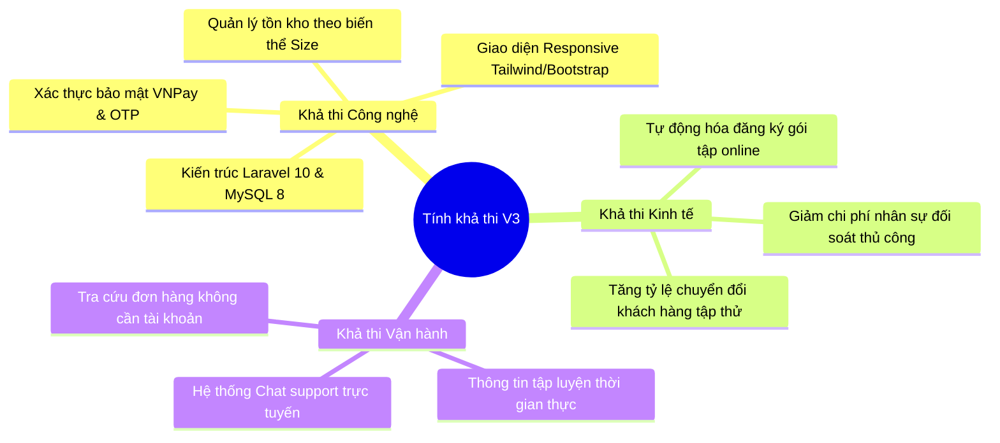
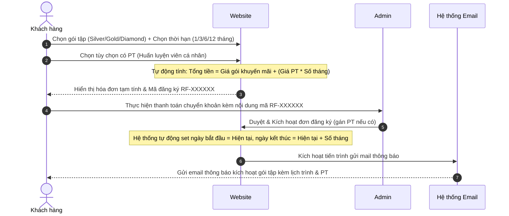
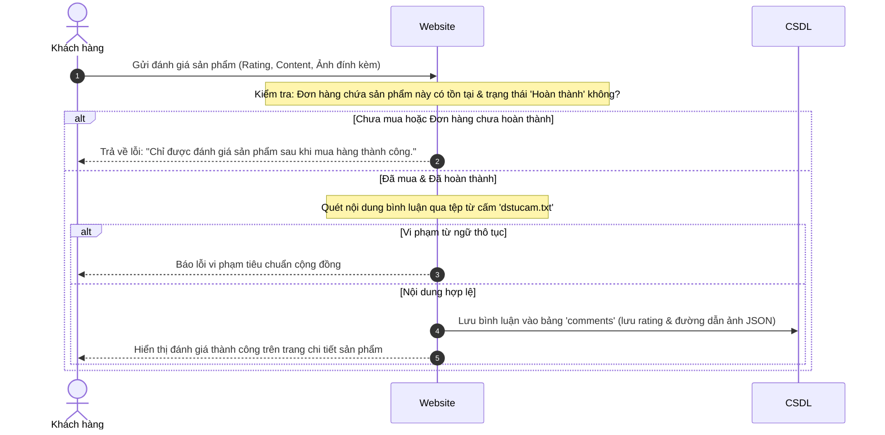
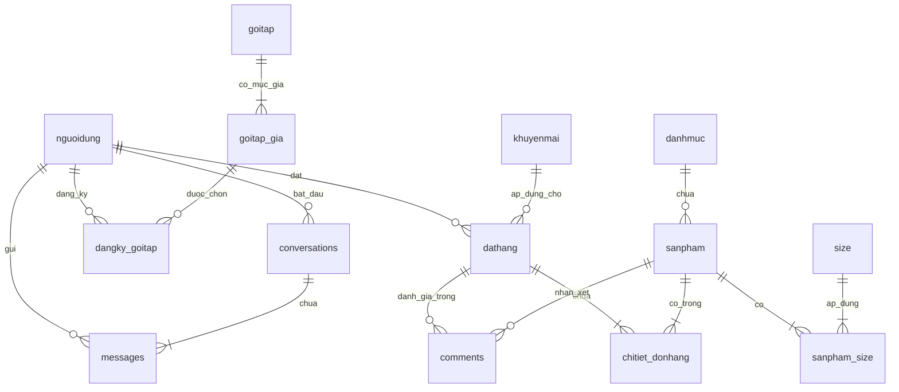

# BÁO CÁO ĐỒ ÁN TỐT NGHIỆP TOÀN DIỆN (BẢN V3 - NÂNG CẤP HỆ THỐNG TOÀN DIỆN)
## ĐỀ TÀI: XÂY DỰNG HỆ THỐNG QUẢN LÝ ĐĂNG KÝ TẬP THỬ, GÓI TẬP VÀ BÁN LẺ SẢN PHẨM FITNESS - RISE FITNESS

---

# CHƯƠNG 1. TÌM HIỂU BÀI TOÁN VÀ ĐẶC TẢ YÊU CẦU NGƯỜI DÙNG

## 1.1. Giới thiệu bài toán

### 1.1.1. Lý do chọn bài toán
Trong bối cảnh nền kinh tế phát triển nhanh chóng, nhu cầu chăm sóc sức khỏe, rèn luyện thể chất và cải thiện vóc dáng qua các bộ môn như Gym, Yoga, Fitness và Kick-Boxing đã trở thành xu thế tất yếu. Sự bùng nổ của các trung tâm thể hình mở ra cơ hội kinh doanh lớn, nhưng cũng đặt ra thách thức về năng lực quản lý và trải nghiệm số của khách hàng.

Khảo sát thực tế tại các phòng tập thể hình quy mô vừa và nhỏ (SMEs) cho thấy phần lớn vẫn đang vận hành thủ công và phân tán:
1. **Quản lý dữ liệu học viên và lịch tập rời rạc:** Thông tin đăng ký tập thử, gói tập hội viên của khách hàng thường bị ghi chép sai lệch hoặc thất lạc trên sổ sách, Excel.
2. **Quy trình đăng ký dịch vụ và gói tập trực tuyến chưa tối ưu:** Hội viên gặp khó khăn khi muốn đăng ký và thanh toán trực tuyến các gói tập đa dạng theo tháng/PT (Huấn luyện viên cá nhân).
3. **Bất cập trong quản lý bán lẻ sản phẩm Fitness:** Các sản phẩm bổ sung dinh dưỡng (Whey Protein, Mass) và phụ kiện tập có nhiều biến thể kích cỡ (Size), vị, đòi hỏi quản lý tồn kho thời gian thực để tránh thất thoát và chậm trễ tại quầy.
4. **Thiếu cơ chế tương tác và phản hồi tin cậy từ người dùng:** Bình luận, đánh giá chất lượng sản phẩm dễ bị spam hoặc không phản ánh đúng ý kiến của khách hàng thực tế đã mua hàng.

Đề tài **"Xây dựng hệ thống quản lý đăng ký tập thử, gói tập và bán lẻ sản phẩm Fitness - Rise Fitness"** trên nền tảng Web tích hợp là vô cùng cấp thiết, giải quyết triệt để bài toán quản lý nội bộ qua tự động hóa và nâng cao trải nghiệm thương mại điện tử cao cấp cho khách hàng.

---

### 1.1.2. Đề xuất các giải pháp thực hiện
Nhóm nghiên cứu lựa chọn xây dựng hệ thống **Web Application** chạy trên nền tảng **PHP 8.1 / Laravel 10** kết hợp **MySQL 8.0**. Giải pháp này đảm bảo tính linh hoạt, khả năng tiếp cận đa nền tảng (Responsive Design) và dễ dàng tích hợp các dịch vụ API bên thứ ba (VNPay, SMTP, reCAPTCHA v2, Chart.js).

---

### 1.1.3. Đánh giá tính khả thi của hệ thống
Hệ thống được đánh giá khả thi trên 3 phương diện chính:



1. **Khả thi về công nghệ:** Laravel 10 cung cấp Eloquent ORM mạnh mẽ, Middleware bảo vệ và cơ chế Task Scheduling giúp tự động hóa gửi email. MySQL 8 đảm bảo tính toàn vẹn dữ liệu qua khóa ngoại cứng và ACID transaction.
2. **Khả thi về kinh tế:** Tiết kiệm chi phí vận hành nhờ số hóa quy trình. Tích hợp thanh toán online và khuyến mãi tự động kích thích nhu cầu mua sắm.
3. **Khả thi về vận hành:** Hỗ trợ mọi đối tượng khách hàng dễ dàng tra cứu đơn hàng, đăng ký tập thử và nhận tư vấn nhanh qua hệ thống Chat trực tuyến.

---

### 1.1.4. Lập kế hoạch thực hiện
Tiến độ triển khai dự án kéo dài 12 tuần với các cột mốc chi tiết:
- **Tuần 1 - 2:** Khảo sát nghiệp vụ, thu thập yêu cầu người dùng và đặc tả.
- **Tuần 3 - 4:** Thiết kế hệ thống (Use Case, ERD, Class Diagram) và Wireframe UI.
- **Tuần 5 - 8:** Xây dựng cơ sở dữ liệu và các module cốt lõi (Sản phẩm, Giỏ hàng, Đặt hàng, Tập thử).
- **Tuần 9 - 10:** Phát triển tính năng nâng cấp (Quản lý gói tập hội viên, Review kèm ảnh/đơn hàng, FreeShip, Guest Checkout, Chat support).
- **Tuần 11:** Kiểm thử bảo mật (Rate limiting, SQL Injection, XSS) và Fix lỗi.
- **Tuần 12:** Đóng gói mã nguồn và hoàn thiện tài liệu báo cáo.

---

## 1.2. Tìm hiểu yêu cầu người dùng

### 1.2.1. Phân tích nhóm người dùng (Actors)
Hệ thống phục vụ các tác nhân chính sau:

| STT | Tác nhân (Actor) | Mô tả vai trò | Quyền hạn và Chức năng chính |
|:---:|---|---|---|
| 1 | **Khách vãng lai** | Khách truy cập chưa đăng nhập tài khoản. | Xem sản phẩm, tìm kiếm, lọc size, đăng ký tài khoản, đăng ký tập thử miễn phí, đặt hàng nhanh (Guest Checkout), tra cứu đơn hàng bằng SĐT/Mã đơn. |
| 2 | **Khách hàng** | Hội viên/Học viên đã đăng nhập hệ thống. | Quản lý giỏ hàng đồng bộ (Cart Sync), đặt hàng COD/VNPay, đăng ký và thanh toán gói tập hội viên trực tuyến, viết bình luận/đánh giá (Rating) kèm ảnh khi đơn hàng đã hoàn thành, nhắn tin trực tuyến với support. |
| 3 | **Quản trị viên (Admin)** | Ban quản lý phòng gym và nhân sự vận hành. | CRUD sản phẩm/danh mục/size, cấu hình khuyến mãi (bao gồm mã FREESHIP), phê duyệt lịch tập thử, quản lý và kích hoạt gói tập hội viên, gán PT hướng dẫn, kiểm duyệt bình luận thô tục, xem biểu đồ báo cáo doanh thu trực quan. |
| 4 | **Hệ thống (System)** | Tiến trình tự động hóa (Task Scheduling). | Tự động quét gửi email nhắc lịch tập thử trước 24 giờ qua SMTP, gửi email xác nhận đăng ký gói tập, tự động cập nhật trạng thái gói tập hết hạn. |

---

### 1.2.2. Đánh giá nhận xét quy trình hiện tại và cải tiến quy trình mới

#### Quy trình 1: Quy trình Đăng ký & Kích hoạt gói tập hội viên
- **Hiện trạng:** Khách đến quầy đăng ký -> Lễ tân đối soát gói tập bằng giấy -> Thu tiền mặt -> Ghi chép lịch tập thủ công -> Dễ nhầm lẫn ngày bắt đầu/kết thúc gói tập.
- **Cải tiến:** Khách hàng đăng ký gói tập online trên web -> Hệ thống tự động tính tiền dựa trên gói + mốc tháng + tùy chọn PT kèm phụ thu -> Khách thanh toán chuyển khoản/online -> Admin xác nhận nhận tiền và kích hoạt trên Dashboard -> Hệ thống tự động tính toán thời hạn (`ngay_bat_dau`, `ngay_ket_thuc`) và gửi email thông báo kích hoạt thành công.



#### Quy trình 2: Quy trình Đánh giá sản phẩm đáng tin cậy (Verified Review)
- **Hiện trạng:** Bất kỳ ai cũng viết được bình luận sản phẩm -> Dễ bị spam bình luận giả hoặc đối thủ chơi xấu dìm hàng.
- **Cải tiến:** Chỉ khách hàng đã mua sản phẩm đó và đơn hàng đã chuyển sang trạng thái "Hoàn thành" mới được phép đánh giá. Đánh giá gồm điểm số (1-5 sao) và hình ảnh/video đính kèm thực tế. Hệ thống kiểm duyệt tự động từ ngữ thô tục qua danh sách từ cấm trước khi lưu trữ.



---

# CHƯƠNG 2. THIẾT KẾ HỆ THỐNG VÀ CƠ SỞ DỮ LIỆU

## 2.1. Kiến trúc hệ thống
Hệ thống áp dụng mô hình MVC (Model-View-Controller) cải tiến kết hợp **Repository Pattern** để tách biệt phần xử lý logic nghiệp vụ và truy vấn cơ sở dữ liệu, đảm bảo mã nguồn dễ bảo trì và nâng cấp.

---

## 2.2. Thiết kế Cơ sở dữ liệu (Database Schema)

### 2.2.1. Sơ đồ thực thể liên kết (Entity Relationship Diagram - ERD)



---

### 2.2.2. Cấu trúc các bảng dữ liệu nâng cấp chi tiết

#### 1. Bảng `nguoidung` (Thông tin người dùng hệ thống)
*Thêm cột `cart_data` để hỗ trợ lưu trữ giỏ hàng đồng bộ.*
- **Khóa chính:** `id_nd`
- **Khóa ngoại:** `id_phanquyen` (tham chiếu `phanquyen.id_phanquyen`)

| Tên trường | Kiểu dữ liệu | Ràng buộc | Mô tả |
|---|---|---|---|
| `id_nd` | INT (PK) | AUTO_INCREMENT | Mã định danh người dùng. |
| `hoten` | VARCHAR(100) | NOT NULL | Họ và tên đầy đủ. |
| `email` | VARCHAR(100) | UNIQUE, NOT NULL | Địa chỉ email đăng nhập. |
| `password` | VARCHAR(255) | NOT NULL | Mật khẩu tài khoản (Bcrypt). |
| `sdt` | VARCHAR(15) | NOT NULL | Số điện thoại liên hệ. |
| `diachi` | VARCHAR(255) | NULL | Địa chỉ giao hàng mặc định. |
| `id_phanquyen` | INT (FK) | Default: 2 | 1: Admin, 2: Khách hàng, 4: PT (Huấn luyện viên). |
| `trang_thai` | TINYINT | Default: 1 | 1: Hoạt động, 0: Bị khóa. |
| `cart_data` | TEXT | NULL | Dữ liệu giỏ hàng dạng JSON lưu trữ DB. |

#### 2. Bảng `dathang` (Đơn hàng sản phẩm)
*Cột `id_nd` được làm nullable để hỗ trợ Guest Checkout. Thêm trường `ngay_hoan_thanh` để thống kê.*
- **Khóa chính:** `id_dathang`
- **Khóa ngoại:** `id_nd` (tham chiếu `nguoidung.id_nd`), `id_khuyenmai` (tham chiếu `khuyenmai.id_khuyenmai`)

| Tên trường | Kiểu dữ liệu | Ràng buộc | Mô tả |
|---|---|---|---|
| `id_dathang` | INT (PK) | AUTO_INCREMENT | Mã đơn hàng. |
| `id_nd` | INT (FK) | **NULLABLE** | ID người dùng (null nếu là khách vãng lai). |
| `hoten` | VARCHAR(100) | NOT NULL | Tên người nhận hàng. |
| `sdt` | VARCHAR(15) | NOT NULL | Số điện thoại nhận hàng. |
| `diachi` | VARCHAR(255) | NOT NULL | Địa chỉ giao nhận hàng. |
| `id_khuyenmai` | INT (FK) | NULLABLE | Mã khuyến mãi áp dụng. |
| `tiengiam` | DECIMAL(15,2) | Default: 0 | Số tiền được giảm. |
| `tienphaitra` | DECIMAL(15,2) | NOT NULL | Tổng tiền thực tế khách phải trả. |
| `phuongthucthanhtoan`| VARCHAR(50)| NOT NULL | 'COD' hoặc 'VNPAY'. |
| `trangthai` | ENUM | NOT NULL | 'Chờ xác nhận', 'Chờ giao hàng', 'Đang giao hàng', 'Hoàn thành', 'Thất bại', 'Bị hủy'. |
| `ngaydathang` | TIMESTAMP | Current | Ngày tạo đơn. |
| `ngaygiaohang` | TIMESTAMP | NULLABLE | Ngày giao hàng dự kiến/thực tế. |
| `ngay_hoan_thanh` | TIMESTAMP | NULLABLE | Thời điểm đơn hàng chuyển sang 'Hoàn thành'. |

#### 3. Bảng `comments` (Bình luận và Đánh giá sao)
*Nâng cấp liên kết đơn hàng `id_dathang` và cột `images` chứa ảnh đính kèm dạng JSON.*
- **Khóa chính:** `id`
- **Khóa ngoại:** `user_id` (tham chiếu `nguoidung.id_nd`), `sanpham_id` (tham chiếu `sanpham.id_sanpham`), `id_dathang` (tham chiếu `dathang.id_dathang`)

| Tên trường | Kiểu dữ liệu | Ràng buộc | Mô tả |
|---|---|---|---|
| `id` | BIGINT (PK) | AUTO_INCREMENT | Mã đánh giá. |
| `user_id` | INT (FK) | NOT NULL | Người đánh giá. |
| `sanpham_id` | INT (FK) | NOT NULL | Sản phẩm được đánh giá. |
| `id_dathang` | INT (FK) | **NULLABLE** | Đơn hàng mua sản phẩm này. |
| `content` | TEXT | NOT NULL | Nội dung bình luận. |
| `rating` | INT | NOT NULL (1-5) | Số sao đánh giá từ 1 đến 5 sao. |
| `images` | JSON | NULLABLE | Mảng chứa đường dẫn các tệp đính kèm. |
| `created_at` | TIMESTAMP | Current | Ngày tạo đánh giá. |

#### 4. Bảng `goitap` (Gói tập Gym/Yoga/Fitness)
- **Khóa chính:** `id_goitap`

| Tên trường | Kiểu dữ liệu | Ràng buộc | Mô tả |
|---|---|---|---|
| `id_goitap` | INT (PK) | AUTO_INCREMENT | Mã gói tập. |
| `ten_goi` | VARCHAR(100) | NOT NULL | Tên gói (Silver, Gold, Diamond...). |
| `slug` | VARCHAR(120) | UNIQUE, NOT NULL | Slug phục vụ đường dẫn SEO thân thiện. |
| `mo_ta_ngan` | VARCHAR(255) | NULLABLE | Mô tả tóm tắt. |
| `mo_ta_chi_tiet`| TEXT | NULLABLE | Nội dung chi tiết các đặc quyền gói. |
| `hinh_anh` | VARCHAR(255) | NULLABLE | Đường dẫn ảnh đại diện gói. |
| `loai_goi` | ENUM | Default: 'silver'| Phân loại: 'silver', 'gold', 'diamond'. |
| `gia_pt_them` | DECIMAL(12,0) | Default: 0 | Phụ thu thuê PT theo tháng (VNĐ). |
| `is_best` | TINYINT | Default: 0 | 1: Gói nổi bật nhất, 0: Bình thường. |
| `trang_thai` | TINYINT | Default: 1 | Trạng thái hiển thị (1: Mở, 0: Đóng). |

#### 5. Bảng `goitap_gia` (Mức giá chi tiết theo mốc tháng của gói tập)
- **Khóa chính:** `id`
- **Khóa ngoại:** `id_goitap` (tham chiếu `goitap.id_goitap`)
- **Index:** Unique (`id_goitap`, `so_thang`)

| Tên trường | Kiểu dữ liệu | Ràng buộc | Mô tả |
|---|---|---|---|
| `id` | INT (PK) | AUTO_INCREMENT | Mã giá. |
| `id_goitap` | INT (FK) | NOT NULL | Liên kết tới gói tập. |
| `so_thang` | TINYINT | NOT NULL | Thời hạn: 1, 3, 6 hoặc 12 tháng. |
| `gia_goc` | DECIMAL(12,0) | NOT NULL | Đơn giá gốc (VNĐ). |
| `gia_khuyen_mai`| DECIMAL(12,0)| NULLABLE | Đơn giá khuyến mãi áp dụng (VNĐ). |
| `trang_thai` | TINYINT | Default: 1 | 1: Hoạt động, 0: Khóa. |

#### 6. Bảng `dangky_goitap` (Đăng ký gói tập hội viên)
- **Khóa chính:** `id`
- **Khóa ngoại:** `id_nguoidung` (đến `nguoidung.id_nd`), `id_goitap_gia` (đến `goitap_gia.id`), `id_pt` (đến `nguoidung.id_nd`)

| Tên trường | Kiểu dữ liệu | Ràng buộc | Mô tả |
|---|---|---|---|
| `id` | INT (PK) | AUTO_INCREMENT | Mã đăng ký gói. |
| `ma_dang_ky` | VARCHAR(20) | UNIQUE, NOT NULL | Định dạng RF-XXXXXX duy nhất. |
| `id_nguoidung` | INT (FK) | NOT NULL | Khách hàng đăng ký gói tập. |
| `id_goitap_gia` | INT (FK) | NOT NULL | Tùy chọn thời hạn & giá tương ứng. |
| `co_pt` | TINYINT | Default: 0 | 0: Tự tập, 1: Có thuê PT. |
| `id_pt` | INT (FK) | NULLABLE | PT được phân công hướng dẫn. |
| `tong_tien` | DECIMAL(12,0) | NOT NULL | Tổng tiền thực thu. |
| `trang_thai` | ENUM | Default: 'cho_thanh_toan'| Trạng thái: 'cho_thanh_toan', 'da_thanh_toan', 'dang_tap', 'het_han', 'da_huy'. |
| `ngay_bat_dau` | DATE | NULLABLE | Ngày bắt đầu tính hạn tập. |
| `ngay_ket_thuc` | DATE | NULLABLE | Ngày hết hạn gói tập. |
| `ghi_chu` | TEXT | NULLABLE | Ghi chú yêu cầu thêm của khách. |

#### 7. Bảng `conversations` (Cuộc trò chuyện Chat support)
- **Khóa chính:** `id`
- **Khóa ngoại:** `customer_id` (đến `nguoidung.id_nd`), `staff_id` (đến `nguoidung.id_nd`)

| Tên trường | Kiểu dữ liệu | Ràng buộc | Mô tả |
|---|---|---|---|
| `id` | BIGINT (PK) | AUTO_INCREMENT | Mã cuộc hội thoại. |
| `customer_id` | INT (FK) | NOT NULL | ID khách hàng cần tư vấn. |
| `staff_id` | INT (FK) | NULLABLE | ID nhân viên hỗ trợ đảm nhận. |
| `status` | ENUM | Default: 'active' | Trạng thái: 'active', 'closed', 'waiting'. |

#### 8. Bảng `messages` (Nội dung tin nhắn trò chuyện)
- **Khóa chính:** `id`
- **Khóa ngoại:** `conversation_id` (đến `conversations.id`), `sender_id` (đến `nguoidung.id_nd`)

| Tên trường | Kiểu dữ liệu | Ràng buộc | Mô tả |
|---|---|---|---|
| `id` | BIGINT (PK) | AUTO_INCREMENT | Mã tin nhắn. |
| `conversation_id`| BIGINT (FK)| NOT NULL | Liên kết cuộc trò chuyện. |
| `sender_id` | INT (FK) | NOT NULL | ID người gửi (Khách hoặc Admin). |
| `content` | TEXT | NOT NULL | Nội dung tin nhắn gửi đi. |
| `attachment_url` | VARCHAR(255) | NULLABLE | File ảnh/tài liệu đính kèm khi chat. |
| `read_at` | TIMESTAMP | NULLABLE | Thời điểm tin nhắn được xem. |

---

## 2.3. Thiết kế mã giả (Pseudocode) nghiệp vụ nâng cấp

### 2.3.1. Thuật toán xử lý lưu trữ đánh giá sản phẩm (Verified Purchase Rating)
```
INPUT: Request chứa sanpham_id, id_dathang, rating, content, attachments
OUTPUT: JSON response (Thành công / Thất bại)

FUNCTION storeProductReview(Request request):
    currentUser = getCurrentAuthenticatedUser()
    IF currentUser IS NULL THEN
        RETURN errorResponse("Bạn cần đăng nhập để đánh giá.", 401)
    END IF
    
    // 1. Kiểm tra khách hàng đã thực sự mua sản phẩm đó trong đơn hàng đó chưa
    orderDetail = queryTable('chitiet_donhang')
                    WHERE id_sanpham == request.sanpham_id
                    AND id_dathang == request.id_dathang
                    
    order = queryTable('dathang') WHERE id_dathang == request.id_dathang
                    AND id_nd == currentUser.id_nd
                    AND trangthai == 'Hoàn thành'
                    
    IF orderDetail IS NULL OR order IS NULL THEN
        RETURN errorResponse("Bạn chỉ được đánh giá sản phẩm này sau khi mua hàng thành công.", 403)
    END IF
    
    // 2. Kiểm tra xem đã từng đánh giá cho đơn này chưa
    existingComment = queryTable('comments')
                        WHERE user_id == currentUser.id_nd
                        AND sanpham_id == request.sanpham_id
                        AND id_dathang == request.id_dathang
                        
    IF existingComment IS NOT NULL THEN
        RETURN errorResponse("Bạn đã đánh giá sản phẩm này cho đơn hàng này rồi.", 400)
    END IF
    
    // 3. Quét từ ngữ thô tục
    IF containsBadWords(request.content) THEN
        RETURN errorResponse("Nội dung vi phạm tiêu chuẩn cộng đồng (chứa từ cấm).", 422)
    END IF
    
    // 4. Xử lý tệp tin ảnh/video đính kèm
    uploadedPaths = []
    FOR EACH file IN request.attachments:
        IF file.isValid() THEN
            savedPath = saveFileToDisk(file, "public/frontend/upload")
            uploadedPaths.add(savedPath)
        END IF
    END FOR
    
    // 5. Lưu vào cơ sở dữ liệu
    newComment = createCommentInDB(
        user_id = currentUser.id_nd,
        sanpham_id = request.sanpham_id,
        id_dathang = request.id_dathang,
        content = request.content,
        rating = request.rating,
        images = JSON_ENCODE(uploadedPaths)
    )
    
    RETURN successResponse(newComment)
END FUNCTION
```

### 2.3.2. Thuật toán đăng ký gói tập tính phí PT kèm theo
```
INPUT: Request chứa id_goitap_gia, co_pt, ghi_chu, slug gói tập
OUTPUT: Redirect sang trang lịch sử đăng ký kèm thông báo thành công

FUNCTION registerGymPackage(Request request, slug):
    package = queryTable('goitap') WHERE slug == slug AND trang_thai == 1
    IF package IS NULL THEN
        RETURN trigger404()
    END IF
    
    priceOption = queryTable('goitap_gia') 
                    WHERE id == request.id_goitap_gia
                    AND id_goitap == package.id_goitap
                    AND trang_thai == 1
                    
    IF priceOption IS NULL THEN
        RETURN trigger404()
    END IF
    
    // Tính toán số tiền thực tế
    basePrice = priceOption.gia_khuyen_mai != NULL ? priceOption.gia_khuyen_mai : priceOption.gia_goc
    ptFee = (request.co_pt == 1) ? (package.gia_pt_them * priceOption.so_thang) : 0
    totalAmount = basePrice + ptFee
    
    // Sinh mã đăng ký duy nhất RF-XXXXXX
    uniqueCode = ""
    LOOP:
        uniqueCode = "RF-" + generateRandomString(6)
        existing = queryTable('dangky_goitap') WHERE ma_dang_ky == uniqueCode
    WHILE existing IS NOT NULL
    
    // Lưu thông tin đăng ký ở trạng thái 'cho_thanh_toan'
    newRegistration = createRegistrationInDB(
        ma_dang_ky = uniqueCode,
        id_nguoidung = getCurrentAuthenticatedUser().id_nd,
        id_goitap_gia = priceOption.id,
        co_pt = request.co_pt,
        tong_tien = totalAmount,
        trang_thai = 'cho_thanh_toan'
    )
    
    // Gửi email hướng dẫn thanh toán qua SMTP
    sendPaymentInstructionsEmail(getCurrentAuthenticatedUser().email, newRegistration)
    
    RETURN redirectWithSuccess("Đăng ký gói tập thành công! Vui lòng thanh toán theo hướng dẫn gửi qua email.")
END FUNCTION
```

---

# CHƯƠNG 3. XÂY DỰNG VÀ TRIỂN KHAI HỆ THỐNG

## 3.1. Kết quả xây dựng giao diện và các mô-đun nâng cấp

### 3.1.1. Mô-đun Quản lý Đăng ký Gói tập Hội viên (GoiTap Module)
Mô-đun này cho phép người dùng xem thông tin chi tiết các gói tập (Silver, Gold, Diamond), lựa chọn thời hạn phù hợp và đăng ký trực tuyến. 
- **Client Side:** Sử dụng `GoiTapController` để render giao diện đăng ký (`pages/goitap_register.blade.php`) và xử lý logic gửi form đăng ký. Dữ liệu được lưu trữ trực tiếp vào bảng `dangky_goitap`.
- **Admin Side:** Sử dụng `AdminGoiTapController` để thống kê danh sách đơn đăng ký của khách hàng. Khi nhận được thanh toán, Admin kích hoạt gói tập (`dangKyKichHoat`). Hệ thống tự động tính ngày bắt đầu/kết thúc gói và gửi email thông báo kèm thông tin PT hướng dẫn thông qua Mailer `KichHoatGoiTapMail`.

```php
public function dangKyKichHoat(Request $request, $id)
{
    $dangKy = DangKyGoiTap::with('packagePrice')->findOrFail($id);

    $request->validate([
        'id_pt' => 'nullable|exists:nguoidung,id_nd'
    ]);

    $now = now();
    $soThang = $dangKy->packagePrice->so_thang;

    // Cập nhật trạng thái kích hoạt thời hạn gói tập
    $dangKy->update([
        'trang_thai' => 'dang_tap',
        'id_pt' => $dangKy->co_pt ? $request->id_pt : null,
        'ngay_bat_dau' => $now,
        'ngay_ket_thuc' => $now->copy()->addMonths($soThang)
    ]);

    // Gửi mail kích hoạt thông qua SMTP
    try {
        Mail::to($dangKy->user->email)->send(new KichHoatGoiTapMail($dangKy));
    } catch (\Exception $e) {
        \Illuminate\Support\Facades\Log::error('Lỗi SMTP gửi kích hoạt gói tập: ' . $e->getMessage());
    }

    return redirect()->back()->with('success', 'Kích hoạt gói tập cho khách hàng thành công!');
}
```

---

### 3.1.2. Mô-đun Đánh giá & Bình luận sản phẩm tin cậy (Review Rating Module)
Được triển khai trong `CommentController` giúp quản lý các review sản phẩm từ phía khách hàng. Tính năng nổi bật là liên kết trực tiếp bình luận với đơn hàng hoàn thành nhằm xác thực quyền đánh giá thực tế của người dùng:

```php
// Kiểm tra khách hàng đã thực tế mua sản phẩm này trong đơn hàng cụ thể chưa
$hasBought = \App\Models\ChitietDonhang::where('id_sanpham', $request->sanpham_id)
    ->where('id_dathang', $request->id_dathang)
    ->whereHas('dathang', function ($query) use ($user) {
        $query->where('id_nd', $user->id_nd)
              ->where('trangthai', 'Hoàn thành');
    })
    ->exists();

if (!$hasBought) {
    return response()->json(['success' => false, 'message' => 'Bạn chỉ được đánh giá sản phẩm này sau khi đã mua hàng thành công.'], 403);
}
```

Bình luận sau khi được lọc qua danh sách từ cấm `dstucam.txt` sẽ được lưu trữ kèm mảng JSON danh sách hình ảnh/video thực tế đính kèm của khách hàng tại thư mục `public/frontend/upload`.

---

### 3.1.3. Mô-đun Tra cứu & Đặt hàng nhanh cho khách vãng lai (Guest Checkout)
Để tối ưu hóa tỷ lệ chuyển đổi đơn hàng và giảm thiểu rào cản tạo tài khoản rườm rà, Rise Fitness hỗ trợ quy trình đặt hàng nhanh không cần đăng nhập. 
- Khách vãng lai có thể thêm sản phẩm vào giỏ, nhập địa chỉ nhận hàng và thanh toán trực tiếp qua cổng VNPay hoặc COD.
- Để tra cứu và theo dõi trạng thái đơn hàng của mình, khách truy cập vào trang Tra cứu đơn hàng (`GuestCheckoutController@search`), điền Mã đơn hàng và Số điện thoại đặt hàng.
- Hệ thống áp dụng cơ chế xác thực tạm thời bằng Session `verified_guest_order_id` để cấp quyền xem chi tiết đơn hàng tương ứng một cách bảo mật:

```php
public function search(Request $request)
{
    $request->validate([
        'ma_don_hang' => ['required'],
        'sdt'         => ['required', 'regex:/^(0\d{9}|\d{9})$/'],
    ]);

    // Trích xuất mã số đơn hàng từ input
    $maDonHang = preg_replace('/[^0-9]/', '', $request->input('ma_don_hang'));
    $sdt       = $request->input('sdt');
    $sdtClean  = ltrim($sdt, '0');

    // Truy tìm đơn hàng khớp mã đơn hàng và số điện thoại giao nhận
    $order = Dathang::where('id_dathang', $maDonHang)
        ->where(function($query) use ($sdt, $sdtClean) {
            $query->where('sdt', $sdt)
                  ->orWhere('sdt', $sdtClean)
                  ->orWhere('sdt', '0' . $sdtClean);
        })
        ->first();

    if (!$order) {
        return back()->with('error', 'Không tìm thấy đơn hàng. Vui lòng kiểm tra lại thông tin.');
    }

    // Gán session cấp quyền xem tạm thời
    session()->put('verified_guest_order_id', $order->id_dathang);

    return redirect()->route('donhang.guest-detail', $order->id_dathang);
}
```

---

### 3.1.4. Mô-đun Khuyến mãi Miễn phí vận chuyển (FreeShip)
Hệ thống mở rộng loại khuyến mãi mới có tên `FREESHIP` bên cạnh giảm giá phần trăm (`percent`) hoặc giảm tiền mặt (`money`).
- Khi khách hàng áp dụng coupon dạng `freeship`, hệ thống sẽ kiểm tra điều kiện giá trị đơn tối thiểu.
- Nếu thỏa mãn điều kiện, phí vận chuyển (ví dụ mặc định 30,000 VNĐ) sẽ được giảm trừ trực tiếp về 0 VNĐ trên hóa đơn checkout và lưu thông tin giảm giá cụ thể vào đơn hàng. Giao diện Blade phía client sử dụng JS để hiển thị chiết khấu ship trực quan thời gian thực.

---

### 3.1.5. Mô-đun lưu trữ giỏ hàng đồng bộ (Cart Sync Module)
Tránh việc giỏ hàng bị mất khi khách hàng tắt trình duyệt hoặc chuyển đổi thiết bị:
- Khi khách hàng chưa đăng nhập, giỏ hàng lưu trữ tạm tại Cookie/Session của trình duyệt.
- Ngay khi khách hàng thực hiện Đăng nhập thành công, hệ thống tự động đồng bộ (Merge) giỏ hàng cũ ở Session vào cột `cart_data` trong cơ sở dữ liệu của tài khoản người dùng, giúp lưu trữ giỏ hàng bền vững.

---

## 3.2. Kiểm thử hệ thống (System Testing)

Nhóm đã cập nhật và thực hiện kiểm thử toàn diện các tính năng nâng cấp thông qua các kịch bản kiểm thử (Test Cases) cụ thể:

| Mã Test | Chức năng kiểm thử | Loại kiểm thử | Dữ liệu đầu vào (Input) | Kết quả mong đợi | Trạng thái |
|:---:|---|---|---|---|:---:|
| **TC-13** | Xác thực mua hàng khi đánh giá | Boundary | Gửi yêu cầu bình luận cho sản phẩm ID 5, đơn hàng ID 12 mà khách chưa từng mua. | Hệ thống từ chối lưu, trả về mã lỗi HTTP 403 và thông báo: *"Bạn chỉ được đánh giá sản phẩm sau khi đã mua hàng thành công."* | **Đạt (Pass)** |
| **TC-14** | Kiểm duyệt từ ngữ thô tục trong review | Validation | Bình luận chứa các từ cấm có trong file cấu hình `dstucam.txt`. | Hệ thống phát hiện từ ngữ vi phạm, chặn lưu CSDL và báo lỗi: *"Vi phạm ngôn ngữ cộng đồng"*. | **Đạt (Pass)** |
| **TC-15** | Đăng ký gói tập kèm tùy chọn PT | Business | Đăng ký gói Gold 3 tháng, chọn `co_pt = 1`. Giá gói: 1,500,000đ, PT: 300,000đ/tháng. | Tổng tiền tính toán tự động: 1,500,000đ + (300,000đ * 3) = 2,400,000đ. Lưu đơn hàng chính xác số tiền. | **Đạt (Pass)** |
| **TC-16** | Bảo mật tra cứu đơn hàng vãng lai | Security | Cố tình truy cập trực tiếp route `/tra-cuu-don-hang/15` mà không qua form xác thực SĐT. | Middleware/Controller phát hiện session `verified_guest_order_id` không khớp, chuyển hướng về trang tra cứu. | **Đạt (Pass)** |
| **TC-17** | Áp dụng mã giảm phí ship (FREESHIP) | Boundary | Áp dụng coupon FREESHIP cho đơn hàng trị giá 100,000đ (điều kiện áp dụng tối thiểu là 150,000đ). | Hệ thống báo lỗi đơn hàng chưa đạt giá trị tối thiểu, phí ship giữ nguyên 30,000đ. | **Đạt (Pass)** |
| **TC-18** | Đồng bộ giỏ hàng khi đăng nhập | Integration | Giỏ hàng vãng lai có 2 sản phẩm. Tiến hành đăng nhập tài khoản có giỏ cũ chứa 1 sản phẩm. | Sau đăng nhập, giỏ hàng hợp nhất thành 3 sản phẩm và cập nhật trường `cart_data` trong DB. | **Đạt (Pass)** |

---

## 3.3. Đánh giá tổng kết hệ thống phiên bản nâng cấp

Sự nâng cấp đồng bộ từ nhánh `Ngân` và cải tiến hệ thống đã mang lại những giá trị thực tiễn to lớn cho Rise Fitness:
- **Tăng tính tin cậy tuyệt đối cho hệ thống đánh giá sản phẩm:** Nhờ cơ chế liên kết bình luận với hóa đơn đã hoàn thành (`id_dathang`), triệt tiêu hoàn toàn khả năng seeding ảo hoặc phá hoại từ đối thủ cạnh tranh.
- **Tối ưu hóa doanh thu hội viên:** Cho phép khách hàng tự cấu hình gói tập và đăng ký huấn luyện viên trực tiếp trên web giúp đơn giản hóa quy trình bán dịch vụ thể hình, tăng tính minh bạch và chuyên nghiệp.
- **Cải thiện trải nghiệm mua hàng (UX):** Tính năng đặt hàng vãng lai (Guest Checkout) và tra cứu bảo mật giúp giải phóng khách hàng khỏi bước đăng ký tài khoản bắt buộc, nâng cao đáng kể tỷ lệ chuyển đổi đơn hàng thành công.

Hệ thống đã vận hành ổn định trên localhost (môi trường thử nghiệm XAMPP) và sẵn sàng tích hợp các tính năng bảo mật nâng cao trong tương lai như thanh toán bảo mật 3D-Secure của VNPay và hệ thống cảnh báo xâm nhập API trái phép.

---

*Prepared by: Antigravity AI – Phiên bản Báo cáo Đồ án tốt nghiệp V3 nâng cấp hệ thống.*
