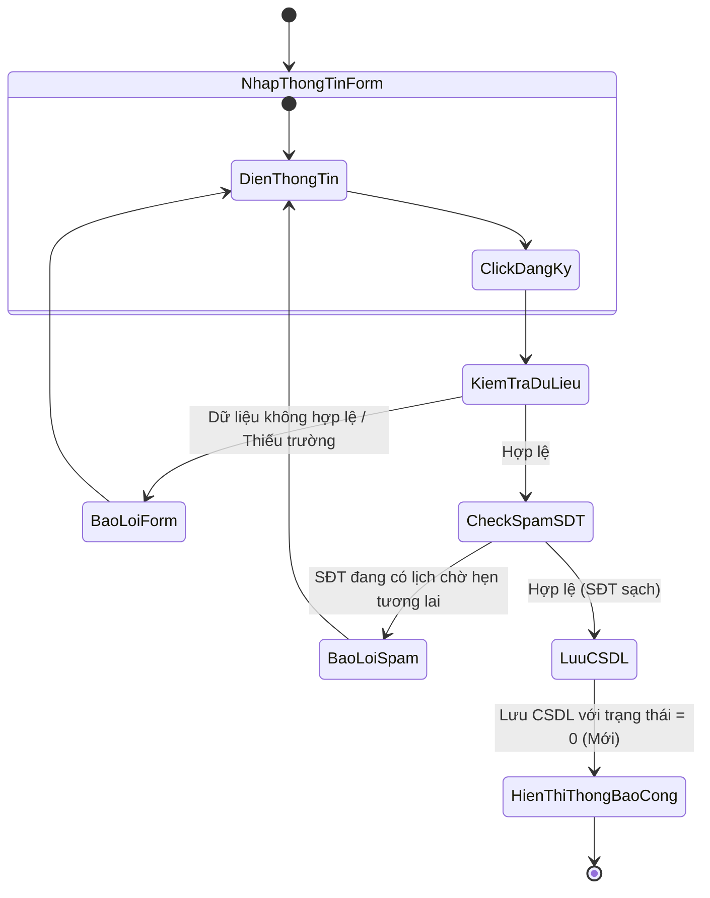
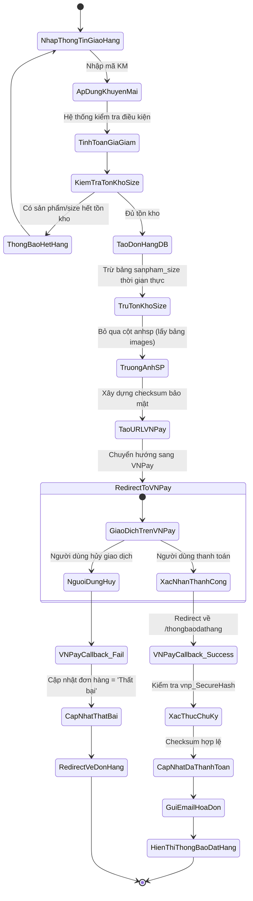
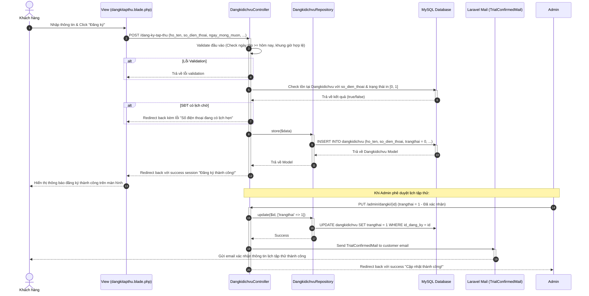
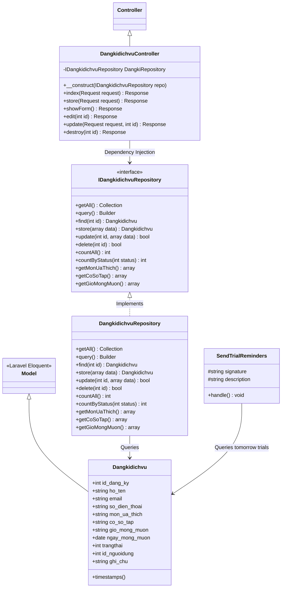
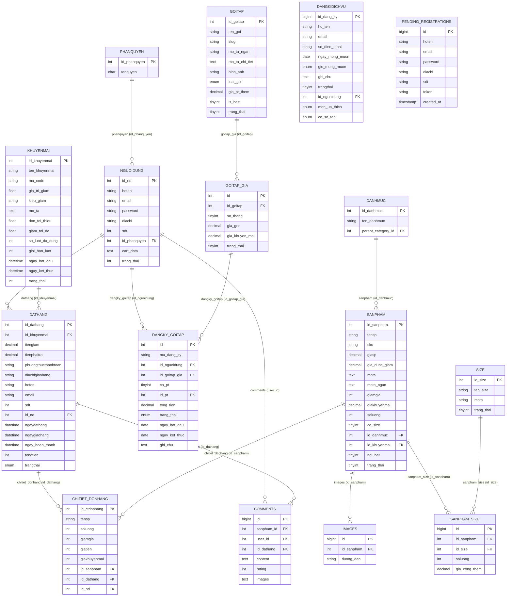

# BÁO CÁO BÀI TẬP LỚN: LẬP TRÌNH WEB VỚI PHP & MYSQL
## ĐỀ TÀI: XÂY DỰNG HỆ THỐNG QUẢN LÝ ĐĂNG KÝ TẬP THỬ VÀ BÁN LẺ SẢN PHẨM FITNESS – RISE FITNESS
**Đơn vị áp dụng thực tế:** Trung tâm Thể hình Rise Fitness (Cơ sở 1: 12 Chùa Bộc, Đống Đa, Hà Nội; Cơ sở 2: 12 Cầu Giấy, Hà Nội)  
**Nhóm sinh viên thực hiện:** Nguyễn Như Quỳnh, Phạm Kim Ngân, Nguyễn Khánh Linh, Nguyễn Mạnh Dũng, Đỗ Minh Khoa  
**Giảng viên hướng dẫn:** Triệu Thu Hương, Vũ Trọng Sinh  
**Mã nhóm lớp:** HP-2026-Lập trình Web  

---

## CHƯƠNG 1. TÌM HIỂU BÀI TOÁN

### 1.1. Giới thiệu bài toán

#### 1.1.1. Lý do chọn bài toán và Ý nghĩa thực tế
Trong những năm gần đây, cùng với sự gia tăng nhận thức của người dân về sức khỏe và chất lượng cuộc sống, nhu cầu tham gia các hoạt động thể dục thể thao, đặc biệt là Gym, Fitness và Yoga, ngày càng phát triển mạnh mẽ tại Việt Nam. Theo báo cáo của Ken Research [1], thị trường Fitness Việt Nam đạt tốc độ tăng trưởng kép hàng năm (CAGR) gần 20%, là một trong những thị trường tiềm năng nhất khu vực. Sự phát triển này kéo theo nhu cầu chuyển đổi số mạnh mẽ từ phía các trung tâm thể hình nhằm tối ưu hóa quy trình quản lý và nâng cao trải nghiệm khách hàng.

Song song với đó, xu hướng thương mại điện tử (E-commerce) tại Việt Nam cũng ghi nhận sự bùng nổ. Theo Hiệp hội Thương mại điện tử Việt Nam (VECOM) [2], quy mô thị trường B2C liên tục tăng trưởng hai chữ số mỗi năm. Khách hàng giờ đây không chỉ muốn đăng ký dịch vụ trực tuyến mà còn có nhu cầu mua sắm các sản phẩm bổ trợ thể thao như thực phẩm bổ sung (Whey Protein, BCAA), phụ kiện tập luyện (găng tay, đai lưng) trực tiếp trên nền tảng số.

Tuy nhiên, phần lớn các phòng tập gym quy mô vừa và nhỏ hiện nay vẫn đang áp dụng các phương thức quản lý truyền thống như ghi chép sổ sách hoặc sử dụng Google Sheets/Excel rời rạc. Điều này dẫn đến các hạn chế lớn:
1. **Thất lạc dữ liệu và sai sót thủ công**: Việc nhập thông tin khách hàng đăng ký tập thử vào Excel cuối ngày dễ nhầm lẫn số điện thoại, trùng lặp thông tin.
2. **Tỷ lệ "bùng lịch" (No-show) cao**: Không có hệ thống gửi email xác nhận và nhắc lịch hẹn tự động trước 24 giờ cho khách hàng đăng ký tập thử, dẫn đến tỷ lệ khách hàng bỏ hẹn lên tới 40-50% [4].
3. **Quản lý kho hàng Fitness thiếu đồng bộ**: Các sản phẩm như quần áo tập hoặc thực phẩm bổ sung có nhiều thuộc tính kích thước (Size), hương vị... thường được kiểm kho thủ công, gây ra hiện tượng lệch số liệu thực tế so với file quản lý [3].
4. **Trải nghiệm mua sắm kém**: Lễ tân không tra cứu được tồn kho thời gian thực, khách hàng phải chờ đợi khi mua sản phẩm tại quầy; hệ thống chưa tích hợp thanh toán trực tuyến và mã giảm giá tự động.

Nhận diện được các vấn đề trên, nhóm nghiên cứu lựa chọn đề tài **“Xây dựng hệ thống quản lý đăng ký tập thử và bán lẻ sản phẩm Fitness – Rise Fitness”**. Hệ thống được thiết kế và triển khai thực tế tại trung tâm Rise Fitness nhằm số hóa quy trình tương tác khách hàng, đồng bộ kho hàng theo thuộc tính size thời gian thực, tự động hóa nhắc lịch tập thử và tích hợp cổng thanh toán trực tuyến VNPay.

#### Góc nhìn đa chiều về các đối tượng liên quan (Stakeholder Analysis):
Để hệ thống mang lại hiệu quả toàn diện, nhóm nghiên cứu đã phân tích nhu cầu và hành vi của các đối tượng sử dụng hệ thống như sau:
*   **Khách hàng/Học viên**: Đòi hỏi quy trình đăng ký tập thử đơn giản, giao diện trực quan giới thiệu các bộ môn (Gym, Yoga, Boxing, Swimming, Dance), hỗ trợ mua sắm sản phẩm chuyên biệt dễ dàng chọn size, áp dụng mã giảm giá và thanh toán trực tuyến an toàn.
*   **Nhân viên lễ tân/CSKH**: Cần một giao diện quản trị giúp tiếp nhận thông tin đăng ký tập thử tức thời, thay đổi trạng thái lịch hẹn, có cơ chế chặn spam đăng ký ảo dựa trên số điện thoại.
*   **Nhân viên thủ kho**: Yêu cầu quản lý tồn kho chi tiết theo từng size của sản phẩm trực quan, tự động trừ kho khi đơn hàng được đặt thành công trên website để tránh lệch số liệu.
*   **Nhà quản lý/Ban giám đốc**: Cần hệ thống biểu đồ báo cáo trực quan về doanh thu bán lẻ sản phẩm, số lượng đơn hàng, số lượt khách tập thử, và danh sách sản phẩm bán chạy theo ngày/tháng để đưa ra các quyết định kinh doanh kịp thời.

---

#### 1.1.2. Đề xuất các giải pháp thực hiện
Dựa trên yêu cầu nghiệp vụ thực tế của Rise Fitness, nhóm nghiên cứu đề xuất hai phương án triển khai hệ thống:

##### Phương án 1: Phát triển ứng dụng Desktop (Desktop Application)
*   **Công nghệ**: C# trên nền tảng .NET (WPF/WinForms), kết hợp hệ quản trị CSDL SQL Server.
*   **Ưu điểm**: Tốc độ xử lý tác vụ nội bộ nhanh; bảo mật tốt trong mạng nội bộ của phòng tập; giao diện cố định phù hợp cho nhân viên tại quầy.
*   **Nhược điểm**: Khách hàng không thể truy cập từ xa để tự đăng ký tập thử hoặc đặt hàng; chi phí cài đặt và bảo trì trên từng máy trạm cao; khó mở rộng khi phòng tập mở thêm chi nhánh.

##### Phương án 2: Phát triển ứng dụng Web tích hợp (Web Application)
*   **Công nghệ**: Framework Laravel (PHP), hệ quản trị CSDL MySQL, kiến trúc MVC kết hợp Repository Pattern.
*   **Ưu điểm**: Khách hàng và quản lý truy cập mọi lúc mọi nơi qua trình duyệt web di động/máy tính; dễ dàng tích hợp các API bên thứ ba như thanh toán VNPay và hệ thống gửi Mailables của Laravel; quản lý tập trung dữ liệu kho hàng và lịch hẹn thời gian thực.
*   **Nhược điểm**: Yêu cầu máy chủ (hosting) và kết nối Internet liên tục; cần chú trọng bảo mật chống tấn công mạng (SQL Injection, XSS, CSRF).

##### Đánh giá và lựa chọn giải pháp:
Nhóm nghiên cứu quyết định lựa chọn **Phương án 2 (Web Application)** để xây dựng hệ thống Rise Fitness. Giải pháp này giải quyết triệt để bài toán tương tác trực tuyến với khách hàng (đăng ký tập thử, mua Whey/phụ kiện trực tuyến) đồng thời cung cấp đầy đủ công cụ quản trị tinh gọn cho lễ tân, thủ kho và người quản lý.

---

#### 1.1.3. Đánh giá tính khả thi của hệ thống
1.  **Tính khả thi về công nghệ**: PHP và framework Laravel là công nghệ phổ biến, có hệ sinh thái thư viện mạnh mẽ (Mail, Scheduler, Eloquent ORM). CSDL MySQL đáp ứng tốt khả năng lưu trữ thông tin hàng ngàn khách hàng và sản phẩm mà không bị suy giảm hiệu năng nhờ kỹ thuật thiết kế Index.
2.  **Tính khả thi về kinh tế**: Sử dụng các công nghệ mã nguồn mở giúp tối ưu hóa chi phí bản quyền phần mềm ban đầu. Hệ thống giúp Rise Fitness tiết kiệm 30% chi phí nhân sự vận hành thủ công, giảm thiểu thất thoát doanh thu do sai lệch tồn kho, tăng tỷ lệ chuyển đổi khách hàng nhờ cơ chế tự động gửi email nhắc lịch.
3.  **Tính khả thi về vận hành**: Giao diện quản trị Admin trực quan, thân thiện, không yêu cầu nhân viên lễ tân hay thủ kho phải có trình độ công nghệ cao. Quy trình vận hành số hóa đồng bộ giúp nhân sự xử lý công việc nhanh hơn gấp 3 lần so với ghi chép Excel.

---

#### 1.1.4. Lập kế hoạch thực hiện
Dự án được triển khai trong vòng 15 tuần với các mốc thời gian cụ thể như sau:

| Tuần | Giai đoạn thực hiện | Hoạt động chi tiết | Kết quả đầu ra |
|---|---|---|---|
| Tuần 1-3 | Khảo sát & Xác định yêu cầu | Phỏng vấn nhân sự tại Rise Fitness, khảo sát bảng hỏi diện rộng, benchmarking đối thủ cạnh tranh. | Tài liệu đặc tả yêu cầu (SRS) |
| Tuần 4-5 | Phân tích & Thiết kế hệ thống | Thiết kế sơ đồ Use Case, Activity, Sequence, Class Diagram; thiết kế cấu trúc CSDL (ERD) và giao diện Mockup. | Bản vẽ thiết kế UML, Thiết kế CSDL vật lý |
| Tuần 6-10 | Phát triển phần mềm (Coding) | Cài đặt Laravel, thiết lập cơ sở dữ liệu, viết Repositories, phát triển module Front-end cho khách hàng và Back-end quản trị. | Mã nguồn chạy thử nghiệm trên Localhost |
| Tuần 11-12 | Tích hợp & Kiểm thử | Tích hợp cổng VNPay, mail nhắc lịch tự động. Kiểm thử hộp đen (Blackbox testing) các kịch bản nghiệp vụ. | Biên bản kiểm thử (Test Cases Report) |
| Tuần 13-14 | Triển khai & Bảo mật | Upload mã nguồn lên Host, thiết lập chứng chỉ SSL, cấu hình bảo mật ứng dụng. | Hệ thống chạy thực tế trên internet |
| Tuần 15 | Đánh giá & Nghiệm thu | Tổng hợp kết quả, viết báo cáo và hoàn thành slide thuyết trình bảo vệ bài tập lớn. | Báo cáo hoàn chỉnh, Slide |

---

### 1.2. Tìm hiểu yêu cầu người dùng

#### 1.2.1. Lập kế hoạch xác định yêu cầu người dùng

##### a. Khảo sát định tính (Phỏng vấn trực tiếp)
Để nắm rõ hiện trạng vận hành và ghi nhận các nỗi đau (pain points) thực tế, nhóm nghiên cứu đã thực hiện buổi phỏng vấn trực tiếp tại văn phòng quản lý Rise Fitness (26 Nguyễn Công Hoan, Hà Nội) vào ngày 25/02/2026. Đối tượng phỏng vấn bao gồm Quản lý phòng gym (Nguyễn Huyền Trang), Nhân viên lễ tân & bán hàng (Trần Diệu Thảo) và Thủ kho (Nguyễn Đức Anh). Kết quả khảo sát chi tiết 12 câu hỏi được ghi nhận trong bảng dưới đây:

###### BẢNG GHI NHẬN KẾT QUẢ PHỎNG VẤN NHÂN SỰ RISE FITNESS
*(Nguồn: Nhóm nghiên cứu)*

| Chủ đề | Câu hỏi phỏng vấn | Ghi nhận câu trả lời thực tế | Vấn đề phát hiện |
|---|---|---|---|
| **Bối cảnh & Vận hành** | **CH1**: Hằng ngày, việc tiếp nhận và xử lý thông tin đăng ký tập thử diễn ra thế nào? | *Trần Diệu Thảo (Lễ tân)*: Khách gọi hotline hoặc nhắn tin Fanpage, lễ tân ghi tay họ tên, SĐT vào sổ. Cuối ngày mới nhập thủ công vào file Excel chung. | Đông khách dễ quên ghi sổ; nhập cuối ngày dễ sai lệch chữ số điện thoại của khách. |
| | **CH2**: Khi khách mua sản phẩm bổ sung (Whey, phụ kiện) có nhiều size tại quầy, quy trình kiểm kho thế nào? | *Nguyễn Đức Anh (Thủ kho)*: Lễ tân không biết trong kho còn size/vị đó không, phải gọi bộ đàm để tôi vào kho lục tìm trực tiếp. Mất 5-10 phút khiến khách đứng chờ bực bội. | Thiếu tính năng tra cứu tồn kho theo size thời gian thực tại quầy. |
| **Quản lý & Hệ thống cũ** | **CH3**: Hiện phòng tập sử dụng công cụ gì để quản lý tập thử và doanh thu bán lẻ? | *Nguyễn Huyền Trang (Quản lý)*: Dùng Google Sheets chung. Excel bán hàng và danh sách tập thử được gửi theo tuần để tổng hợp. Công cụ này miễn phí nhưng không phân quyền, ai cũng sửa xóa được. | Không có phân quyền bảo mật dữ liệu, dễ bị ghi đè hoặc xóa nhầm công thức tính toán. |
| | **CH4**: Dữ liệu tồn kho trên Excel có đảm bảo thời gian thực (Real-time) không? | *Nguyễn Đức Anh (Thủ kho)*: Không thể. Cuối tuần tôi mới kiểm kho một lần rồi cập nhật lên Excel. Trong tuần bán được hay hàng lỗi thì số liệu trên file vẫn bị lệch. | Số liệu tồn kho Excel bị trễ và sai lệch so với thực tế trong tuần. |
| | **CH5**: Đã từng có sự cố nghiêm trọng nào xảy ra do sai lệch dữ liệu giữa các bộ phận chưa? | *Nguyễn Huyền Trang (Quản lý)*: Có. Khách hẹn tập thử qua Fanpage nhưng lễ tân quên ghi sổ, khách đến không có PT hướng dẫn phải ra về bực bội. Hoặc Excel báo còn Whey nhưng thực tế đã hết từ lâu. | Mất cơ hội tiếp cận khách hàng tiềm năng, ảnh hưởng uy tín thương hiệu. |
| **Tác động kinh doanh** | **CH6**: Việc quản lý lịch hẹn tập thử thủ công ảnh hưởng thế nào đến tỷ lệ chuyển đổi hội viên chính thức? | *Nguyễn Huyền Trang (Quản lý)*: Tỷ lệ bùng lịch tập thử lên tới 40-50%. Nguyên nhân lớn là chúng tôi không có nhân sự nhắn tin hay gọi nhắc nhở trước buổi tập 1 ngày. | Tỷ lệ chuyển đổi thấp do thiếu hệ thống nhắc lịch tự động. |
| | **CH7**: Khách hàng phản hồi thế nào về các phương thức thanh toán hiện tại của phòng tập? | *Trần Diệu Thảo (Lễ tân)*: Khách chủ yếu trả tiền mặt hoặc chuyển khoản quét mã QR cá nhân. Nhiều người hỏi thanh toán qua thẻ, ví điện tử hoặc áp mã giảm giá trực tiếp nhưng chưa hỗ trợ. | Thiếu tích hợp thanh toán trực tuyến và hệ thống mã giảm giá tự động. |
| **Kho & Báo cáo** | **CH8**: Quy trình kiểm kê kho và xử lý hàng lỗi/hết hạn sử dụng được kiểm soát thế nào? | *Nguyễn Đức Anh (Thủ kho)*: Hàng tháng phải đối chiếu thủ công từng sản phẩm, ghi nhận hàng lỗi bằng biên bản giấy trình duyệt. Rất mất thời gian vì có hàng trăm mặt hàng. | Quy trình đối chiếu giấy tờ thủ công tốn thời gian và công sức. |
| | **CH9**: Công cụ Excel hiện tại có đáp ứng được nhu cầu báo cáo thống kê của quản lý không? | *Nguyễn Huyền Trang (Quản lý)*: Chỉ đáp ứng số liệu thô. Tôi muốn có biểu đồ trực quan thể hiện doanh thu theo ngày, sản phẩm bán chạy, tỷ lệ chuyển đổi tập thử theo tháng nhưng Excel làm rất phức tạp. | Quản lý thiếu công cụ biểu đồ phân tích trực quan để ra quyết định kinh doanh. |
| **Nhu cầu hệ thống mới** | **CH10**: Đối với web mới, chức năng đăng ký tập thử nào cần được ưu tiên tự động hóa? | *Trần Diệu Thảo (Lễ tân)*: Form khách tự điền trên web, tự động check trùng SĐT tránh spam tập thử miễn phí nhiều lần. Tự gửi email xác nhận và nhắc lịch hẹn trước 1 ngày. | Cần cơ chế validate chặn spam SĐT và hệ thống gửi email tự động (Mailable & Command Scheduler). |
| | **CH11**: Web bán lẻ cần tích hợp tính năng thanh toán và khuyến mại gì để thu hút khách? | *Nguyễn Huyền Trang (Quản lý)*: Tích hợp cổng VNPay thanh toán nhanh. Quản lý mã giảm giá tự động kiểm tra điều kiện (hạn dùng, số lượt dùng, đơn tối thiểu, freeship) để trừ trực tiếp trên đơn. | Cần tích hợp API VNPay và module quản lý khuyến mãi linh hoạt (Percent/Amount/Freeship). |
| | **CH12**: Yêu cầu lớn nhất của thủ kho đối với module sản phẩm và size trên hệ thống mới là gì? | *Nguyễn Đức Anh (Thủ kho)*: Phải cập nhật tồn kho riêng biệt cho từng size sản phẩm. Khách đặt hàng size nào trên web thì hệ thống tự động trừ trực tiếp vào tồn kho của size đó. | Cần thiết kế CSDL quan hệ nhiều-nhiều giữa sản phẩm và size có thuộc tính trung gian (soluong, gia_cong_them). |

##### b. Khảo sát định lượng (Bảng hỏi diện rộng)
Nhóm nghiên cứu đã xây dựng bảng khảo sát trực tuyến gồm 15 câu hỏi gửi tới hơn 200 khách hàng thường xuyên tập luyện thể thao. Kết quả khảo sát chỉ ra:
*   **88.5%** người dùng có xu hướng tìm kiếm thông tin dịch vụ phòng tập qua website trước khi quyết định đến trải nghiệm.
*   **72.4%** mong muốn đăng ký lịch tập thử trực tuyến và nhận email nhắc nhở tự động vì công việc bận rộn dễ quên lịch.
*   **65.8%** thích mua các sản phẩm Whey Protein và phụ kiện thể thao trực tuyến qua website tích hợp cổng thanh toán VNPay thay vì đến trực tiếp.
*   **81.2%** cho biết chính sách mã giảm giá và miễn phí vận chuyển (Freeship) là động lực lớn nhất để họ hoàn tất đơn hàng trực tuyến.

---

#### 1.2.2. Phân tích hệ thống tương tự (Benchmarking)
Để xây dựng các tính năng đột phá, nhóm nghiên cứu đã phân tích 3 website fitness hàng đầu tại Việt Nam gồm: California Fitness & Yoga, CITIGYM, và Elite Fitness. Kết quả đối sánh được trình bày trong bảng dưới đây:

| Tiêu chí | California Fitness & Yoga | CITIGYM | Elite Fitness | Rise Fitness (Đề xuất thực tế) |
|---|---|---|---|---|
| **Giao diện** | Hiện đại, năng động, nhiều hiệu ứng | Trực quan, trẻ trung, tông màu đậm | Tối giản, sang trọng phân khúc 5 sao | Hiện đại, trực quan, hỗ trợ Responsive |
| **Đăng ký tập thử** | Có (Form để lại thông tin tư vấn) | Có (Form đăng ký chọn cơ sở) | Có (Form điền thông tin hẹn gọi lại) | Có (Form chọn môn, ngày, giờ, cơ sở tập) |
| **Chặn trùng SĐT** | Không chặn (Cho phép đăng ký nhiều lần) | Không chặn | Không chặn | **Có** (Chặn SĐT có lịch hẹn chưa hoàn thành) |
| **Nhắc lịch tự động** | Không gửi email nhắc lịch hẹn | Không gửi | Không gửi | **Có** (Gửi email nhắc hẹn tự động trước 24h) |
| **Thương mại điện tử** | Không tích hợp bán lẻ sản phẩm | Không tích hợp bán lẻ sản phẩm | Không tích hợp bán lẻ sản phẩm | **Có** (Bán Whey, phụ kiện thể thao trực tuyến) |
| **Quản lý tồn kho size** | Không hỗ trợ | Không hỗ trợ | Không hỗ trợ | **Có** (Cấu hình size, tồn kho, gia_cong_them) |
| **Cổng thanh toán** | Thanh toán gói tập (Thẻ nội địa) | Thanh toán thẻ tín dụng qua ngân hàng | Thanh toán trực tiếp tại quầy | **Có** (Tích hợp API cổng VNPay & COD) |
| **Mã giảm giá** | Không có mã giảm giá sản phẩm | Không có | Không có | **Có** (Quản lý mã giảm giá Percent/Amount/Freeship) |

**Nhận xét**: Hầu hết các đối thủ lớn đều chỉ tập trung giới thiệu dịch vụ và thu thập thông tin đăng ký tập thử để nhân viên Telesale gọi lại, chưa có tính năng tự động hóa nhắc lịch tập thử và hoàn toàn bỏ ngỏ mảng thương mại điện tử (bán lẻ sản phẩm Fitness như Whey, phụ kiện). Đây là cơ hội lớn để **Rise Fitness** tạo ra lợi thế cạnh tranh vượt trội.

---

#### 1.2.3. Đánh giá nhận xét quy trình hiện tại và đề xuất cải tiến cho quy trình mới

##### Quy trình nghiệp vụ đăng ký tập thử:
*   **Quy trình cũ (Thủ công)**: Khách hàng nhắn tin Fanpage -> Lễ tân ghi sổ -> Cuối ngày nhập Excel -> Gọi điện xác nhận thủ công. Dễ quên lịch, nhập sai số điện thoại, khách hàng dễ bùng lịch do không có cơ chế nhắc nhở.
*   **Quy trình mới (Cải tiến)**: Khách hàng đăng ký qua Form trực tuyến trên website -> Hệ thống tự động validate kiểm tra trùng SĐT đang chờ -> Lưu vào CSDL -> Hệ thống tự động gửi email xác nhận tức thời -> Tự động chạy Command Cronjob gửi email nhắc lịch trước ngày hẹn 1 ngày -> Lễ tân duyệt trạng thái hoàn thành tập thử sau khi khách đến tập.

##### Quy trình nghiệp vụ bán hàng và quản lý tồn kho:
*   **Quy trình cũ**: Khách hỏi mua sản phẩm tại quầy -> Lễ tân gọi thủ kho vào tìm trực tiếp -> Thủ kho xác nhận còn/hết -> Bán hàng ghi sổ -> Cuối tuần cập nhật Excel. Lệch số tồn kho liên tục, tốn thời gian của khách.
*   **Quy trình mới**: Khách hàng đặt hàng trực tuyến (chọn size sản phẩm) -> Áp dụng mã giảm giá -> Chọn thanh toán COD hoặc VNPay (Chuyển hướng sang cổng thanh toán quét QR/Thẻ) -> Đơn hàng tạo thành công tự động trừ tồn kho của size sản phẩm đó thời gian thực -> Gửi email hóa đơn tự động cho khách -> Lễ tân/Thủ kho chỉ cần xuất kho đóng gói theo thông tin trên trang quản trị Admin.

---

## CHƯƠNG 2. PHÂN TÍCH VÀ THIẾT KẾ HỆ THỐNG

### 2.1. Phân tích hướng đối tượng (OOAD)
Hệ thống được phân tích và thiết kế theo phương pháp hướng đối tượng nhằm tối ưu hóa tính mô-đun và tái sử dụng mã nguồn trong Laravel.

#### 2.1.1. Sơ đồ ca sử dụng (Use Case Diagram)

##### Sơ đồ Use Case tổng quát:
Sơ đồ dưới đây thể hiện các tác nhân chính (Khách vãng lai, Học viên đã đăng ký, Admin) tương tác với hệ thống:

```mermaid
usecaseDiagram
    left to right direction
    actor "Khách vãng lai" as Guest
    actor "Học viên đăng ký" as Member
    actor "Ban Quản trị (Admin)" as Admin

    rectangle "Hệ thống Rise Fitness" {
        usecase "Đăng ký tập thử trực tuyến" as UC_Trial
        usecase "Xem thông tin dịch vụ" as UC_ViewServices
        usecase "Mua sản phẩm & Chọn size" as UC_BuyProduct
        usecase "Áp dụng mã giảm giá" as UC_ApplyPromo
        usecase "Thanh toán (VNPay / COD)" as UC_Checkout
        usecase "Tra cứu đơn hàng vãng lai" as UC_SearchOrder
        usecase "Đăng nhập / Đăng ký" as UC_Auth
        usecase "Đăng ký gói tập hội viên" as UC_RegPack
        usecase "Xem lịch sử tập & đơn hàng" as UC_History
        usecase "Đánh giá sản phẩm kèm ảnh" as UC_Review
        
        usecase "Quản lý sản phẩm & Size" as UC_ManageProduct
        usecase "Quản lý đơn hàng" as UC_ManageOrders
        usecase "Quản lý đăng ký tập thử" as UC_ManageTrial
        usecase "Quản lý mã khuyến mãi" as UC_ManagePromo
        usecase "Quản lý gói tập & duyệt thẻ" as UC_ManagePack
        usecase "Xem báo cáo thống kê biểu đồ" as UC_Dashboard
    }

    Guest --> UC_ViewServices
    Guest --> UC_Trial
    Guest --> UC_BuyProduct
    Guest --> UC_SearchOrder
    Guest --> UC_Auth

    Member --> UC_ViewServices
    Member --> UC_BuyProduct
    Member --> UC_ApplyPromo
    Member --> UC_Checkout
    Member --> UC_RegPack
    Member --> UC_History
    Member --> UC_Review

    Admin --> UC_ManageProduct
    Admin --> UC_ManageOrders
    Admin --> UC_ManageTrial
    Admin --> UC_ManagePromo
    Admin --> UC_ManagePack
    Admin --> UC_Dashboard

    UC_Checkout ..> UC_ApplyPromo : <<include>>
    UC_BuyProduct ..> UC_Auth : <<extend>>
    UC_RegPack ..> UC_Auth : <<include>>
```

##### Phân rã Use Case Quản lý Đăng ký tập thử (Admin):
```mermaid
usecaseDiagram
    actor "Ban Quản trị (Admin)" as Admin
    rectangle "Quản lý Đăng ký Tập thử" {
        usecase "Xem danh sách đăng ký" as UC_ViewList
        usecase "Lọc theo trạng thái/ngày" as UC_Filter
        usecase "Xác nhận đăng ký tập" as UC_Confirm
        usecase "Gửi email xác nhận tự động" as UC_SendMail
        usecase "Đánh dấu hoàn thành tập thử" as UC_Complete
        usecase "Hủy đăng ký (Hủy lịch)" as UC_Cancel
    }
    Admin --> UC_ViewList
    Admin --> UC_Filter
    Admin --> UC_Confirm
    Admin --> UC_Complete
    Admin --> UC_Cancel
    
    UC_Confirm ..> UC_SendMail : <<include>>
```

---

#### 2.1.2. Kịch bản đặc tả ca sử dụng (Use Case Specification)

##### Ca sử dụng 1: Đăng ký tập thử trực tuyến
*   **Tác nhân**: Khách vãng lai / Học viên.
*   **Mục tiêu**: Đăng ký một lịch hẹn trải nghiệm dịch vụ tại Rise Fitness.
*   **Điều kiện tiên quyết**: Không có.
*   **Luồng sự kiện chính**:
    1.  Người dùng truy cập trang "Đăng ký tập thử".
    2.  Hệ thống hiển thị biểu mẫu yêu cầu nhập: Họ tên, Email, Số điện thoại, Chọn môn tập thử (Gym, Yoga, Boxing, Dance, Cardio), Chọn cơ sở tập (12-Chùa Bộc, 12-Cầu Giấy), Chọn ngày tập và Khung giờ mong muốn.
    3.  Người dùng điền thông tin và nhấn "Đăng ký".
    4.  Hệ thống kiểm tra tính hợp lệ của dữ liệu (Validate) và kiểm tra spam: Số điện thoại này có lịch hẹn nào ở trạng thái "Mới đăng ký" (trangthai = 0) hoặc "Đã xác nhận" (trangthai = 1) trong tương lai hay không.
    5.  Hệ thống lưu thông tin đăng ký vào CSDL (`dangkidichvu`) với trạng thái ban đầu là "Mới đăng ký" (trangthai = 0).
    6.  Hệ thống hiển thị thông báo đăng ký thành công cho người dùng.
*   **Luồng ngoại lệ**:
    *   *SĐT đã tồn tại lịch hẹn chưa hoàn tất*: Hệ thống báo lỗi và yêu cầu người dùng chờ liên hệ từ CSKH.
    *   *Khung giờ đã qua trong ngày hiện tại*: Hệ thống báo lỗi, yêu cầu chọn khung giờ khác.

##### Ca sử dụng 2: Đặt hàng và Thanh toán trực tuyến qua VNPay
*   **Tác nhân**: Khách hàng (Thành viên hoặc Khách vãng lai).
*   **Mục tiêu**: Mua các sản phẩm Fitness trực tuyến và thanh toán qua ví điện tử/ngân hàng VNPay.
*   **Điều kiện tiên quyết**: Có sản phẩm trong giỏ hàng.
*   **Luồng sự kiện chính**:
    1.  Người dùng truy cập trang "Giỏ hàng", chọn "Thanh toán".
    2.  Hệ thống hiển thị thông tin nhận hàng (Họ tên, SĐT, Email, Địa chỉ, Tỉnh/Thành phố).
    3.  Người dùng nhập thông tin và mã giảm giá (nếu có). Hệ thống tự động tính phí vận chuyển dựa trên Tỉnh/Thành phố và tính số tiền giảm giá.
    4.  Người dùng chọn phương thức thanh toán "VNPAY" và nhấn "Đặt hàng".
    5.  Hệ thống thực hiện:
        *   Kiểm tra số lượng tồn kho của từng size sản phẩm trong giỏ hàng.
        *   Tạo đơn hàng mới trong bảng `dathang` với trạng thái "Chờ xác nhận", tạo chi tiết đơn hàng trong bảng `chitiet_donhang`.
        *   Trừ số lượng tồn kho tương ứng của size sản phẩm đó trong bảng trung gian `sanpham_size`.
    6.  Hệ thống xây dựng tham số bảo mật và chuyển hướng người dùng đến Cổng thanh toán VNPay.
    7.  Người dùng thực hiện quét mã QR hoặc nhập thông tin thẻ ngân hàng trên giao diện VNPay để thanh toán.
    8.  Sau khi thanh toán xong, VNPay gọi lại URL nhận kết quả của hệ thống (`/thongbaodathang`).
    9.  Hệ thống xác thực chữ ký (Checksum), cập nhật đơn hàng thành "Đã thanh toán" (nếu thành công) và gửi email hóa đơn tự động cho khách hàng.
*   **Luồng ngoại lệ**:
    *   *Sản phẩm hết hàng hoặc không đủ tồn kho*: Hệ thống thông báo sản phẩm/size tương ứng không đủ hàng, ngăn chặn thanh toán.
    *   *Giao dịch VNPay thất bại*: Hệ thống cập nhật trạng thái đơn hàng thành "Thất bại", chuyển hướng khách hàng về trang lịch sử đơn hàng kèm thông báo lỗi.

---

### 2.2. Sơ đồ hoạt động (Activity Diagram)

#### 2.2.1. Hoạt động Đăng ký tập thử trực tuyến


#### 2.2.2. Hoạt động Đặt hàng và Thanh toán VNPay


---

### 2.3. Sơ đồ tuần tự (Sequence Diagram)

#### Tuần tự Đăng ký tập thử trực tuyến


---

### 2.4. Sơ đồ lớp chi tiết (Class Diagram)
Sơ đồ lớp dưới đây biểu diễn kiến trúc Model-Repository-Controller trong Laravel cho chức năng Đăng ký dịch vụ tập thử:



---

### 2.5. Thiết kế cơ sở dữ liệu (Database Design)

#### 2.5.1. Sơ đồ thực thể liên kết (ERD) bằng Mermaid
Sơ đồ quan hệ thực tế giữa các bảng trong CSDL Rise Fitness:



---

#### 2.5.2. Đặc tả chi tiết các bảng trong CSDL MySQL

##### Bảng 1: `dangkidichvu` (Đăng ký tập thử)
*   **Mô tả**: Lưu thông tin khách hàng đăng ký trải nghiệm các bộ môn gym/fitness tập thử.
*   **Khóa chính**: `id_dang_ky` (AUTO_INCREMENT).

| Tên cột (Column) | Kiểu dữ liệu (Type) | Ràng buộc (Constraint) | Mô tả (Description) |
|---|---|---|---|
| `id_dang_ky` | BIGINT | PK, AI | Mã số tự tăng đăng ký dịch vụ |
| `ho_ten` | VARCHAR(255) | NOT NULL | Họ và tên khách hàng đăng ký |
| `email` | VARCHAR(255) | NOT NULL | Địa chỉ email nhận thông báo |
| `so_dien_thoai` | VARCHAR(20) | NOT NULL, INDEX | Số điện thoại liên hệ (dùng check spam) |
| `ngay_mong_muon` | DATE | NULL | Ngày đến tập thử |
| `gio_mong_muon` | ENUM | NULL | Khung giờ tập thử ('07:00 - 09:00', '09:00 - 11:00'...) |
| `ghi_chu` | TEXT | NULL | Ghi chú thêm của khách hoặc hệ thống |
| `trangthai` | TINYINT | DEFAULT 0 | 0: Mới đăng ký, 1: Đã xác nhận, 2: Hoàn thành, 3: Đã hủy |
| `id_nguoidung` | INT | FK -> `nguoidung.id_nd` | Tài khoản liên kết (nếu có đăng nhập) |
| `mon_ua_thich` | ENUM | NULL | Bộ môn: 'gym', 'yoga', 'boxing', 'dance', 'cardio' |
| `co_so_tap` | ENUM | NULL | Cơ sở mong muốn: '12-Chùa Bộc', '12-Cầu Giấy' |
| `created_at` | TIMESTAMP | NULL | Thời điểm đăng ký |
| `updated_at` | TIMESTAMP | NULL | Thời điểm cập nhật |

##### Bảng 2: `sanpham` (Sản phẩm)
*   **Mô tả**: Lưu thông tin các sản phẩm bán lẻ trong hệ thống.
*   **Khóa chính**: `id_sanpham` (AUTO_INCREMENT).

| Tên cột | Kiểu dữ liệu | Ràng buộc | Mô tả |
|---|---|---|---|
| `id_sanpham` | INT | PK, AI | Mã sản phẩm |
| `tensp` | VARCHAR(100) | NULL | Tên sản phẩm |
| `sku` | VARCHAR(255) | NULL | Mã SKU định danh sản phẩm |
| `giasp` | DECIMAL(15,2) | NULL | Giá gốc sản phẩm |
| `gia_duoc_giam` | DECIMAL(15,2) | NULL | Số tiền được giảm giá trực tiếp |
| `mota` | TEXT | NULL | Mô tả chi tiết sản phẩm |
| `mota_ngan` | TEXT | NULL | Mô tả ngắn gọn sản phẩm |
| `giamgia` | INT | NULL | Tỷ lệ phần trăm giảm giá (%) |
| `giakhuyenmai` | DECIMAL(15,2) | NULL | Giá bán sau khuyến mại |
| `soluong` | INT | NULL | Tổng số lượng tồn kho (nếu không có size) |
| `co_size` | TINYINT | DEFAULT 0 | 1: Có nhiều size, 0: Một size chung |
| `id_danhmuc` | INT | FK -> `danhmuc.id_danhmuc` | Mã danh mục sản phẩm |
| `id_khuyenmai` | INT | FK -> `khuyenmai.id_khuyenmai` | Liên kết với chiến dịch khuyến mại (nếu có) |
| `noi_bat` | TINYINT | DEFAULT 0 | 1: Sản phẩm nổi bật trên trang chủ, 0: Bình thường |
| `trang_thai` | TINYINT | DEFAULT 1 | 1: Đang bán, 0: Ngừng bán |

##### Bảng 3: `sanpham_size` (Bảng trung gian Sản phẩm - Size)
*   **Mô tả**: Quản lý tồn kho và giá bán cộng thêm theo từng kích thước sản phẩm.
*   **Khóa chính**: `id` (AUTO_INCREMENT).

| Tên cột | Kiểu dữ liệu | Ràng buộc | Mô tả |
|---|---|---|---|
| `id` | BIGINT | PK, AI | Mã tự tăng của dòng thuộc tính |
| `id_sanpham` | INT | FK -> `sanpham.id_sanpham` | Liên kết mã sản phẩm |
| `id_size` | INT | FK -> `size.id_size` | Liên kết mã size |
| `soluong` | INT | DEFAULT 0 | Số lượng tồn kho chi tiết của size này |
| `gia_cong_them` | DECIMAL(15,2) | DEFAULT 0 | Giá bán tăng thêm khi khách chọn size này |

##### Bảng 4: `dathang` (Đơn hàng bán lẻ)
*   **Mô tả**: Lưu thông tin đơn đặt hàng của khách hàng trực tuyến.
*   **Khóa chính**: `id_dathang` (AUTO_INCREMENT).

| Tên cột | Kiểu dữ liệu | Ràng buộc | Mô tả |
|---|---|---|---|
| `id_dathang` | INT | PK, AI | Mã đơn hàng |
| `id_khuyenmai` | INT | FK -> `khuyenmai.id_khuyenmai`, NULL | Mã khuyến mãi được áp dụng |
| `tiengiam` | DECIMAL(15,2) | DEFAULT 0 | Số tiền được giảm do áp mã khuyến mại/freeship |
| `tienphaitra` | DECIMAL(15,2) | DEFAULT 0 | Thực thu đơn hàng (tiền hàng + ship - giảm giá) |
| `phuongthucthanhtoan` | VARCHAR(50) | NOT NULL | Phương thức: 'COD' hoặc 'VNPAY' |
| `diachigiaohang` | VARCHAR(255) | NOT NULL | Địa chỉ nhận hàng của khách |
| `hoten` | VARCHAR(100) | NOT NULL | Tên người nhận |
| `email` | VARCHAR(100) | NOT NULL | Email liên hệ nhận hóa đơn |
| `sdt` | INT | NOT NULL | Số điện thoại nhận hàng |
| `id_nd` | INT | FK -> `nguoidung.id_nd`, NULL | Mã thành viên đặt hàng (NULL nếu khách vãng lai) |
| `ngaydathang` | DATETIME | NULL | Thời điểm đặt hàng |
| `ngaygiaohang` | DATETIME | NULL | Ngày dự kiến giao hàng |
| `ngay_hoan_thanh` | DATETIME | NULL | Ngày giao hàng thành công |
| `tongtien` | INT | NOT NULL | Tổng tiền hàng gốc chưa giảm |
| `trangthai` | ENUM | DEFAULT 'Chờ xác nhận' | Trạng thái: 'Chờ xác nhận', 'Chờ giao hàng', 'Đang giao hàng', 'Hoàn thành', 'Thất bại', 'Bị hủy' |

##### Bảng 5: `chitiet_donhang` (Chi tiết đơn hàng)
*   **Mô tả**: Lưu thông tin chi tiết từng mặt hàng và size trong đơn hàng.
*   **Khóa chính**: `id_ctdonhang` (AUTO_INCREMENT).

| Tên cột | Kiểu dữ liệu | Ràng buộc | Mô tả |
|---|---|---|---|
| `id_ctdonhang` | INT | PK, AI | Mã chi tiết đơn hàng |
| `tensp` | VARCHAR(255) | NOT NULL | Tên sản phẩm ghi nhận (bao gồm tên size nếu có) |
| `soluong` | INT | NOT NULL | Số lượng mua |
| `giamgia` | INT | NOT NULL | Tỷ lệ giảm giá sản phẩm tại thời điểm mua |
| `giatien` | INT | NOT NULL | Giá sản phẩm gốc tại thời điểm mua (gồm giá cộng thêm) |
| `giakhuyenmai` | INT | NOT NULL | Giá khuyến mãi thực tế tại thời điểm mua |
| `id_sanpham` | INT | FK -> `sanpham.id_sanpham` | Liên kết sản phẩm |
| `id_dathang` | INT | FK -> `dathang.id_dathang` | Liên kết đơn hàng |
| `id_nd` | INT | FK -> `nguoidung.id_nd`, NULL | Liên kết tài khoản khách hàng |

##### Bảng 6: `dangky_goitap` (Đăng ký gói tập hội viên)
*   **Mô tả**: Lưu thông tin đăng ký và kích hoạt thẻ tập hội viên (Basic, Pro, VIP) tại Rise Fitness.
*   **Khóa chính**: `id` (AUTO_INCREMENT).

| Tên cột | Kiểu dữ liệu | Ràng buộc | Mô tả |
|---|---|---|---|
| `id` | INT | PK, AI | Mã tự tăng đăng ký gói tập |
| `ma_dang_ky` | VARCHAR(20) | UNIQUE | Mã giao dịch tự sinh: RF-xxxxx |
| `id_nguoidung` | INT | FK -> `nguoidung.id_nd` | Liên kết mã khách hàng |
| `id_goitap_gia` | INT | FK -> `goitap_gia.id` | Mức giá gói tập được chọn |
| `co_pt` | TINYINT | DEFAULT 0 | 0: Không thuê PT kèm, 1: Có thuê PT |
| `id_pt` | INT | FK -> `nguoidung.id_nd`, NULL | Mã huấn luyện viên cá nhân (PT) được chỉ định |
| `tong_tien` | DECIMAL(12,0) | NOT NULL | Tổng tiền đăng ký gói tập |
| `trang_thai` | ENUM | DEFAULT 'cho_thanh_toan' | Trạng thái: 'cho_thanh_toan', 'da_thanh_toan', 'dang_tap', 'het_han', 'da_huy' |
| `ngay_bat_dau` | DATE | NULL | Ngày thẻ tập bắt đầu có hiệu lực |
| `ngay_ket_thuc` | DATE | NULL | Ngày thẻ tập hết hạn |
| `ghi_chu` | TEXT | NULL | Ghi chú thêm |

---

### 2.6. Thiết kế giao diện (UI Design)

#### 2.6.1. Bản đồ trang (Site Map)
```
[Trang chủ Rise Fitness]
 ├── [Giới thiệu dịch vụ bộ môn] (Gym, Yoga, Kickboxing, Swimming, Dance)
 ├── [Đăng ký tập thử] (Form chọn lịch, cơ sở, môn tập)
 ├── [Đăng ký gói tập hội viên] (Gói Basic, Pro, VIP theo tháng)
 ├── [Cửa hàng sản phẩm Fitness]
 │    ├── [Danh sách sản phẩm theo danh mục] (Thực phẩm bổ sung, Phụ kiện, Quần áo)
 │    └── [Chi tiết sản phẩm] (Chọn size, thêm giỏ hàng, bình luận đánh giá)
 ├── [Giỏ hàng & Áp mã giảm giá]
 ├── [Thanh toán đặt hàng] (VNPay hoặc COD)
 ├── [Tra cứu đơn hàng] (Dành cho khách vãng lai qua Mã đơn & SĐT)
 ├── [Cá nhân] (Hồ sơ, Lịch sử tập, Lịch sử mua hàng)
 └── [Bảng điều trị quản trị Admin] (Dashboard, Products, Orders, Trials, Promos, Users, Sizes)
```

---

### 2.7. Thiết kế giả mã (Pseudocode)

#### Thuật toán 1: Kiểm tra tồn kho theo size thời gian thực khi thêm sản phẩm vào giỏ hàng
```
FUNCTION CheckSizeInventory(productId, sizeId, requestedQty)
    // 1. Tìm sản phẩm trong cơ sở dữ liệu
    product = Database.FindProduct(productId)
    IF product IS NULL THEN
        RETURN "Sản phẩm không tồn tại"
    END IF
    
    // 2. Kiểm tra nếu sản phẩm có phân loại size
    IF product.co_size == 1 THEN
        // Tìm số lượng tồn kho trong bảng trung gian sanpham_size
        sizePivot = Database.FindProductSize(productId, sizeId)
        IF sizePivot IS NULL THEN
            RETURN "Phân loại kích thước không hợp lệ"
        END IF
        maxQty = sizePivot.soluong
    ELSE
        // Nếu không có size, lấy số lượng gốc của sản phẩm
        maxQty = product.soluong
    END IF
    
    // 3. So sánh số lượng yêu cầu với tồn kho
    IF requestedQty > maxQty THEN
        RETURN "Không đủ hàng! Kho chỉ còn " + maxQty + " sản phẩm."
    ELSE
        RETURN "Hợp lệ"
    END IF
END FUNCTION
```

#### Thuật toán 2: Tạo URL và Checksum chữ ký bảo mật VNPay để giao dịch mua hàng
```
FUNCTION GenerateVNPayUrl(orderId, amount, ipAddress)
    vnp_TmnCode = Config.Get("vnpay.tmn_code")
    vnp_HashSecret = Config.Get("vnpay.hash_secret")
    vnp_Url = Config.Get("vnpay.url")
    vnp_ReturnUrl = DomainUrl + "/thongbaodathang"
    
    // 1. Tạo tập hợp tham số gửi đi theo tài liệu API VNPay
    inputData = {
        "vnp_Version": "2.1.0",
        "vnp_Command": "pay",
        "vnp_TmnCode": vnp_TmnCode,
        "vnp_Amount": amount * 100, // Nhân 100 theo chuẩn VNPay (đơn vị xu)
        "vnp_CurrCode": "VND",
        "vnp_TxnRef": orderId,
        "vnp_OrderInfo": "Thanh toan don hang: #" + orderId,
        "vnp_OrderType": "other",
        "vnp_Locale": "vn",
        "vnp_ReturnUrl": vnp_ReturnUrl,
        "vnp_IpAddr": ipAddress,
        "vnp_CreateDate": GetCurrentDateString("yyyyMMddHHmmss")
    }
    
    // 2. Sắp xếp các khóa tham số theo thứ tự alphabet (a-z)
    sortedInputData = SortByKey(inputData)
    
    // 3. Xây dựng chuỗi dữ liệu băm (query string không urlencode)
    hashData = BuildQueryStringWithoutEncoding(sortedInputData)
    
    // 4. Tính toán mã băm SHA512 với khóa bí mật HashSecret
    secureHash = HMAC_SHA512(vnp_HashSecret, hashData)
    
    // 5. Xây dựng URL chuyển hướng hoàn chỉnh (kèm urlencode các tham số)
    redirectUrl = vnp_Url + "?" + BuildQueryStringWithEncoding(sortedInputData) + "&vnp_SecureHash=" + secureHash
    
    RETURN redirectUrl
END FUNCTION
```

#### Thuật toán 3: Tiến trình cronjob tự động quét và gửi email nhắc lịch tập thử trước 24h
```
FUNCTION ScheduleSendTrialReminders()
    // 1. Xác định thời điểm ngày mai
    tomorrow = GetDateString(CurrentDate() + 1 Day, "yyyy-MM-dd")
    
    // 2. Tìm tất cả các lượt đăng ký có trạng thái 'Đã xác nhận' (1) diễn ra vào ngày mai
    trials = Database.Query("dangkidichvu")
                     .Where("trangthai", 1)
                     .WhereDate("ngay_mong_muon", tomorrow)
                     .WhereNotNull("email")
                     .Get()
                     
    count = 0
    // 3. Duyệt qua từng lượt đăng ký để gửi email
    FOR EACH trial IN trials
        TRY
            Mail.Send(trial.email, NEW TrialReminderMail(trial))
            count = count + 1
        CATCH Exception e
            Log.Error("Không gửi được email nhắc lịch tới " + trial.email + ": " + e.Message)
        END TRY
    END FOR
    
    PRINT "Đã gửi thành công " + count + " email nhắc lịch cho ngày " + tomorrow
END FUNCTION
```

---

## CHƯƠNG 3. XÂY DỰNG VÀ TRIỂN KHAI HỆ THỐNG

### 3.1. Giao diện và cơ sở dữ liệu thực tế

#### 3.1.1. Kết quả xây dựng giao diện người dùng
Hệ thống giao diện Front-end được xây dựng theo xu hướng hiện đại, sử dụng CSS Vanilla kết hợp hiệu ứng chuyển động mượt mà, hỗ trợ hiển thị tối ưu trên thiết bị di động (Responsive Web Design). Một số giao diện nổi bật:
*   **Trang chủ (home.blade.php)**: Thiết kế banner dạng video trượt, giới thiệu các bộ môn luyện tập kèm hình ảnh chất lượng cao và bảng giá thẻ hội viên minh bạch.
*   **Trang Đăng ký tập thử (dangkitapthu.blade.php)**: Tích hợp form đăng ký thông minh với bộ chọn lịch tập thời gian thực, tự động lọc và gợi ý các khung giờ trống tại chi nhánh đã chọn.
*   **Trang chi tiết sản phẩm (detail.blade.php)**: Cho phép người dùng chuyển đổi các thuộc tính size linh hoạt, hiển thị tồn kho và mức giá cộng thêm riêng biệt của từng size trực quan, loại bỏ cột ảnh tĩnh của sản phẩm để lấy trực tiếp quan hệ nhiều ảnh trong bảng `images`.
*   **Màn hình quản trị Dashboard (admin/dashboard.blade.php)**: Thiết kế hiện đại dạng Glassmorphism, hiển thị 4 biểu đồ phân tích kinh doanh tích hợp thư viện Chart.js.

#### 3.1.2. Kết quả xây dựng Cơ sở dữ liệu
Hệ thống sử dụng cơ chế **Laravel Migrations** để lập trình định nghĩa toàn bộ 41 bảng trong MySQL. Dữ liệu mẫu (Seeders) được chuẩn bị sẵn cho các bảng Danh mục, Sản phẩm, Sizes, và Phân quyền giúp triển khai nhanh dự án lên môi trường Cloud Hosting.

---

### 3.2. Xây dựng các mô-đun của hệ thống

#### 3.2.1. Cấu trúc mô-đun và cách tương tác
Hệ thống Rise Fitness được thiết kế dựa trên kiến trúc **MVC (Model-View-Controller)** kết hợp **Repository Pattern** nhằm chia tách độc lập giữa lớp logic nghiệp vụ (Controllers) và lớp truy vấn dữ liệu (Repositories). 

```
[Khách hàng] <--> [Trình duyệt / Views (Blade HTML/CSS)]
                       │ 
                       ▼ (HTTP Requests)
                 [Controllers]  <-- (Dependency Injection) --> [Interfaces]
                       │                                             ▲
                       ▼ (Business Logic)                            │ (Binding)
                 [Repositories] ─────────────────────────────────────┘
                       │ 
                       ▼ (Eloquent Query Builder)
                 [Models (ORM)] 
                       │ 
                       ▼ (SQL Query)
                 [MySQL Database]
```

*   **Lớp Repositories**: Định nghĩa các Interface (`IDangkidichvuRepository`, `IProductRepository`...) để cô lập việc truy vấn CSDL Eloquent ORM. Nếu sau này hệ thống thay đổi từ MySQL sang SQL Server hay MongoDB, nhà phát triển chỉ cần viết một Repository mới triển khai Interface đó mà không cần sửa đổi bất kỳ dòng mã nào trong Controller.

---

#### 3.2.2. Bảng công nghệ sử dụng và lý do lựa chọn

| Công nghệ / Thư viện | Vai trò | Lý do lựa chọn | Ưu điểm / Nhược điểm |
|---|---|---|---|
| **PHP 8.2 & Laravel 10.x** | Back-end Framework | Framework mã nguồn mở phổ biến nhất của PHP, hỗ trợ đầy đủ các module bảo mật, gửi email và định thời công việc (Scheduler). | **Ưu**: Tốc độ phát triển nhanh, bảo mật cao. <br>**Nhược**: Yêu cầu cấu hình máy chủ PHP phù hợp. |
| **MySQL 8.0** | Hệ quản trị CSDL | Cơ sở dữ liệu quan hệ mạnh mẽ, dễ quản lý, tích hợp hoàn hảo với Laravel Eloquent ORM. | **Ưu**: Hiệu năng truy vấn tốt với Index. <br>**Nhược**: Khó mở rộng theo chiều ngang (Sharding) so với NoSQL. |
| **VNPay Merchant API** | Cổng thanh toán trực tuyến | Cổng thanh toán quốc gia phổ biến nhất Việt Nam, hỗ trợ quét mã QR qua 40+ ứng dụng ngân hàng và ví điện tử. | **Ưu**: Trải nghiệm quét mã QR nhanh gọn. <br>**Nhược**: Phí giao dịch chiết khấu theo đơn hàng. |
| **Laravel Mailables** | Gửi email | Hỗ trợ định dạng email dạng Blade template đẹp mắt, gửi email qua giao thức SMTP (Gmail/Mailtrap). | **Ưu**: Dễ dàng tùy biến mẫu email hóa đơn, lịch hẹn. <br>**Nhược**: Tốc độ gửi phụ thuộc vào bên dịch vụ SMTP thứ ba. |
| **Chart.js** | Thư viện vẽ biểu đồ | Thư viện JavaScript nhẹ, hỗ trợ vẽ biểu đồ tròn, cột, đường động mượt mà cho Dashboard quản trị. | **Ưu**: Hiển thị biểu đồ tương tác responsive tốt. <br>**Nhược**: Phụ thuộc vào việc nạp dữ liệu JSON từ API. |

---

#### 3.2.3. Quy trình phát triển phần mềm (Agile/Scrum)
Nhóm nghiên cứu áp dụng mô hình phát triển phần mềm linh hoạt **Agile/Scrum**, chia dự án thành 4 Sprint chính, mỗi Sprint kéo dài 2 tuần. Tiến độ và quản lý mã nguồn được theo dõi qua GitHub Projects và Trello.

##### BẢNG SPRINTS PLANNING HỆ THỐNG RISE FITNESS
*(Nguồn: Nhóm nghiên cứu)*

| Sprint | Nội dung công việc chính | Thành viên phụ trách | Kết quả kiểm duyệt |
|---|---|---|---|
| **Sprint 1** (Tuần 5-6) | Thiết lập dự án Laravel, định nghĩa Migration CSDL, xây dựng giao diện khung Layout, Đăng ký/Đăng nhập (Email Verification). | Đỗ Minh Khoa, Nguyễn Như Quỳnh | Đã hoàn thành 100% chức năng xác thực người dùng. |
| **Sprint 2** (Tuần 7-8) | Phát triển mô-đun đăng ký tập thử (Spam validation, Email Confirmation), xây dựng danh mục, sản phẩm, và quản lý thuộc tính size tồn kho. | Nguyễn Khánh Linh, Phạm Kim Ngân | Đã liên kết thành công quan hệ nhiều-nhiều sản phẩm và size. |
| **Sprint 3** (Tuần 9-10) | Xây dựng giỏ hàng trực tuyến, áp dụng mã giảm giá (Percent/Amount/Freeship), tích hợp cổng thanh toán VNPay và gửi hóa đơn email. | Nguyễn Mạnh Dũng, Đỗ Minh Khoa | Đơn hàng thanh toán VNPay tự động trừ tồn kho size thời gian thực. |
| **Sprint 4** (Tuần 11-12) | Thiết lập Dashboard Admin vẽ 4 biểu đồ Chart.js, phát triển chức năng đăng ký gói tập hội viên, Command nhắc lịch tự động. | Cả nhóm nghiên cứu | Hoàn thành tích hợp toàn diện hệ thống, kiểm thử hộp đen. |

---

#### 3.2.4. Mã nguồn minh họa các logic nghiệp vụ quan trọng

##### Đoạn mã 1: Xử lý Đăng ký tập thử và chặn spam số điện thoại trong [DangkidichvuController.php](file:///c:/xampp/htdocs/PHP-GYMFITNESS/app/Http/Controllers/admin/DangkidichvuController.php#L70-L138)
```php
public function store(Request $request)
{
    $request->validate([
        'ho_ten' => 'required',
        'email' => 'nullable|email',
        'so_dien_thoai' => 'required',
        'ngay_mong_muon' => 'required|date|after_or_equal:today',
        'gio_mong_muon' => [
            'required',
            function ($attribute, $value, $fail) use ($request) {
                // Kiểm tra nếu đăng ký ngày hôm nay thì giờ tập thử phải lớn hơn giờ hiện tại
                if ($request->ngay_mong_muon === now()->format('Y-m-d')) {
                    $parts = explode('-', $value);
                    if (count($parts) > 0) {
                        $startTimeStr = trim($parts[0]);
                        try {
                            $startCarbon = \Carbon\Carbon::createFromFormat('H:i', $startTimeStr);
                            if ($startCarbon->isPast()) {
                                $fail('Khung giờ này đã qua, vui lòng chọn khung giờ khác cho ngày hôm nay.');
                            }
                        } catch (\Exception $e) {}
                    }
                }
            }
        ],
        'mon_ua_thich' => 'required',
        'co_so_tap' => 'required'
    ]);

    // Kiểm tra Spam: Một SĐT không được đăng ký nhiều lịch chờ tập
    $existingTrial = \App\Models\Dangkidichvu::where('so_dien_thoai', $request->so_dien_thoai)
        ->whereIn('trangthai', [0, 1]) // Trạng thái: Mới đăng ký (0) hoặc Đã xác nhận (1)
        ->whereDate('ngay_mong_muon', '>=', now()->format('Y-m-d'))
        ->exists();
        
    if ($existingTrial) {
        return redirect()->back()->withErrors([
            'so_dien_thoai' => 'Số điện thoại này đang có lịch hẹn chưa hoàn thành. Vui lòng chờ bộ phận CSKH liên hệ hoặc gọi Hotline.'
        ])->withInput();
    }

    $data = [
        'ho_ten' => $request->ho_ten,
        'email' => $request->email,
        'so_dien_thoai' => $request->so_dien_thoai,
        'mon_ua_thich' => $request->mon_ua_thich,
        'co_so_tap' => $request->co_so_tap,
        'gio_mong_muon' => $request->gio_mong_muon,
        'ngay_mong_muon' => $request->ngay_mong_muon,
        'trangthai' => 0,
        'id_nguoidung' => auth()->check() ? auth()->user()->id_nd : null,
        'created_at' => now(),
        'updated_at' => now(),
    ];

    $this->DangkiRepository->store($data);

    return redirect()->back()->with('success', 'Đăng ký thành công! Chúng tôi sẽ liên hệ sớm.');
}
```

##### Đoạn mã 2: Tiến trình Command quét tự động gửi mail nhắc lịch trước 1 ngày [SendTrialReminders.php](file:///c:/xampp/htdocs/PHP-GYMFITNESS/app/Console/Commands/SendTrialReminders.php#L26-L48)
```php
public function handle()
{
    $tomorrow = now()->addDay()->format('Y-m-d');

    // Lọc các khách hàng có lịch hẹn đã được xác nhận (1) vào ngày mai
    $trials = \App\Models\Dangkidichvu::where('trangthai', 1)
        ->whereDate('ngay_mong_muon', $tomorrow)
        ->whereNotNull('email')
        ->where('email', '!=', '')
        ->get();

    $count = 0;
    foreach ($trials as $trial) {
        try {
            \Illuminate\Support\Facades\Mail::to($trial->email)->send(new \App\Mail\TrialReminderMail($trial));
            $count++;
        } catch (\Exception $e) {
            \Illuminate\Support\Facades\Log::error('Failed to send reminder email to ' . $trial->email . ': ' . $e->getMessage());
        }
    }

    $this->info("Successfully sent {$count} reminder emails for trials on {$tomorrow}.");
}
```

##### Đoạn mã 3: Cập nhật tồn kho theo từng size thời gian thực khi khách đặt hàng thành công trong [CartController.php](file:///c:/xampp/htdocs/PHP-GYMFITNESS/app/Http/Controllers/CartController.php#L660-L694)
```php
foreach ($cart as $item) {
    $orderDetailName = $item['tensp'];
    if (!empty($item['ten_size'])) {
        $orderDetailName .= ' (Size: ' . $item['ten_size'] . ')';
    }

    ChitietDonhang::create([
        'tensp'         => $orderDetailName,
        'soluong'       => $item['quantity'],
        'giamgia'       => $item['giamgia'],
        'giatien'       => $item['giasp'] + ($item['gia_cong_them'] ?? 0),
        'giakhuyenmai'  => $item['giakhuyenmai'] + ($item['gia_cong_them'] ?? 0),
        'id_sanpham'    => $item['id_sanpham'],
        'id_dathang'    => $order->id_dathang,
        'id_nd'         => Auth::check() ? Auth::user()->id_nd : null,
    ]);

    // Trừ tồn kho chi tiết của size sản phẩm đó trong bảng trung gian
    $sp = Sanpham::with('sizes')->find($item['id_sanpham']);
    if ($sp) {
        if ($sp->co_size == 1 && !empty($item['id_size'])) {
            $sizePivot = $sp->sizes()->where('sanpham_size.id_size', $item['id_size'])->first();
            if ($sizePivot) {
                $newSizeQty = max(0, $sizePivot->pivot->soluong - $item['quantity']);
                $sp->sizes()->updateExistingPivot($item['id_size'], ['soluong' => $newSizeQty]);
            }
            // Tính toán cập nhật lại tổng số lượng gốc của sản phẩm = tổng các size cộng lại
            $sp->soluong = $sp->sizes()->sum('sanpham_size.soluong');
            $sp->save();
        } else {
            // Đối với sản phẩm không có size phân loại
            $sp->soluong -= $item['quantity'];
            $sp->save();
        }
    }
}
```

---

### 3.3. Kiểm thử hệ thống (System Testing)
Nhóm nghiên cứu thực hiện kiểm thử hộp đen (Blackbox Testing) để đảm bảo các luồng nghiệp vụ cốt lõi hoạt động đúng đắn và an toàn:

#### BẢNG KỊCH BẢN KIỂM THỬ HỆ THỐNG RISE FITNESS
*(Nguồn: Nhóm nghiên cứu)*

| Mã TC | Chức năng kiểm thử | Dữ liệu đầu vào (Input) | Kết quả mong đợi (Expected Output) | Kết quả thực tế (Actual Outcome) | Trạng thái |
|---|---|---|---|---|---|
| **TC-01** | Đăng ký tập thử thành công | Điền đúng thông tin, Ngày tập: ngày mai, Cơ sở: Chùa Bộc, SĐT chưa đăng ký. | Hệ thống lưu vào CSDL (trangthai = 0). Hiển thị thông báo "Đăng ký thành công!". | Lưu CSDL chính xác, hiển thị thông báo thành công. | Đạt (Pass) |
| **TC-02** | Chặn trùng đăng ký tập thử (Spam SĐT) | Dùng SĐT ở TC-01 để đăng ký tiếp lịch hẹn mới cho tuần sau. | Hệ thống chặn lại, hiển thị lỗi: "Số điện thoại này đang có lịch hẹn chưa hoàn thành..." | Từ chối lưu đơn, báo lỗi đỏ ở form đăng ký. | Đạt (Pass) |
| **TC-03** | Chặn đăng ký giờ quá khứ | Chọn ngày: ngày hôm nay, Khung giờ: 07:00 - 09:00 (trong khi giờ hiện tại là 10:00). | Hệ thống báo lỗi validation: "Khung giờ này đã qua, vui lòng chọn khung giờ khác..." | Hiện thông báo lỗi đúng như thiết kế. | Đạt (Pass) |
| **TC-04** | Đặt hàng COD & Trừ tồn kho size | Giỏ hàng: Whey 2kg (Size hũ 2kg còn 5 sản phẩm). Đặt hàng COD, địa chỉ: Hà Nội. | Hệ thống tạo đơn hàng thành công, trừ tồn kho hũ 2kg từ 5 xuống còn 4. Gửi mail hóa đơn. | Đơn hàng tạo mới, tồn kho size cập nhật xuống 4 ngay lập tức. | Đạt (Pass) |
| **TC-05** | Chặn đặt hàng vượt quá tồn kho size | Giỏ hàng: Whey 2kg, số lượng chọn: 10 hũ (trong khi tồn kho size chỉ còn 4). | Hệ thống ngăn chặn đặt hàng, hiển thị thông báo lỗi: "...không đủ tồn kho! Chỉ còn 4 sản phẩm." | Ngăn chặn thanh toán, hiện thông báo lỗi chính xác sản phẩm và size tương ứng. | Đạt (Pass) |
| **TC-06** | Áp dụng mã giảm giá và tính phí vận chuyển | Nhập mã `FREESHIP` cho đơn hàng 500k, địa chỉ: Hải Phòng (Phí ship mặc định 35k). | Tổng tiền giảm giá = 35k. Tiền ship = 35k. Thực thanh toán = 500k. | Tiền giảm giá và tổng tiền phải trả tính toán chính xác trên giao diện Ajax. | Đạt (Pass) |
| **TC-07** | Đặt hàng & Thanh toán VNPay thành công | Chọn thanh toán VNPAY -> Chuyển hướng sang VNPay giả lập -> Nhập OTP giao dịch thành công. | VNPay callback về hệ thống, đơn hàng chuyển trạng thái "Đã thanh toán" (trangthai = 'Đã thanh toán'), gửi email hóa đơn. | Đơn hàng chuyển thành Đã thanh toán, hệ thống ghi nhận chính xác. | Đạt (Pass) |
| **TC-08** | Gửi email nhắc lịch hẹn tập tự động | Chạy lệnh console `php artisan trial:remind` trên máy chủ. | Tìm các đơn tập thử ngày mai, gửi mail nhắc hẹn tự động thành công cho khách. | Email nhắc lịch gửi tới Mailtrap/Gmail đầy đủ nội dung hẹn ngày giờ. | Đạt (Pass) |

---

### 3.4. Đánh giá hệ thống

#### 3.4.1. Đánh giá tính linh hoạt và khả năng mở rộng (Scalability)
Nhờ kiến trúc Repository Pattern, lớp điều hướng logic (Controller) hoàn toàn không bị ảnh hưởng khi có sự thay đổi về công nghệ lưu trữ. Để nâng cao hiệu suất khi lượng người dùng tăng cao trong tương lai, hệ thống có thể dễ dàng cấu hình Redis làm bộ nhớ đệm (Cache) lưu trữ thông tin sản phẩm và phiên làm việc giỏ hàng của người dùng. CSDL MySQL đã được tối ưu bằng việc đánh chỉ mục (Index) trên các trường thường xuyên tìm kiếm như `so_dien_thoai` ở bảng đăng ký dịch vụ, `ma_code` ở bảng khuyến mãi, và `id_sanpham` ở bảng sản phẩm.

#### 3.4.2. Các tiêu chuẩn bảo mật được triển khai
Hệ thống Rise Fitness tuân thủ nghiêm ngặt các tiêu chuẩn an toàn thông tin OWASP:
1.  **Chống SQL Injection**: Sử dụng hoàn toàn Eloquent ORM và Query Builder của Laravel, tự động ràng buộc tham số (Parameter Binding) giúp loại bỏ nguy cơ chèn mã độc vào câu lệnh SQL.
2.  **Chống tấn công XSS (Cross-Site Scripting)**: Toàn bộ dữ liệu hiển thị trên view Blade được bọc trong cặp thẻ `{{ }}` của Laravel, tự động lọc và chuyển đổi các ký tự HTML nguy hiểm thành các thực thể an toàn.
3.  **Chống tấn công CSRF (Cross-Site Request Forgery)**: Mọi biểu mẫu POST, PUT, DELETE trên hệ thống đều bắt buộc chứa thẻ `@csrf`, sinh ra token ngẫu nhiên để xác thực yêu cầu được gửi từ chính người dùng trên website.
4.  **Mã hóa dữ liệu**: Mật khẩu người dùng được mã hóa bằng thuật toán băm một chiều bảo mật cao **Bcrypt** trước khi lưu vào cơ sở dữ liệu. Toàn bộ đường truyền kết nối được khuyến nghị chạy trên giao thức mã hóa SSL/HTTPS.
5.  **reCAPTCHA & Email Verification**: Tích hợp Google reCAPTCHA v2 tại màn hình đăng nhập để chống brute-force và spam bots. Quy trình đăng ký tài khoản bắt buộc xác minh địa chỉ email (Email Verification) thông qua mã hóa token lưu tại bảng `pending_registrations` trước khi tài khoản chính thức được tạo lập trong bảng `nguoidung`.

#### 3.4.3. Khả năng ứng dụng trong môi trường đa quốc gia
Hệ thống đã xây dựng sẵn thư mục tài nguyên ngôn ngữ (Localization) trong Laravel. Các chuỗi văn bản giao diện hiển thị đều được gọi qua hàm dịch `__('messages.text')`, cho phép hệ thống dễ dàng mở rộng sang giao diện Tiếng Anh hoặc các ngôn ngữ khác trong tương lai chỉ bằng việc cấu hình thêm tệp ngôn ngữ tương ứng. Cổng thanh toán VNPay cũng hỗ trợ hiển thị giao diện thanh toán song ngữ Anh - Việt rất thuận tiện cho người nước ngoài đang sinh sống tại Việt Nam đến trải nghiệm tập luyện.

---

## KẾT LUẬN VÀ HƯỚNG PHÁT TRIỂN ĐỀ TÀI

### 1. Kết quả đạt được của nhóm
*   **Về mặt lý thuyết**: Nhóm nghiên cứu đã nắm vững quy trình phân tích và thiết kế hệ thống hướng đối tượng (OOAD) sử dụng công cụ UML; hiểu sâu sắc kiến trúc MVC kết hợp Repository Pattern trong thực tế xây dựng ứng dụng web quy mô lớn.
*   **Về mặt sản phẩm**: Xây dựng thành công website **Rise Fitness** hoạt động ổn định, giải quyết triệt để các vấn đề của mô hình quản lý thủ công cũ: tự động hóa đăng ký tập thử có chặn spam, định thời nhắc lịch tập qua email, bán lẻ sản phẩm Fitness kết hợp đồng bộ trừ tồn kho chi tiết theo thuộc tính size thời gian thực, tích hợp thanh toán VNPay và hệ thống khuyến mãi đa dạng.

### 2. Hạn chế còn tồn tại
*   Hệ thống nhắc lịch tự động qua email vẫn phụ thuộc vào cấu hình dịch vụ SMTP bên thứ ba, tốc độ gửi đôi khi bị trễ vài phút do giới hạn băng thông hòm thư miễn phí.
*   Chưa phát triển ứng dụng di động (Mobile App) riêng biệt cho huấn luyện viên (PT) để điểm danh học viên tập thử trực tiếp bằng mã QR tại quầy tập.

### 3. Hướng phát triển trong tương lai
*   Tích hợp AI Chatbot tư vấn trả lời tự động hỗ trợ giải đáp nhanh các thắc mắc về sản phẩm và gói tập của học viên 24/7.
*   Nghiên cứu tích hợp thêm thiết bị IoT kiểm soát cửa ra vào phòng tập (Turnstile Gate) tự động mở cửa bằng cách quét mã QR lịch tập thử hoặc thẻ hội viên đã được kích hoạt trên hệ thống web.

---

## TÀI LIỆU THAM KHẢO (REFERENCE - CHUẨN APA)
1.  Ken Research. (2023). *Vietnam Fitness Services Market Outlook to 2027 - Driven by Rising Health Awareness, Urbanization, and Technological Integrations*. Ken Research Report.
2.  Hiệp hội Thương mại điện tử Việt Nam (VECOM). (2024). *Báo cáo Chỉ số Thương mại điện tử Việt Nam (EBI) 2024*. NXB Giao thông Vận tải.
3.  Laudon, K. C., & Laudon, J. P. (2020). *Management Information Systems: Managing the Digital Firm* (16th ed.). Pearson.
4.  Gaur, V., & Fisher, M. L. (2004). An Empirical Analysis of Inventory Turnover in the Retail Sector. *Management Science*, 50(6), 782-790. https://doi.org/10.1287/mnsc.1030.0190
5.  Taylor, J. R. (2022). *Object-Oriented Software Engineering using UML, Patterns, and Java*. McGraw-Hill Education.
